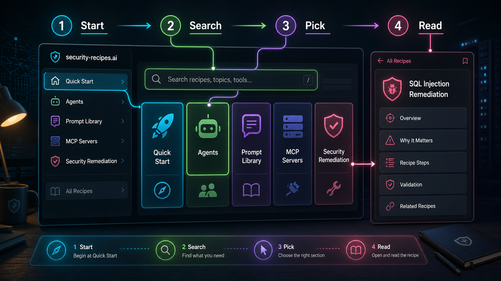
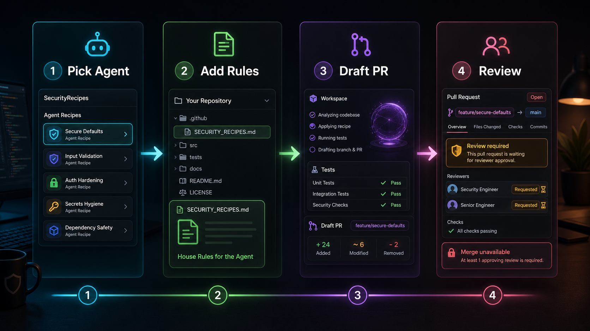
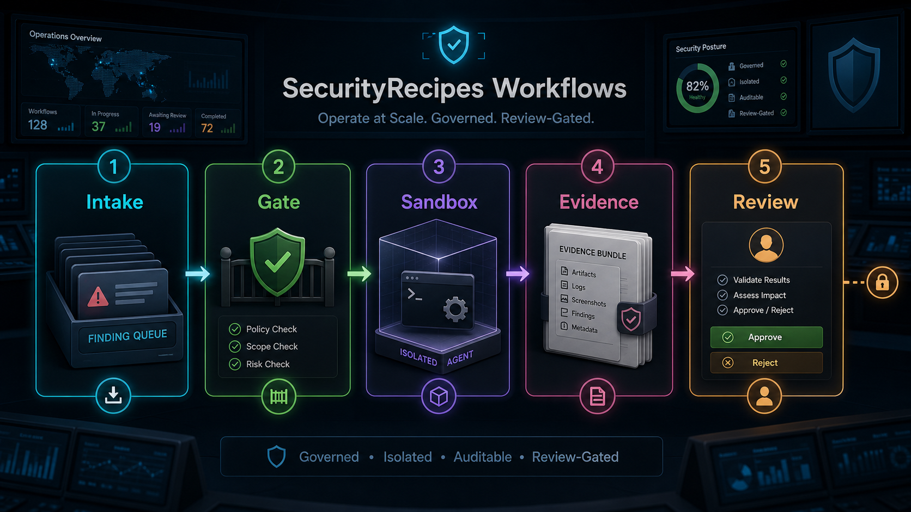
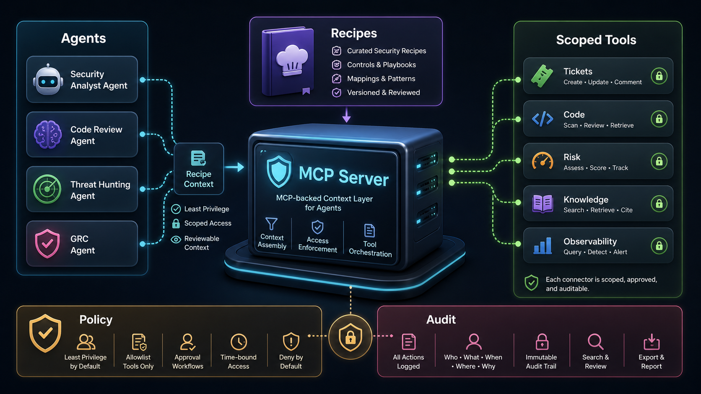

# security-recipes.ai

A Hugo docs site (built with the [Hextra](https://imfing.github.io/hextra/)
theme) — published as **[security-recipes.ai](https://security-recipes.ai/)** —
positioning SecurityRecipes as **the trusted secure context layer for agentic AI and MCP servers**.

It combines:
- **Open knowledge (MIT Licensed):** community recipes, docs, and prompt playbooks.
- **Production MCP path:** free and premium MCP access, including premium-only
  features delivered through MCP for enterprise operations.

## Vision

The agentic landscape is moving faster than any single team's internal
documentation can keep up with. New models ship monthly, new agent
platforms launch quarterly, MCP connectors proliferate across every
SaaS an engineering org touches, and the guardrails that kept a pilot
safe last quarter may not cover the capabilities shipping next quarter.

SecurityRecipes is designed to become a high-trust foundation for agentic security operations in 2026 and beyond.

This project exists for two reasons:

1. **A working reference for agentic security remediation.** A
   tool-agnostic, reviewer-gated, measurable shape of workflow that
   any security engineering team can adopt, adapt, and fork — rather
   than starting from a blank page every time a new capability lands.
2. **A common language for agentic enablement inside companies
   embracing this transformational moment.** Engineering leaders,
   security teams, platform teams, and compliance counterparts need
   a shared vocabulary and a shared mental model to have the same
   conversation. This site is designed to be that shared artifact —
   something a team can point at internally ("this is the shape we're
   adopting, this is the maturity stage we're in, this is the
   evidence we're producing") instead of re-explaining first
   principles in every meeting.

The recipes, prompts, reference workflows, metrics, reviewer
playbook, rollout model, compliance mapping, and threat model are
all written to be **industry-generic**: rename the labels, swap the
tools, bring your own policy — the shape travels. As the landscape
evolves, so does this site. Forks are encouraged; contributions back
are the whole point.

## Standards alignment

SecurityRecipes content is designed to align with established security references:

- **OWASP Top 10** for common application security failure modes.
- **NIST AI Risk Management Framework (AI RMF 1.0)** for governable AI system lifecycle controls.
- **Least-privilege + auditable control design** reflected in MCP guidance and reviewer-gated workflows.

## What's in the site

The site is a polished landing page backed by a full docs experience,
and ships with:

- **Visual Guide** - four GPT Image-2 walkthrough panels that show how
  to explore the repo, run a first agent PR, operate workflows, and
  scale through MCP.
- **Fundamentals** — plain-English primer on agents, prompts, MCP,
  and the vocabulary the rest of the site assumes.
- **Agents** — five per-tool recipe pages with install / configure /
  dispatch / guardrail sections.
- **Prompt Library** — tool-agnostic and per-tool prompts, including
  full OWASP Top 10 (2026) audit and remediation playbooks.
- **MCP Servers** — connector catalog, onboarding checklist, and a
  write-up on MCP gateways (when and why to put one in front of your
  connectors).
- **Agentic Security Remediation** — reference workflows a security
  team can operate on engineering's behalf: Sensitive Data Element
  and Vulnerable Dependency remediation.
- **MCP Connector Trust Registry** - generated connector trust evidence
  for every workflow MCP namespace: tiers, access modes, required
  controls, evidence, promotion criteria, and kill signals.
- **MCP Runtime Decision Evaluator** - deterministic allow, hold, deny,
  and kill-session decisions for each agent tool call before it reaches
  enterprise systems.
- **Agentic Assurance Pack** — generated enterprise evidence that maps
  workflows, MCP policy, control objectives, and AI/Agent BOM seed data
  to current agentic AI security expectations.
- **Agentic Red-Team Drill Pack** - generated adversarial eval drills
  that replay prompt injection, goal hijack, approval bypass, token
  passthrough, connector drift, runaway-loop, and evidence-integrity
  failure modes across approved workflows.
- **Agentic Readiness Scorecard** - generated scale, pilot, gate, and
  block decisions for approved workflows using control-plane, MCP
  policy, connector trust, identity, assurance, and red-team evidence.
- **Agent Identity & Delegation Ledger** - generated non-human identity
  contracts for approved agents, delegated MCP scopes, explicit denies,
  review ownership, runtime revocation, and audit evidence.
- **Automation, not agentic** — what deterministic tooling still does
  best, and where agents should *not* replace it.
- **Contribute** — fork-and-PR guide for adding recipes, prompts, or
  workflows.

It's designed to be hosted on **GitHub Pages** with zero manual deploy
steps: pushing to `main` rebuilds and publishes. The Repository and
Contribute links resolve **dynamically** to whichever repo hosts the
site — no find-and-replace required before forking.

---

## Visual guide: how to use this repo

This repo is easiest to use as a path, not a pile of pages. The
visual guide below shows the intended reading order and the operational
loop the site is designed to support.

### 1. Start with the map



Begin with **Quick Start** when you want a five-minute path, use search
when you already know the problem, then pick the section that matches
your job: agent setup, prompt reuse, MCP access, or security-operated
remediation workflows.

### 2. Run one safe agent PR



Pick one agent your team already uses, add the matching house-rules
file from the recipe or prompt library, let the agent draft a branch
and pull request, and review it like any other human-authored change.

### 3. Operate remediation as a security workflow



For scale, treat agentic remediation as a security-owned workflow:
findings enter a queue, eligibility gates decide what can run, the
agent works in a bounded sandbox, evidence is produced, and humans keep
the merge decision.

### 4. Use MCP as the context layer



The production shape is MCP-backed: agents retrieve recipe context,
policy narrows tool access, scoped connectors reach enterprise systems,
and audit records make the whole run reviewable.

The same walkthrough is available in the Hugo site on the
[Visual Guide page](content/how-to-use/_index.md).

---

## Quick start

### Prerequisites

- [Hugo extended](https://gohugo.io/installation/) `>= 0.139`
- [Go](https://go.dev/dl/) `>= 1.21` (Hextra is loaded as a Hugo Module)
- Git

### Run locally

Run from the repository root, the directory that contains `hugo.yaml`.
The current layout does not use a nested site directory.

```bash
hugo mod get -u           # fetch the Hextra theme
hugo server -D            # http://localhost:1313
```

### Run in Docker

A multi-stage `Dockerfile` builds the site with Hugo extended and
serves it from `nginx:alpine`:

```bash
# from the repository root
docker build -t security-recipes .
docker run --rm -p 8080:80 security-recipes
# open http://localhost:8080
```

### Add a recipe for a new agent

```bash
hugo new content <agent_name>/_index.md
```

Then edit the file. The archetype (`archetypes/default.md`) gives you a
ready-made skeleton with the four required sections (Install →
Configure → Dispatch → Guardrails).

### Contribute a prompt

Drop a new Markdown file under `content/prompt-library/<tool>/` (or
under `content/prompt-library/general/` for tool-agnostic prompts).
Every entry carries frontmatter with `author`, `team`, `maturity`, and
the `model` it was validated against. See any existing prompt — for
example, `content/prompt-library/general/owasp-top-10-2026-audit.md` —
as a template.


### Generate CVE recipe drafts from GitHub Advisory Database

If you have a local checkout of `github/advisory-database`, you can
bulk-generate draft CVE recipe pages (High/Critical entries with CVE IDs
and a fixed version event) using:

```bash
python scripts/generate_cve_recipes_from_ghad.py \
  --advisory-root /path/to/advisory-database/advisories/github-reviewed \
  --output-root content/prompt-library/cve/generated \
  --report-path data/ghad-assessment/latest.json \
  --published-year 2026
```

The generator assesses **all High/Critical advisories** in the input
path (optionally filtered by `--published-year`) and records one decision per advisory in the JSON report
(`generated`, `skipped_no_cve`, `skipped_no_fix`, `skipped_no_ranges`).
Generated pages are intentionally marked **draft** so maintainers can
review wording and add CVE-specific nuances before publishing. After
generation, iterate through each `generated` result in the assessment
report and either (a) promote to a curated file in
`content/prompt-library/cve/` or (b) discard if no real remediation path
exists.

---

### Generate the agentic assurance pack

The assurance pack joins the workflow control plane, MCP gateway policy,
control map, and validation report into a buyer- and auditor-ready JSON
artifact:

```bash
python3 scripts/generate_agentic_assurance_pack.py
python3 scripts/generate_agentic_assurance_pack.py --check
```

The generated artifact lives at
`data/evidence/agentic-assurance-pack.json` and is exposed through the
MCP server as `recipes_agentic_assurance_pack`.

---

### Generate the agent identity delegation ledger

The identity ledger joins the workflow control plane, MCP gateway
policy, and validation report into a non-human identity contract for
each approved workflow and agent class:

```bash
python3 scripts/generate_agent_identity_ledger.py
python3 scripts/generate_agent_identity_ledger.py --check
```

The generated artifact lives at
`data/evidence/agent-identity-delegation-ledger.json` and is exposed
through the MCP server as `recipes_agent_identity_ledger`.

---

### Generate the agentic red-team drill pack

The red-team drill pack joins adversarial scenarios, workflow manifests,
gateway policy, connector trust, and agent identity scope into a
machine-readable eval bundle:

```bash
python3 scripts/generate_agentic_red_team_drill_pack.py
python3 scripts/generate_agentic_red_team_drill_pack.py --check
```

The generated artifact lives at
`data/evidence/agentic-red-team-drill-pack.json` and is exposed through
the MCP server as `recipes_agentic_red_team_drill_pack`.

---

### Generate the agentic readiness scorecard

The readiness scorecard joins the workflow manifest, MCP gateway policy,
connector trust pack, identity ledger, red-team drill pack, assurance
pack, and readiness model into a promotion-gate artifact:

```bash
python3 scripts/generate_agentic_readiness_scorecard.py
python3 scripts/generate_agentic_readiness_scorecard.py --check
```

The generated artifact lives at
`data/evidence/agentic-readiness-scorecard.json` and is exposed through
the MCP server as `recipes_agentic_readiness_scorecard`.

---

### Generate the MCP connector trust pack

The connector trust pack joins the MCP connector registry, workflow
control plane, and gateway policy into a machine-readable inventory of
connector namespaces, trust tiers, access modes, controls, evidence,
promotion criteria, and kill signals:

```bash
python3 scripts/generate_mcp_connector_trust_pack.py
python3 scripts/generate_mcp_connector_trust_pack.py --check
```

The generated artifact lives at
`data/evidence/mcp-connector-trust-pack.json` and is exposed through the
MCP server as `recipes_mcp_connector_trust_pack`.

---

### Evaluate an MCP gateway runtime decision

The runtime evaluator turns the generated MCP gateway policy into a
single pre-call decision an agent host, MCP gateway, CI admission check,
or policy sidecar can log and enforce:

```bash
python3 scripts/evaluate_mcp_gateway_decision.py \
  --workflow-id vulnerable-dependency-remediation \
  --agent-id sr-agent::vulnerable-dependency-remediation::codex \
  --run-id run-123 \
  --tool-namespace repo.contents \
  --tool-access-mode write_branch \
  --branch-name sec-auto-remediation/fix-cve \
  --changed-path package.json \
  --changed-path package-lock.json \
  --diff-line-count 120 \
  --gate-phase tool_call
```

The same decision function is exposed through the MCP server as
`recipes_evaluate_mcp_gateway_decision`.

---

## Project layout

The Hugo project lives directly at the repository root. All paths below
are root-relative.

```
.
├── hugo.yaml                       # Site config (menus, params, dynamic repoURL)
├── go.mod                          # Hugo module deps (Hextra)
├── archetypes/default.md           # `hugo new` template
├── assets/css/custom.css           # Hextra overrides — matches landing theme
├── content/
│   ├── _index.md                   # Home page (rendered by custom layout)
│   ├── how-to-use/_index.md         # Visual guide for using the repo/site
│   ├── fundamentals/_index.md      # Primer — agents, prompts, MCP, vocabulary
│   ├── docs/_index.md              # Docs landing — purpose of this site
│   ├── agents/_index.md            # Agents overview / decision tree
│   ├── github_copilot/_index.md    # Per-agent recipe
│   ├── devin/_index.md
│   ├── cursor/_index.md
│   ├── codex/_index.md
│   ├── claude/_index.md
│   ├── prompt-library/
│   │   ├── _index.md               # Library landing
│   │   ├── general/                # Tool-agnostic prompts (OWASP, review, triage)
│   │   ├── claude/                 # Claude skills, slash commands
│   │   ├── cursor/                 # Cursor rules + commands
│   │   ├── codex/                  # Codex CLI prompts
│   │   ├── devin/                  # Devin playbooks + knowledge
│   │   └── github_copilot/         # Copilot instructions + issue templates
│   ├── mcp-servers/_index.md       # Connector catalog + gateway write-up
│   ├── security-remediation/
│   │   ├── _index.md               # Security team workflow overview
│   │   ├── sensitive-data/         # SDE remediation workflow
│   │   └── vulnerable-dependencies/# Dep remediation workflow
│   ├── automation/_index.md        # Automation, not agentic
│   └── contribute/_index.md        # How to submit recipes/prompts
├── data/
│   ├── assurance/                  # Assurance control map
│   ├── control-plane/              # Workflow manifests + schema
│   ├── evidence/                   # Generated audit / assurance reports
│   └── policy/                     # Generated MCP gateway policy
├── layouts/
│   ├── index.html                  # Custom landing page (polished hero + cards)
│   ├── partials/footer.html        # Footer override (copyright)
│   ├── partials/custom/head-end.html # Injects custom.css
│   └── shortcodes/prompt-toc.html  # Auto-TOC for prompt-library pages
├── static/
│   ├── .nojekyll                   # Tell GH Pages "this is not Jekyll"
│   └── images/
│       ├── logo.svg
│       ├── how-to-use/              # GPT Image-2 visual walkthrough panels
│       └── covers/                 # Per-tool hero illustrations
├── Dockerfile                      # Multi-stage: Hugo extended → nginx:alpine
└── .github/workflows/hugo.yml      # GH Pages CI/CD + dynamic repoURL injection
```

The repo root also holds `CONTRIBUTING.md` (the fork-and-PR guide that
the top nav's **Contribute** link points at) and `LICENSE`.

---

## Site sections at a glance

| Section | What's in it |
| ------- | ------------ |
| **Visual Guide** | Four GPT Image-2 walkthrough panels that explain how to use the repo as a path: explore, run one PR, operate workflows, and scale through MCP. |
| **Fundamentals** | What an agent is; the five tools; prompts; MCP; MCP gateways; agentic remediation; vocabulary. |
| **Docs** | Orientation for the site — who it's for, how to read a recipe, how to contribute. |
| **Agents** | Per-tool recipes for GitHub Copilot, Claude, Cursor, Codex, Devin — each with Install → Configure → Dispatch → Guardrails, plus General and Enterprise onboarding. |
| **Prompt Library** | Tool-agnostic prompts under `general/` (OWASP Top 10 2026 audit, OWASP Top 10 2026 remediate) plus per-tool prompts for CVE triage, vulnerable deps, and SDE remediation. |
| **MCP Servers** | Why MCP exists; connector catalog (risk, ownership, ticket, knowledge, code, observability); MCP gateway patterns; integration on-ramp. |
| **Security Remediation** | Reference workflows a security team can operate: SDE, vulnerable dependencies, SAST, base images, artifact quarantine, classic vulnerable defaults, crypto payments, and DeFi / blockchain security. Includes the workflow control plane, MCP gateway policy pack, runtime decision evaluator, MCP connector trust registry, agentic assurance pack, readiness scorecard, red-team drill pack, agent identity ledger, program metrics, reviewer playbook, rollout maturity model, and compliance mapping. |
| **Automation** | The "just use a linter" checklist — deterministic automation that earns its keep before an agent ever runs. |
| **Contribute** | How to add a recipe, a prompt, or a new workflow. |

---

## Dynamic repository URL

The "Repository" link on the landing page and repo-backed Contribute
links are resolved from the root-level `hugo.yaml` and site content. CI
runs from the repository root and updates repo-aware values during the
build:

```bash
HUGO_PARAMS_REPOURL="https://github.com/${{ github.repository }}"
CANONICAL_REPOSITORY="stevologic/security-recipes.ai"
sed -i "s|${CANONICAL_REPOSITORY}|${{ github.repository }}|g" hugo.yaml
find content -type f -name "*.md" -exec sed -i \
  "s|${CANONICAL_REPOSITORY}|${{ github.repository }}|g" {} +
```

This means you can fork the repo under any org/user and the links
follow without moving files or adding a subdirectory-specific
`working-directory`.

---

## Deploying to GitHub Pages

The project ships with a GitHub Actions workflow
(`.github/workflows/hugo.yml`) that:

1. Installs Hugo (extended) + Go.
2. Fetches the Hextra theme via Hugo Modules.
3. Runs `hugo --gc --minify` from the repository root with
   `HUGO_PARAMS_REPOURL` wired to the hosting repo.
4. Verifies `public/recipes-index.json` is generated at the root build
   output for MCP
   search/retrieval servers.
5. Pushes the compiled root-level `public/` directory to a dedicated
   **`gh-pages`** branch using `peaceiris/actions-gh-pages`.

### MCP server-friendly content index

This site generates a machine-readable JSON corpus at:

- **`/recipes-index.json`** (for example,
  `https://security-recipes.ai/recipes-index.json`)

The index is emitted by Hugo during the normal build (`hugo --gc --minify`)
using:

- `hugo.yaml` output format: `RECIPESINDEX` (base name: `recipes-index`)
- template: `layouts/index.recipesindex.json`

Each record includes structured fields intended for MCP tools such as
`search_recipes` and `get_recipe`, including:

- `slug`, `title`, `url`, `path`, `section`
- `agent`, `tags`, `severity`
- `last_updated`, `summary`, `content`, `source_file`

In CI, the workflow validates that `public/recipes-index.json` is:

1. Present and non-empty
2. Valid JSON
3. A non-empty array with required fields (`slug`, `title`, `url`, `content`)

This keeps the static site MCP-ready without requiring runtime crawling of
rendered HTML.

### Workflow control plane manifests

Enterprise workflows also have a source-controlled control-plane pack:

- manifest: `data/control-plane/workflow-manifests.json`
- schema: `data/control-plane/workflow-manifest.schema.json`
- validator: `scripts/validate_workflow_control_plane.py`
- report: `data/evidence/workflow-control-plane-report.json`

The manifest declares each workflow's eligible findings, automation-first
tools, MCP context, file scope, gates, evidence, KPIs, and kill signals.
CI runs the validator before the Hugo build so workflow policy cannot drift
silently from the documentation.

### MCP gateway policy pack

The workflow manifest also compiles into an enforcer-friendly gateway
policy pack:

- policy: `data/policy/mcp-gateway-policy.json`
- generator: `scripts/generate_mcp_gateway_policy.py`
- runtime evaluator: `scripts/evaluate_mcp_gateway_decision.py`
- MCP tools: `recipes_mcp_gateway_policy`,
  `recipes_evaluate_mcp_gateway_decision`

The generated pack gives an MCP gateway or agent host a default-deny
decision contract for scoped tool access, remediation branch writes,
ticket writes, approval holds, runtime session kills, and evidence
records. CI runs the generator in `--check` mode so workflow changes must
update the policy artifact.

The runtime evaluator executes the same policy for one tool-call request
and returns `allow`, `allow_scoped_branch`, `allow_scoped_ticket`,
`hold_for_approval`, `deny`, or `kill_session` with matched scope,
violations, approval state, and source manifest hash.

### MCP connector trust pack

The workflow manifest and gateway policy also compile with the MCP
connector registry into a trust pack:

- registry: `data/mcp/connector-trust-registry.json`
- generator: `scripts/generate_mcp_connector_trust_pack.py`
- pack: `data/evidence/mcp-connector-trust-pack.json`
- MCP tool: `recipes_mcp_connector_trust_pack`

The generated pack covers every workflow MCP namespace with connector
owner, status, trust tier, access mode, controls, evidence records,
promotion criteria, and runtime kill signals. CI runs the generator in
`--check` mode so connector trust cannot drift from workflow policy.

### Agentic assurance pack

The manifest, gateway policy, and control map also compile into a
buyer- and auditor-ready assurance pack:

- control map: `data/assurance/agentic-assurance-control-map.json`
- generator: `scripts/generate_agentic_assurance_pack.py`
- pack: `data/evidence/agentic-assurance-pack.json`

The generated pack maps SecurityRecipes controls to AI risk references,
summarizes per-workflow assurance coverage, and seeds AI/Agent BOM
inventory work. CI runs the generator in `--check` mode so the control
story cannot drift from the workflow and policy artifacts.

### Agent identity delegation ledger

Agent identities are generated from the same workflow and policy
sources:

- ledger: `data/evidence/agent-identity-delegation-ledger.json`
- generator: `scripts/generate_agent_identity_ledger.py`
- MCP tool: `recipes_agent_identity_ledger`

The ledger declares one non-human identity contract per workflow and
agent class, including delegated MCP scopes, explicit denied actions,
reviewer pools, runtime kill signals, required evidence, token rules,
and source artifact hashes. CI runs the generator in `--check` mode so
identity scope cannot drift from gateway policy.

### Agentic red-team drill pack

Adversarial eval scenarios are generated from a source-controlled
scenario map and joined to the workflow, policy, connector trust, and
identity artifacts:

- scenario map: `data/assurance/agentic-red-team-scenario-map.json`
- generator: `scripts/generate_agentic_red_team_drill_pack.py`
- pack: `data/evidence/agentic-red-team-drill-pack.json`
- MCP tool: `recipes_agentic_red_team_drill_pack`

The generated pack gives every approved workflow repeatable drills for
tool-result injection, goal hijack, credential access, approval bypass,
token passthrough, connector schema drift, runaway loops, and evidence
integrity failures. CI runs the generator in `--check` mode so red-team
coverage cannot drift from workflow and MCP policy.

### Agentic readiness scorecard

Scale decisions are generated from the workflow manifest, gateway
policy, connector trust pack, identity ledger, red-team drill pack,
assurance pack, and source-controlled readiness model:

- readiness model: `data/assurance/agentic-readiness-model.json`
- generator: `scripts/generate_agentic_readiness_scorecard.py`
- scorecard: `data/evidence/agentic-readiness-scorecard.json`
- MCP tool: `recipes_agentic_readiness_scorecard`

The generated scorecard gives each approved workflow a `scale_ready`,
`pilot_guarded`, `manual_gate`, or `blocked` decision with dimension
scores, blockers, pilot connector dependencies, and next actions. CI
runs the generator in `--check` mode so adoption decisions cannot drift
from the underlying control artifacts.

### Standalone MCP server (Python + Docker)

This repo also includes a standalone MCP server implementation that reads
`recipes-index.json` directly from GitHub Pages (or any forked host):

- Script: `mcp_server.py`
- Config template: `mcp-server.toml.example`
- Docker image recipe: `Dockerfile.mcp-server`
- Python deps: `requirements-mcp-server.txt`

#### Local run

```bash
python -m venv .venv
source .venv/bin/activate
pip install -r requirements-mcp-server.txt
cp mcp-server.toml.example mcp-server.toml
python mcp_server.py
# MCP endpoint: http://localhost:8000/mcp
```

#### Docker run

```bash
docker build -f Dockerfile.mcp-server -t mcp.server .
docker run --rm -it \
  -p 8123:80 \
  mcp.server
# MCP endpoint: http://localhost:8123/mcp
```

See `README.mcp-localhost.md` for client configuration examples and
localhost troubleshooting.

#### Re-pointing for forks / custom domains

Edit `mcp-server.toml`:

- `source_index_url` → where your fork publishes `recipes-index.json`
- `allowed_source_hosts` → strict allow-list for that index hostname
- `server_public_base_url` → your MCP server's own hostname (metadata)
- `control_plane_manifest_path` -> local workflow-control-plane manifest
  exposed through the `recipes_workflow_control_plane` MCP tool
- `gateway_policy_path` -> generated policy pack exposed through the
  `recipes_mcp_gateway_policy` and
  `recipes_evaluate_mcp_gateway_decision` MCP tools
- `assurance_pack_path` -> generated assurance pack exposed through the
  `recipes_agentic_assurance_pack` MCP tool
- `identity_ledger_path` -> generated agent identity ledger exposed
  through the `recipes_agent_identity_ledger` MCP tool
- `connector_trust_pack_path` -> generated MCP connector trust pack
  exposed through the `recipes_mcp_connector_trust_pack` MCP tool
- `red_team_drill_pack_path` -> generated agentic red-team drill pack
  exposed through the `recipes_agentic_red_team_drill_pack` MCP tool
- `readiness_scorecard_path` -> generated agentic readiness scorecard
  exposed through the `recipes_agentic_readiness_scorecard` MCP tool

This lets teams host the Hugo site and MCP server under different domains
without changing code.

### One-time setup

1. **Push this repo to GitHub.**
   The Hugo project lives at the repository root. Keep `hugo.yaml`,
   `content/`, `layouts/`, `assets/`, `static/`, `data/`, and
   `.github/workflows/hugo.yml` together at the top level.

2. **Choose your Pages URL.**
   For normal GitHub Pages hosting, no path edits are required:
   the workflow computes the correct `baseURL` for either
   `https://<user>.github.io/` or `https://<user>.github.io/<repo>/`
   and patches the root `hugo.yaml` during CI. For a custom domain,
   keep `static/CNAME` at the repo root's `static/` directory. For
   non-GitHub-Actions builds, set `baseURL` in `hugo.yaml` to the
   URL where the compiled site will be served.

3. **Push to `main`.**
   The workflow runs, creates the `gh-pages` branch on first deploy,
   and every subsequent push force-updates that branch with the
   latest build (`force_orphan: true` keeps the branch small).

4. **Point GitHub Pages at `gh-pages`.**
   In the repo's **Settings → Pages**:
   - **Source:** Deploy from a branch
   - **Branch:** `gh-pages`  /  `(root)`

   Save. A minute later your site is live at
   `https://<user>.github.io/<repo>/`.

> **Custom domain?** Add a `static/CNAME` file containing your domain
> (it ends up at the root of `gh-pages`, which is what makes the
> custom-domain binding survive `force_orphan: true` deploys). The
> workflow detects the CNAME and uses `https://<your-domain>/` as the
> baseURL automatically — no `hugo.yaml` edit required, and the
> GitHub-Pages-subpath rewrites (asset URLs, card links) are skipped
> because the site is served from the host root.

> **Token permissions.** The workflow only needs the default
> `GITHUB_TOKEN` with `contents: write` — no PATs required.

---

## Customising

- **Colors / branding** — `assets/css/custom.css` sets the shared
  accent palette and the ambient orbs that carry the landing-page
  aesthetic into the docs.
- **Logo** — replace `static/images/logo.svg`.
- **Per-tool covers** — replace anything in `static/images/covers/`.
- **Landing page** — `layouts/index.html` is a fully custom home.
  Tweak the hero copy, tool tags, or the Prompt Library CTA there.
- **Navbar / footer** — see the `menu` and `params.footer` blocks in
  `hugo.yaml`. The footer template itself is overridden at
  `layouts/partials/footer.html` to guarantee the site-owned copyright
  wins over the theme default.

---

## Forking for an enterprise

The site is designed to be forked and customised without code
changes:

- GitHub Pages forks usually need no path edits: the workflow computes
  `baseURL`, runs Hugo from the repo root, and publishes root `public/`.
- Use `static/CNAME` for a custom GitHub Pages domain, or update
  `baseURL` in `hugo.yaml` only for non-GitHub-Actions hosting.
- `HUGO_PARAMS_REPOURL` overrides Repository link targets via CI.
- Per-agent pages carry an **Enterprise Onboarding** section as a
  placeholder — a forking enterprise fills it with its own
  identity-provider, policy, and deployment specifics while leaving
  the **General Onboarding** section intact.

See each per-agent recipe for the exact shape; the pattern is
consistent across all five.

---

## License

MIT — see `LICENSE`.

---

An open, community-driven playbook for **security engineering teams** ♥
