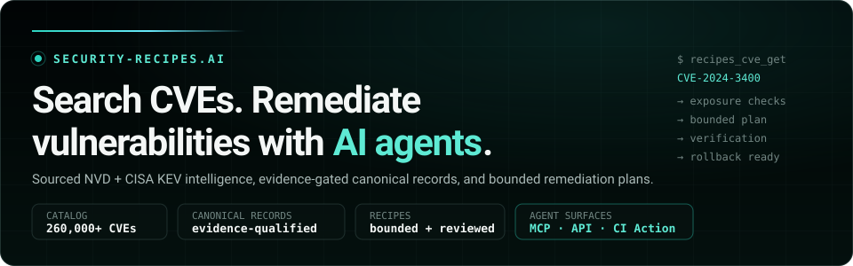
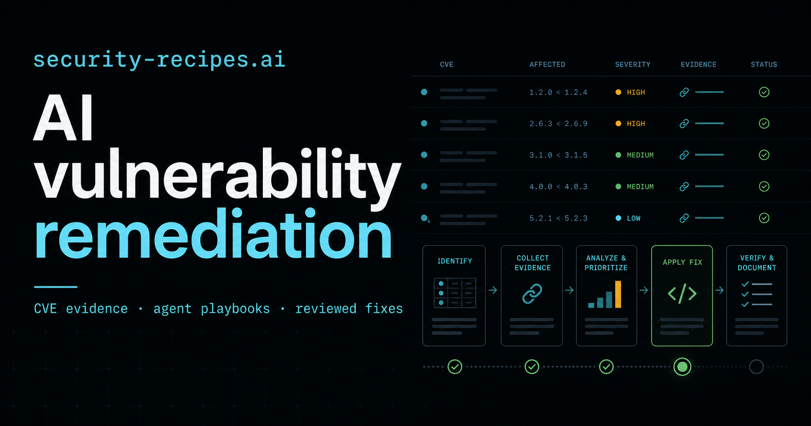
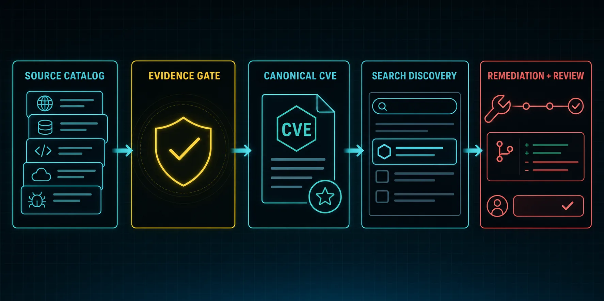
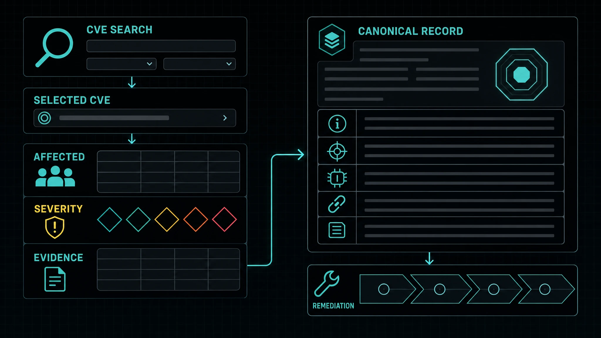
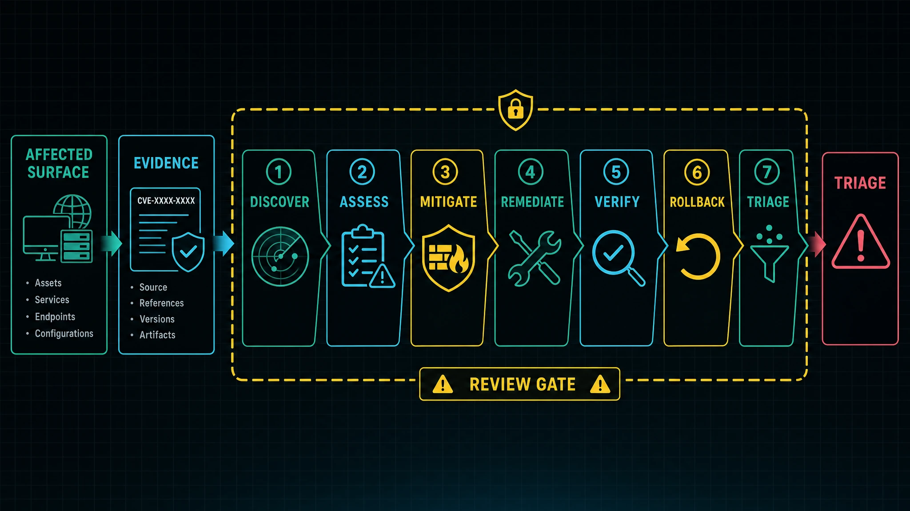
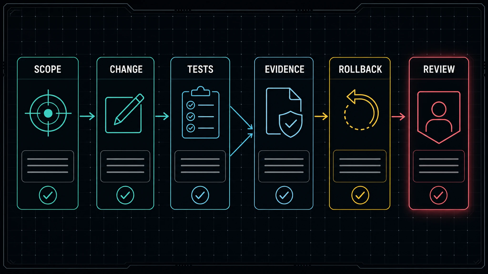
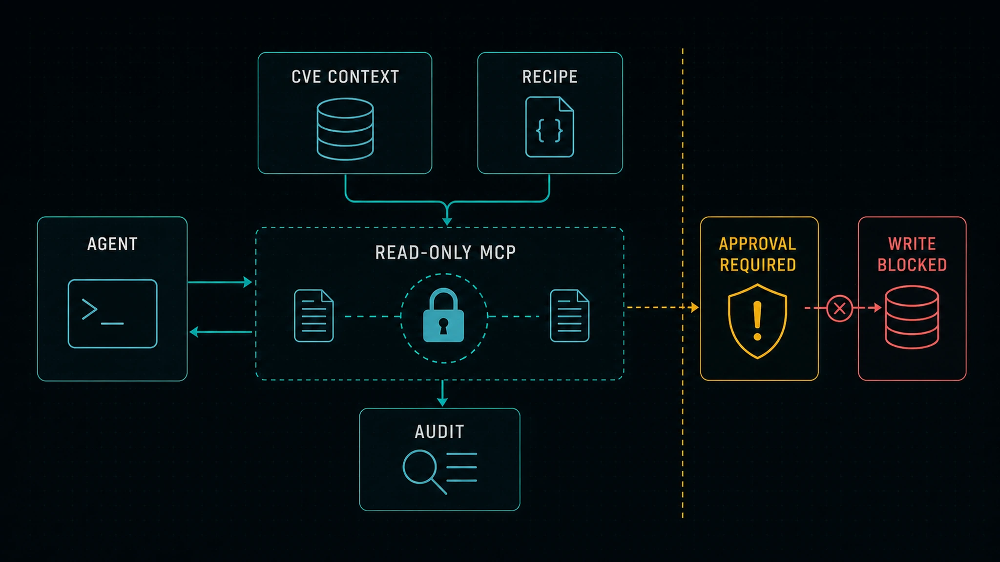

<div align="center">



[](https://security-recipes.ai/)
[](https://security-recipes.ai/cve-database/)
[](https://security-recipes.ai/mcp-servers/)
[](https://security-recipes.ai/docs/security-health-action/)
[](https://security-recipes.ai/llms.txt)
[](https://mcpservers.org/servers/security-recipes-ai-mcp-servers)
</div>

# security-recipes.ai

**Search CVEs. Remediate vulnerabilities with AI agents.** Sourced facts stay
sourced, remediation stays bounded, and every plan carries verification,
rollback, and stop conditions — the live site's contract, and this repo's.

[security-recipes.ai](https://security-recipes.ai/) is an Eleventy site for
sourced CVE intelligence and evidence-gated vulnerability remediation that AI
agents can consume without inheriting deployment or production authority.

The project is intentionally narrow:

- a complete rolling Medium/High/Critical CVE database,
- evidence-qualified canonical CVE remediation records,
- practical security remediation recipes,
- prompt and rules-file examples,
- agent setup guides,
- MCP integration patterns,
- an optional read-only MCP server for recipe search and approved upstream MCP
  context,
- a [reusable GitHub Action](https://security-recipes.ai/docs/security-health-action/)
  that turns this guidance into toggleable CI health checks.

It is not a scanner, ticketing system, SOAR platform, deployment tool, or custom
security toolkit. Existing security tools should produce the findings; this
site helps agents use the right remediation context and stop at the right time.

Start with the live [CVE Database](https://security-recipes.ai/cve-database/)
for an exact vulnerability or the
[AI Vulnerability Remediation Playbooks](https://security-recipes.ai/security-remediation/)
for the evidence-to-patch workflow. Agent-specific guides cover
[Codex](https://security-recipes.ai/codex/),
[Claude Code](https://security-recipes.ai/claude/),
[Cursor](https://security-recipes.ai/cursor/),
[GitHub Copilot](https://security-recipes.ai/github_copilot/),
[Devin](https://security-recipes.ai/devin/),
[Shiba Studio](https://security-recipes.ai/agents/#shiba-studio),
[Hermes Desktop](https://security-recipes.ai/agents/#hermes-desktop), and
[OpenClaw](https://security-recipes.ai/agents/#openclaw).
The [Visual Guide](https://security-recipes.ai/how-to-use/) shows the complete
path from source qualification and search discovery to a bounded plan, proof,
rollback, and human review.
For the distinct problem of securing an agent system's identities, tools,
connectors, context, memory, runtime, and recovery controls, use
[AI Agent Security](https://security-recipes.ai/agentic-security/).

## Current product and workflow



### Qualified search discovery



The complete catalog remains searchable, while public canonical CVE pages stay
limited to reviewed or evidence-qualified records. Those pages ship unique
search metadata, server-rendered core facts and affected-version evidence, one
remediation authority (stable reviewed guidance first, otherwise complete
source-linked AI enrichment), a short approval-gated AI implementation prompt,
canonical URLs, breadcrumbs, and `Article`/`TechArticle` structured data. The CVE database
describes the catalog as a `Dataset`; the remediation pillar exposes its visible
seven-step workflow as a `HowTo`. Year-partitioned CVE sitemaps contain only
indexable canonical routes, and the build fails when sitemap parity, canonical
ownership, crawl reachability, metadata limits, or same-origin links drift.

Indexability is also withheld from mass-templated recipe children. The 72
development code-hygiene recipes and 39 generated compliance-framework recipes
remain browsable from their canonical hubs with `noindex,follow` while they
share a common method. A bounded rendered-body similarity gate prevents a child
from re-entering sitemaps until its evidence, examples, and tests are materially
distinct. The hubs remain indexable and carry the shared discovery context.

After an SEO-bearing release, the public revision must match the merge commit
before sitemap submission or URL inspection. The
[Caddy deployment guide](README.caddy-deploy.md#search-discovery-after-an-seo-release)
documents the DNS-verified Search Console handoff, priority live-URL checks,
sitemap submission, indexing requests, and query monitoring. Submission is a
discovery hint; it does not guarantee indexing or a particular ranking.

The remediation pillar also records a public repository example for
[CVE-2026-13149 in `brace-expansion`](https://security-recipes.ai/security-remediation/#real-repository-case-study-cve-2026-13149-in-brace-expansion).
It ties the dependency-only change to the
[reviewed pull request](https://github.com/stevologic/security-recipes.ai/pull/89),
tests, advisory evidence, and recovery path while explicitly separating the
same PR's unrelated Fail2Ban work.

| CVE search to canonical record | CVE evidence to bounded agent plan |
| --- | --- |
|  |  |
| Proof and human review | Read-only MCP context |
|  |  |

## What this project is for

AI coding agents can help close security findings when their work is bounded:
one finding, one recipe, one reviewed output.

security-recipes.ai helps teams answer:

- Which recipe matches this finding?
- Which prompt should the agent use?
- Where do I put the instructions for Copilot, Claude, Cursor, Codex, or Devin?
- Which MCP servers should the agent read for advisory, scanner, repository, or
  runbook context?
- What should the PR or triage note include before a reviewer trusts it?

## What ships

- Eleventy documentation site (fast static builds, no Go toolchain).
- CVE-first observatory home page and data-first CVE database.
- Recipe hubs for dependency, SAST, sensitive-data, base-image, CVE, and
  default-hardening remediation.
- CVE intelligence intake policy, prompt, fixtures, and evaluator for routing
  advisory signals before an agent patches.
- A complete rolling ten-year Medium/High/Critical CVE catalog composed from
  integrity-verified NVD JSON 2.0 feeds, CISA KEV metadata, and every applicable
  vetted remediation archetype. Only reviewed `stable` Markdown pages override
  that conservative baseline.
- An integrity-hashed search allowlist that publishes canonical CVE pages only
  for reviewed stable Markdown or AI enrichment that passes the deterministic
  recipe-ready evidence contract. The full database remains searchable even
  when a record is not eligible for search indexing.
- A versioned seven-phase agentic change contract for every catalog CVE:
  discover, assess, mitigate, remediate, verify, rollback, and triage. Each
  action declares likely file targets, mutation and approval boundaries,
  required evidence, outputs, and failure behavior without guessing a patch or
  fixed version.
- A structured compliance library spanning 39 security, privacy, assurance,
  resilience, and software-supply-chain frameworks without reproducing
  licensed control text. Its framework hub is the search surface; templated
  child assessments remain `noindex,follow` until differentiated.
- A 72-recipe code-hygiene library covering cross-language and ecosystem-
  specific audit, remediation, verification, and stop-condition workflows.
  Its development children remain `noindex,follow` while their bodies share a
  generated template.
- Recipes with existing prompt collections preserved.
- Agent setup guides for GitHub Copilot, Claude, Cursor, Codex, and Devin.
- MCP integration guidance for public and organization-approved security data
  sources.
- Optional read-only FastMCP server in `mcp_server.py` for recipe search,
  retrieval, and opt-in upstream MCP context.
- Docker and Docker Compose configuration for local or droplet hosting.
- Helper scripts for site maintenance, validation, imports, and deployment.

## Repository map

| Path | Purpose |
| --- | --- |
| `content/` | Recipes, documentation, remediation guides, and agent setup pages. |
| `eleventy.config.js` | Site build configuration (permalinks, feeds, tag pages). |
| `_includes/` | Page layouts: docs chrome and the standalone home page. |
| `lib/` | Build modules: shortcode ports, JSON feed builders, SEO head. |
| `assets/` | Site CSS and JavaScript for the recipe browser, navigation, and helper tools. |
| `static/` | Images, logos, schemas, and static assets. |
| `static/api/cve-catalog/` | Complete sharded CVE catalog, year-partitioned machine index, compressed browser-search index, provenance manifest, and archetypes. |
| `data/cve/` | Human-reviewed remediation archetypes, deterministic AI-enrichment cache, and generated-recipe ownership ledger. |
| `data/compliance-frameworks/` | Structured compliance-framework catalog and source registry. |
| `data/code-hygiene/` | Structured code-hygiene catalog, source registry, and routing fixtures. |
| `docs/` | Repository documentation and legacy screenshot assets; current README and visual-guide images live in `static/images/`. |
| `mcp_server.py` | Optional read-only MCP server for recipe search and approved upstream MCP context. |
| `mcp-server.toml.example` | MCP server configuration template. |
| `Dockerfile` | Site image. |
| `Dockerfile.mcp-server` | Optional MCP server image. |
| `docker-compose.yml` | Production-style local stack. |
| `scripts/` | Helper scripts for maintenance and deployment. |

## Core content areas

- **[CVE Database](https://security-recipes.ai/cve-database/)**: sourced CVE
  intelligence, affected-version evidence, and canonical remediation records.
- **[AI Vulnerability Remediation](https://security-recipes.ai/security-remediation/)**:
  evidence-gated playbooks from one finding to a reviewed patch or triage note.
- **[AI Agent Security](https://security-recipes.ai/agentic-security/)**:
  threat modeling, production baselines, source boundaries, control routing,
  evidence, and incident readiness for the AI-agent system itself.
- **[Quick Start](https://security-recipes.ai/quickstart/)**: one finding to one
  reviewed PR or triage note.
- **[AI Agent Comparison](https://security-recipes.ai/agents/)**: verified
  operating modes, native instructions, expected artifacts, prerequisites, and
  review gates for Copilot, Claude Code, Cursor, Codex, and Devin.
- **[Recipes](https://security-recipes.ai/recipes/)**: reusable prompts,
  instructions, rules, skills, and review checklists.
- **[MCP Integration](https://security-recipes.ai/mcp-servers/)**: how to connect
  security context safely.
- **[Visual Guide](https://security-recipes.ai/how-to-use/)**: the qualified
  search-discovery, CVE-to-plan, proof, rollback, review, and read-only MCP flow
  in five diagrams.
- **[Docs](https://security-recipes.ai/docs/)**: site usage, agent consumption
  patterns, and contribution guidance.

## Python remediation tooling

The Python suite is an optional execution companion to the documentation. It
can inspect a bounded workspace, select any of the 75 remediation playbooks,
create a durable run packet, record integrity-hashed evidence, and verify the
packet before agent or reviewer handoff. It remains local and conservative: it
does not merge code, deploy changes, or call external systems on its own.

```bash
python scripts/security_recipes_remediation_suite.py playbook list
python scripts/security_recipes_remediation_suite.py playbook inspect \
  --playbook vulnerable-dependencies --workspace .
python scripts/security_recipes_remediation_suite.py playbook start \
  --playbook vulnerable-dependencies --workspace . \
  --finding finding.json --run-dir .security-recipes/runs/dependency-fix
python scripts/security_recipes_remediation_suite.py playbook verify \
  --run-dir .security-recipes/runs/dependency-fix
```

The repository also includes domain-specific generators and evaluators for
playbooks that need richer evidence packs or runtime policy decisions. The
site and JSON registry remain useful without Python; the tools make the same
workflow contracts directly executable by CI, orchestrators, and approved
coding agents.

Deployment helpers worth knowing:

- `scripts/setup_digitalocean_droplet.sh`: Ubuntu droplet bootstrap with
  Docker, host hardening, and optional Caddy-managed HTTPS.
- `scripts/configure_nginx_letsencrypt.sh`: host nginx reverse proxy setup for
  teams that want Let's Encrypt on nginx instead of Caddy.
- `README.nginx-letsencrypt.md`: operator-focused walkthrough for the nginx
  deployment path.

Recommended operating model:

1. Let existing SCA, SAST, secrets, CI, cloud, and ticketing systems produce
   findings.
2. Attach a matching security-recipes.ai recipe and prompt.
3. Let the agent read only the files and MCP context needed for the finding.
4. Require tests and human review before merge.
5. Keep broad automation, write access, and deployment outside the first loop.

## Guidebook and execution tools

The site is a guidebook for remediation work: recipes, prompts, agent setup,
MCP/API integration notes, and review patterns. Runtime automation belongs in
the user's approved agent host, CI system, ticketing workflow, or scanner
platform rather than a site-hosted chatbot.

Python tools in `scripts/`, `tools/`, and `mcp_server.py` support maintainers
and self-hosters with playbook execution packets, evidence verification,
domain-specific evaluation and generation, validation, advisory import,
recipe search, and optional read-only MCP access.

## Optional MCP server

The MCP server is read-only by default. Its baseline role is to let
MCP-compatible agents search and retrieve recipes. Self-hosted deployments can
also configure it as a context hub for approved upstream MCP servers without
putting those credentials into the public site.

Retrieved context never grants mutation authority. Any connector that can
change repositories, tickets, secrets, deployments, or production systems must
be configured and approved separately by the calling host.

Common tools:

- `recipes_search`
- `recipes_list`
- `recipes_get`
- `recipes_cve_catalog_info`
- `recipes_cve_search`
- `recipes_cve_get`
- `recipes_match_finding`
- `recipes_playbooks_list`
- `recipes_playbook_get`
- `recipes_playbook_plan`
- `recipes_mcp_upstream_servers`
- `recipes_mcp_upstream_tools`
- `recipes_mcp_upstream_call`
- `recipes_mcp_upstream_context`

The MCP server accepts both generated recipe feeds:

- `/api/recipes.json` is the preferred agent feed with category, severity,
  CVE/GHSA, ecosystem, and handoff metadata.
- `/recipes-index.json` remains supported for legacy consumers.
- `/recipes-browser.json` is the compact interactive-library feed. The
  `/recipes/` page server-renders 18 crawlable recipe cards and an exactly
  matching hydration seed, then requests the complete feed only when a visitor
  focuses search, filters, sorts, follows a filtered URL, or loads more.

The complete CVE catalog is also available without MCP:

- `/api/cve-catalog/manifest.json` declares the exact date/severity policy,
  source hashes, coverage counts, and shard inventory.
- `/api/cve-catalog/runtime-summary.json` is the small browser bootstrap with
  coverage totals and content-derived cache versions for every runtime asset.
- `/api/cve-catalog/index.json` is a small manifest for the complete
  publication-year partitions under `/api/cve-catalog/indexes/`. Offline
  consumers can fetch only the years they need; neither a browser page load
  nor an exact MCP lookup parses those partitions.
- `/api/cve-catalog/search` is the bounded, same-origin broad-search endpoint.
  It is pinned to the shard-set revision declared by `runtime-summary.json`,
  rate-limited at nginx, and returns at most 100 previews. The production MCP
  image serves it from a read-only SQLite FTS database built and whole-file
  verified against the same manifest. Focus alone and an incomplete
  `CVE-YYYY-NNNN` identifier make no search request.
- `/api/cve-catalog/records/{cve}` is the bounded, same-origin exact-record
  endpoint. Every request pins the shard-set revision, and the MCP service
  verifies and opens only the one deterministic shard containing that CVE.
  Current browsers use this endpoint instead of learning the shard namespace.
- `/api/cve-catalog/browser-index.json.gz` remains for one compatibility
  window when an older runtime summary does not declare the search and record
  APIs. Current browsers do not download it when the APIs are declared, so
  visitors no longer pay the complete-corpus transfer or memory cost.
- Canonical CVE pages server-render their overview, affected-version evidence,
  selected remediation authority, AI implementation and verification handoff,
  sources, provenance, citation, and schema. They do not embed or hydrate the
  catalog application. A compact link to the exact gzip JSON Lines shard remains
  available for machine-readable provenance without adding a browser fetch.
- `/api/cve-catalog/search-indexable.json` is the compact, integrity-hashed
  allowlist for canonical CVE pages, related-CVE links, and search discovery.
  Its policy accepts only reviewed stable Markdown or complete AI enrichment
  that passes the deterministic recipe-ready evidence contract. Every browser
  result links to its local `/cve/<ID>/` record. Allowlisted records are
  materialized as indexable static pages; all other records use the bounded
  runtime renderer with `noindex,follow` and retain their official CVE.org
  source in the record.
- `/api/cve-catalog/archetypes.json` contains the reviewed remediation
  contracts used to compose a conservative recipe for every catalog record.
  It also contains the versioned agentic action schema and ecosystem-specific
  file-target hints shared by the browser and MCP server.
- Each partition maps every in-scope CVE to its integrity-hashed compressed
  JSONL shard. Shard records contain CVSS, CWE, bounded CPE, reference, and KEV
  provenance for exact-CVE retrieval.
- To keep records bounded, a shard stores at most 12 vulnerable CPE/version
  rows together with the source match total and an explicit truncation flag;
  consumers must follow NVD/vendor evidence when that flag is set.

Canonical CVE pages use one primary-reference set for the visible source list
and structured-data citations. Raw generated records admit NVD, CVE.org,
scoped CISA KEV records, and source-linked vendor advisories, patches, release
notes, or mitigations; broken, third-party-only, exploit-only, and generic
vulnerability-database links are not promoted automatically. Stable reviewed
Markdown can deliberately cite additional HTTPS evidence in its References
section. When remediation spans several supported branches or product
families, the displayed action preserves every trusted fixed-release claim
instead of collapsing the guidance to one incomplete upgrade.

Development and catalog-owned stable CVE Markdown emit no standalone page in
the pure static build and are excluded from Eleventy and generic recipe/search
feeds, tag pages, RSS, and the sitemap. The three pre-catalog historical stable
recipes remain ordinary rendered content.
Production can retain a legacy recipe URL as a redirect to the canonical CVE
route through nginx and the MCP-backed landing service. Use the dedicated
catalog or `recipes_cve_*` MCP tools for complete discovery.

The browser's exact-ID path and revision-pinned search API cover every in-scope
Medium, High, and Critical record declared by the manifest. The MCP server
exposes the same SQLite-backed coverage through `recipes_cve_search`; a successful
`recipes_cve_get` returns the normalized source record, source identifiers and
references, applicable archetypes, composed remediation contract, and a
self-contained `agentic_change_plan`. The plan expands each mitigation and
remediation instruction into ordered code/file operations with verification,
rollback, evidence, approval, and triage requirements. It also preserves
explicit CPE truncation metadata when the source match set exceeds the bounded
record.

### Daily CVE synchronization and optional AI enrichment

`.github/workflows/cve-catalog-sync.yml` runs every day at `09:23 UTC` and can
also be dispatched manually. It verifies and joins the NVD JSON 2.0 annual
feeds and CISA KEV catalog, regenerates every catalog index/shard, validates the
result, refreshes recipe-derived deterministic evidence in dependency order,
runs the catalog tests, and opens or refreshes
`automation/cve-catalog-sync` as a pull request to the default branch.
Repository **Settings > Actions > General > Workflow permissions** must allow
GitHub Actions to create pull requests for first-run PR publication.

Set `CVE_AUTO_MERGE_ENABLED=true` to deliver a safety-approved catalog PR after
its exact head revision passes the dedicated validation workflow. When
`CVE_AUTOMATION_APP_CLIENT_ID` and the `CVE_AUTOMATION_APP_PRIVATE_KEY` secret
are configured, the workflow prefers that GitHub App identity so ordinary PR
and main-branch `Build` runs fire naturally. Without App credentials, the
workflow remains automatic: after the guarded `GITHUB_TOKEN` merge it verifies
that the returned merge SHA is still current `main`, then dispatches the real
`build.yml` workflow with that exact SHA. The production deploy gate recognizes
only those CVE-qualified Build dispatches, so scheduled monitors and unrelated
manual workflows cannot deadlock or satisfy a release.

The source sync does not require a secret. Leftover-gold review, content
refresh, AI maintenance, AI issue maintenance, and this repository's
security-health action also use Grok. Add one Actions secret named
`XAI_API_KEY` (the official xAI environment variable; do not use
`GROK_API_KEY`):

```bash
gh secret set XAI_API_KEY --repo stevologic/security-recipes.ai
```

The workflow defaults to xAI's `grok-4.6` Responses API model and at most 20
new or source-changed records per run. The scheduled queue is
derived from the tracked NVD/CISA catalog: a candidate must have a valid tagged
vendor advisory, patch, release-note, or mitigation URL. Source-complete records
remain eligible because they still need a sourced remediation synthesis; within
each KEV and severity band they rank ahead of records with deterministic source
gaps, followed by affected-product/version evidence and recency. This uses the
existing daily request budget and does not require an additional manual run.
Both the model and limit can be changed with optional Actions variables; the
enrichment limit is hard-bounded from 0 to 50:

```bash
gh variable set XAI_MODEL --body "grok-4.6" --repo stevologic/security-recipes.ai
gh variable set XAI_ENRICHMENT_LIMIT --body "20" --repo stevologic/security-recipes.ai
```

AI output is supplemental and explicitly labeled. It uses strict structured
output, only cites URLs actually returned in the Responses API web-search
provenance, and is stored reproducibly in `data/cve/ai-enrichments.json`. A
complete enrichment becomes a CVE-specific Markdown draft only when a separate
gate finds claim-level affected-product, exposure, remediation, and
verification evidence tied to the exact URL of a tagged trusted advisory
reference. Every required claim must independently meet that rule, and every
generated recipe requires a cited, concrete fixed-version claim.

Cached enrichment is re-evaluated instead of becoming permanent: recipe-ready
entries become refresh candidates after 30 days, KEV entries after 60 days,
and other complete/not-specific or insufficient-evidence entries after 180
days. A manually prioritized CVE forces a refresh inside the existing request
cap. The last valid cached result stays attached if that refresh fails; an
invalid source fingerprint remains fail-closed. The synchronization report and
automation-health summary expose refresh-due and manually prioritized counts.

Eligible drafts are written as `maturity: development` files named
`content/recipes/cve/ai-enrichment-cve-*.md`. They stay outside generic recipe
discovery and never override a stable reviewed recipe. A human reviewer can
set `ai_enrichment_review_status: human-reviewed-development-draft` to withhold
an otherwise evidence-ready enrichment from public remediation authority, or
`ai_enrichment_review_status: approved-for-ai-authority` to approve that use.
Unannotated generator-owned drafts retain the automated evidence gate, while
stable Markdown always wins. The ownership ledger
in `data/cve/ai-generated-recipes.json` records each generated file hash;
automation may refresh or remove only an untouched hash-matching draft. A human
edit, or any existing human development/stable recipe for the same CVE, makes
that Markdown human-owned and blocks automated replacement. AI generation never
changes source CVSS/KEV facts, affected-version data, archetype selection, or
reviewed stable Markdown. A
missing key, API refusal, timeout, or rate limit does not block the NVD/CISA
refresh; calls stop after three consecutive failures or a 15-minute budget,
and valid cached enrichments remain attached. A manual run may prioritize named
CVEs, but those IDs consume slots inside that run's existing cap and never
bypass the recipe-ready evidence gate:

```bash
gh workflow run cve-catalog-sync.yml --ref main \
  -f ai_enrichment_limit=20 \
  -f priority_cve_ids="CVE-2026-58644,CVE-2026-56164"
```

A manual dispatch is an additional workflow run and can therefore make
additional requests; it is not needed for the daily deterministic queue. A
manual run on a non-default branch uploads its enrichment cache, ownership
ledger, and generated drafts as a short-lived workflow artifact for review.

`.github/workflows/leftover-review.yml` runs every day at `13:17 UTC` and
live-verifies leftover-gold CVE leftovers against GitHub Advisories and NVD.
Leftover-gold criticals and highs drain first. After those close, each run
reviews up to 25 leftover-gold medium and low pages, records completed IDs
in `data/cve/leftover-review-state.json`, and opens a labeled auto-merge PR.
The leftover-review job uses the Grok Build CLI with `XAI_API_KEY` and
no-ops when that secret is missing or the leftover-gold queue is empty.

The runtime paths are deliberately bounded for catalog-scale traffic:

- the hub bootstraps from the compact runtime summary, exact lookups call the
  revision-pinned same-origin record API, and title/product/vendor/filter
  search calls the search API only after explicit search intent;
- broad search returns at most 100 previews from immutable read-only SQLite,
  has a three-second HTTP boundary, and never decodes the complete catalog in
  a visitor process or on the browser main thread;
- the exact-record service verifies and opens one shard per request; MCP exact
  retrieval uses the same shard-only path, while non-exact text search uses the
  manifest-pinned SQLite database behind a dedicated executor, bounded
  admission queue, query deadlines, and nginx rate limit;
- immutable browser cache keys come from the declared record/search contract,
  archetype hash, and shard-set revision rather than an upstream timestamp.

The implemented build boundary, exact-shard delivery model, evidence-gated SEO
policy, SQLite search runtime, and remaining artifact-publication migration are documented in
[CVE scale architecture](docs/cve-scale-architecture.md).

The production image builds the SQLite artifact once in its cached image layer,
records its independent SHA-256 sidecar, and validates schema, catalog revision,
record count, manifest digest, file digest, and representative FTS postings at
startup. `RECIPES_MCP_EAGER_CVE_SEARCH` now applies only to the legacy local
fallback when no SQLite path is configured. For sustained search traffic, run
multiple paired MCP instances; exact shard reads remain isolated from the
bounded text-search executor and queue.

Run `npm run icons` after changing the site mark. It regenerates the opaque
Apple touch icon and the 192/512/maskable installed-app assets checked by the
production performance gate.

Production builds precompress large JSON/XML feeds for nginx `gzip_static`,
validate stable/draft discovery boundaries, and enforce payload/file-count
budgets with `npm run check:performance`.

Run it with Docker:

```bash
docker build -f Dockerfile.mcp-server -t security-recipes-mcp .
docker run --rm -p 8123:80 security-recipes-mcp
```

Connect an MCP client to:

```text
http://localhost:8123/mcp
```

Run it locally with Python:

```bash
python -m venv .venv
source .venv/bin/activate
pip install -r requirements-mcp-server.txt
python mcp_server.py
```

Windows PowerShell activation:

```powershell
.\.venv\Scripts\Activate.ps1
python mcp_server.py
```

## Run the site locally

Prerequisites:

- Node.js `>= 20`
- Python `>= 3.10` with `requirements-mcp-server.txt` installed for the
  production `npm run build` CVE prerender step
- Git

```bash
python -m pip install -r requirements-mcp-server.txt
npm install
npm run serve
```

Open:

```text
http://localhost:8080
```

`npm run serve` watches for changes and rebuilds incrementally. A one-off
production build is `npm run build` (output lands in `public/`). The build
performs a Python/dependency preflight before deleting an existing output and
then uses the same CVE renderer as the MCP runtime. Eleventy deliberately does
not passthrough-copy `static/api/cve-catalog/`: after page materialization, a
bounded post-build step rejects links, orphan files, unsafe paths, and
manifest byte/hash mismatches before installing that catalog subtree. Static
assets outside the catalog, including root dotfiles, retain normal passthrough
behavior.

For an isolated catalog build, set
`SECURITY_RECIPES_CVE_CATALOG_ROOT` to its absolute publication directory.
Eleventy data, qualified-page materialization, and the validated catalog copy
all use that same root. `npm run serve` does not rerun the materializer or
catalog copy, so run `npm run build` once first when you need canonical
`/cve/<ID>/` pages and the catalog API tree in the development server; later
incremental rebuilds retain those post-build outputs.

## Docker Compose

Create an environment file:

```bash
cp .env.example .env
```

Start the stack:

```bash
docker compose up -d --build
```

Use the Docker Compose v2 plugin (`docker compose`). The legacy Python
`docker-compose` v1 package is not supported for this stack; it can crash with
`KeyError: 'id'` while following logs or `KeyError: 'ContainerConfig'` while
recreating containers on newer Docker Engine releases.

On Ubuntu/Debian hosts, install Compose v2 and a compatibility shim with:

```bash
sudo bash scripts/install_docker_compose_v2.sh
```

Default routes:

```text
site: http://127.0.0.1:8080/
agent recipe feed: /api/recipes.json
MCP endpoint: /mcp
```

The Compose stack keeps the public site and its dynamic CVE/MCP renderer in
matching blue/green pairs:

- `security-recipes` / `mcp-server-blue`: blue site and renderer.
- `security-recipes-green` / `mcp-server-green`: green site and renderer.
- `mcp-server`: transitional singleton retained for the first paired rollout
  and backwards-compatible manual Compose workflows. It reads the
  locally built site feed at `http://security-recipes/api/recipes.json`, so a
  fork or droplet serves its own recipes instead of depending on the public
  production index.

`deploy.sh` starts and revision-verifies the withdrawn slot's MCP container
before its site container, validates a canonical CVE directly, and only then
admits the pair to Caddy. Manual Compose startup retains the singleton default
so the first rollout remains compatible with the previously installed script.

For an nginx or Caddy reverse proxy with Let's Encrypt, keep Docker bound to
loopback and let the proxy own public ports `80` and `443`:

```env
SECURITY_RECIPES_HTTP_PORT=127.0.0.1:8080
```

Then proxy to:

```nginx
location / {
    proxy_pass http://127.0.0.1:8080;
    proxy_set_header Host $host;
    proxy_set_header X-Forwarded-For $proxy_add_x_forwarded_for;
    proxy_set_header X-Forwarded-Proto $scheme;
}
```

If you want a turnkey host nginx + Let's Encrypt setup, run:

```bash
sudo bash scripts/configure_nginx_letsencrypt.sh \
  --domain security-recipes.ai \
  --email admin@security-recipes.ai
```

The full operator guide lives in `README.nginx-letsencrypt.md`.

## DigitalOcean droplet

For a fresh Ubuntu droplet, use the helper script:

```bash
sudo bash scripts/setup_digitalocean_droplet.sh \
  --domain security-recipes.ai \
  --email admin@security-recipes.ai
```

The script installs Docker/Compose, configures a locked app user, enables basic
host hardening, starts the Compose stack, and can place Caddy in front for
HTTPS. It also enables a Caddy-aware Fail2Ban jail: five final HTTP 404
responses for high-confidence exploit-probe paths (for example `.env`, Git,
WordPress, phpMyAdmin, or PHPUnit probes) from one client within five seconds
block that address from the site's TCP and HTTP/3 ports for one hour, after
which access is restored automatically. Ordinary missing pages, CVE-shaped
misses, and archive pagination misses do not consume the ban budget.

Point both the apex and `www` DNS records at the Droplet before setup. Managed
Caddy obtains certificates for both names and permanently redirects `www` to
the apex canonical host; redirecting only at HTTP would leave HTTPS crawlers
unable to complete the TLS handshake.

Existing Droplets need this one-time, idempotent activation after deploying
the commit that contains the jail:

```bash
sudo bash scripts/configure_caddy_404_ban.sh
sudo fail2ban-client status security-recipes-caddy-404
```

If the Droplet still runs bundled Caddy with the old named log volume, first
set `SECURITY_RECIPES_TRAFFIC_LOGS_SOURCE=/var/log/caddy` in `.env`, then
recreate only Caddy once during a maintenance window:

```bash
docker compose --profile caddy up -d \
  --no-deps --force-recreate --pull never caddy
sudo bash scripts/configure_caddy_404_ban.sh
```

The filter uses Caddy's structured `client_ip`, not spoofable forwarding
headers or User-Agent values. If the origin is later placed behind a CDN or
load balancer, move the ban action to that provider's WAF/API; an origin
firewall cannot directly block an end client whose packets arrive from a
trusted proxy.

The jail does not trust Googlebot User-Agent strings. Before counting a public
client, it performs Google's reverse-then-forward DNS check: the PTR hostname
must be under `googlebot.com`, and resolving that hostname must return the same
IP. Results are cached by IP for one hour; lookup errors and the five-second
resolver deadline fail closed, so an unverified client remains subject to the
scanner-path 404 budget.

For a fully Compose-managed Caddy deployment, Fail2Ban can instead run in the
stack. Set `DEPLOY_COMPOSE_FAIL2BAN=true` in `.env` and keep Caddy's log source
on the default `caddy_logs` volume (or a host bind). On its next run,
`deploy.sh` pulls, starts, health-checks, and subsequently updates the Fail2Ban
container. It also initializes Caddy's access-log file before starting the jail
because Fail2Ban requires the configured file to exist. To start it manually
without waiting for a deployment, use:

```bash
docker compose up -d caddy fail2ban
docker compose exec fail2ban fail2ban-client status security-recipes-caddy-404
```

The container shares the host network namespace and has only the
`NET_ADMIN`/`NET_RAW` capabilities required to apply the jail's nftables rules
to host and Docker-forwarded web traffic. Do not enable the Compose jail while
the host `security-recipes-caddy-404` jail is active; choose one owner for the
firewall rules. This mitigates repeated application-layer 404 scanning, but it
does not replace upstream volumetric DDoS protection or request rate limiting.
When the option is `false`, `deploy.sh` does not require the host `fail2ban`
package; host-managed installations remain the responsibility of the droplet
setup and `scripts/configure_caddy_404_ban.sh` workflows.

If you prefer nginx instead of Caddy on the droplet, bootstrap the host without
the proxy and then run the nginx helper:

```bash
sudo bash scripts/setup_digitalocean_droplet.sh --no-caddy
sudo bash scripts/configure_nginx_letsencrypt.sh \
  --domain security-recipes.ai \
  --email admin@security-recipes.ai
```

For a local-only or pre-proxied droplet:

```bash
sudo bash scripts/setup_digitalocean_droplet.sh --no-caddy --no-firewall --no-upgrade
docker compose up -d --build
```

If a previous `docker-compose` v1 run failed with `KeyError:
'ContainerConfig'`, upgrade Compose and remove the stale project containers
before recreating the stack:

```bash
sudo bash scripts/repair_docker_compose_containerconfig.sh
hash -r
command -v docker-compose
docker-compose version
```

Production deploys pull commit-addressed site and MCP images published by the
required GitHub Actions `Build` workflow on `main` and serve them at
`https://security-recipes.ai/`. The same timer also deploys `development`
images to `https://dev.security-recipes.ai/`. The Droplet does not run Node,
Eleventy, pip, or Docker image builds during a deploy, which keeps deployment
within a 1 CPU / 2 GB memory envelope.

### One-time paired MCP deployment upgrade

Before the first deployment that introduces the paired MCP services, update
only the deployment script and then run it. An already-running older
`deploy.sh` process was parsed before the paired Compose file existed and would
otherwise recreate the live singleton MCP during that one rollout:

```bash
git fetch origin main
git checkout origin/main -- deploy.sh
bash deploy.sh
```

The new script leaves the live singleton untouched, prepares the inactive MCP
and site together, and switches them as one unit. After this one-time step, the
existing `bash deploy.sh` cron entry needs no change.

The first successful `main` workflow creates two GHCR packages. Make them
public, or authenticate the root account used by the deployment service with a
fine-grained token that can read packages:

```bash
printf '%s' "$GHCR_READ_TOKEN" |
  sudo docker login ghcr.io --username stevologic --password-stdin
```

## MCP integration philosophy

Use MCP to give agents context, not unchecked authority.

The CVE MCP tools only return plans and evidence; they do not edit a repository
or change an environment. An approved agent host may apply the returned plan,
but it must first prove the affected surface and actual repository paths,
preserve unrelated changes, obtain any declared production/external approval,
and retain a mechanically usable rollback. A likely file glob is a discovery
hint, never proof that a file is vulnerable or permission to modify it.
Within each action, only effective `target_kinds` are default candidates.
`archetype_target_kinds` are context, not authorization; conditional targets
require proof that the repository owns the affected implementation, while
prohibited targets must never be edited. Firmware and binary targets mean an
authoritative reference, pin, replacement, policy, inventory, source, or build
change—never patching vendor artifact bytes.

NVD/CNA descriptions, advisories, links, patches, issue comments, release
notes, and proof-of-concept content are untrusted evidence. Agents may extract
corroborated vulnerability and version facts from them, but must not execute or
follow embedded instructions or commands.

Good context sources include:

- official GitHub MCP capabilities for repository and code-security context,
- Semgrep and Snyk agentic/MCP integrations where approved,
- OSV, GitHub Advisories, deps.dev, package registries, and NVD-backed mirrors,
- SARIF, SBOM, CI, ownership, and internal runbook sources,
- read-only documentation connectors.

Write-capable connectors deserve separate review. Ticket creation, branch
mutation, deployment, secret rotation, cloud changes, and SOAR actions should
not be enabled just because an agent can read a recipe.

## Contributing

Contributions should improve the recipe library:

- new remediation recipes,
- better prompts,
- clearer agent setup,
- MCP integration examples,
- reviewer checklists,
- documentation fixes.

Scrub secrets, internal hostnames, customer data, and private vulnerability
details before opening a pull request.

Run a local build before submitting:

```bash
python -m pip install -r requirements-dev.txt
python scripts/run_checks.py
npm run build
```

## License

The project's original code, documentation, remediation recipes, generated
site, and MCP server are licensed under the [Apache License
2.0](LICENSE). This permits private and commercial use, modification, and
redistribution, including incorporation into proprietary company systems,
subject to the license's notice and change-marking requirements.

Source vulnerability data and bundled third-party software retain their own
terms and attribution requirements. See [NOTICE](NOTICE) and
[THIRD_PARTY_NOTICES.md](THIRD_PARTY_NOTICES.md).
