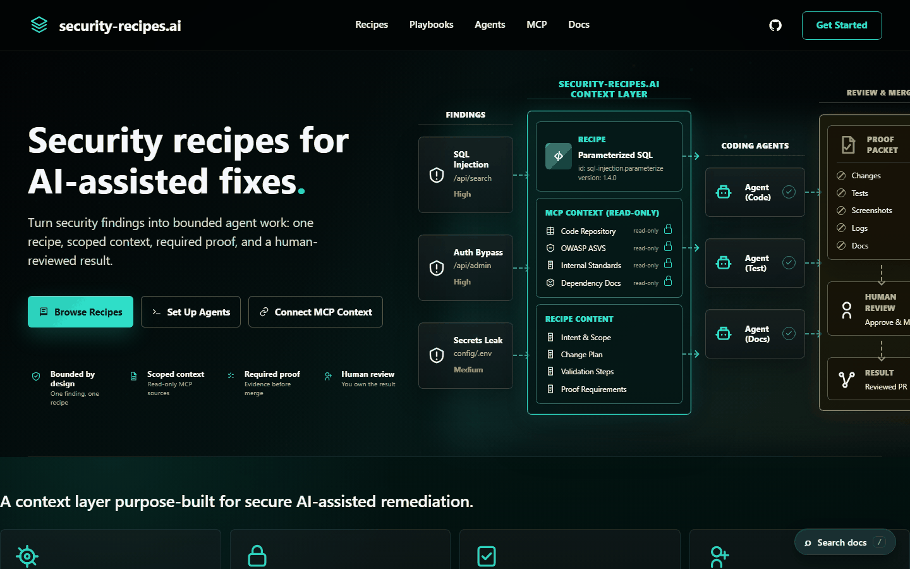
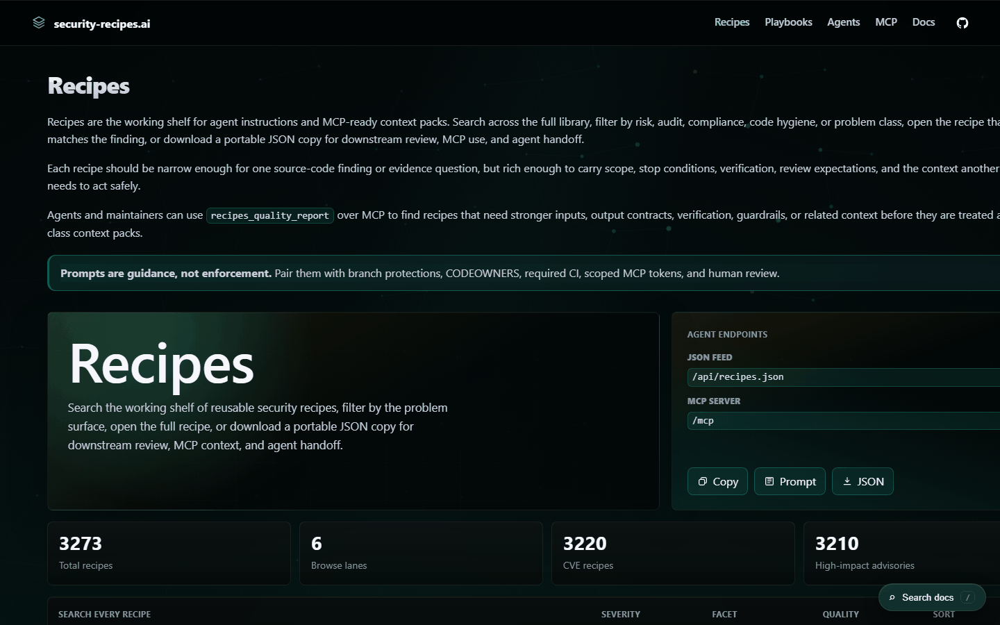
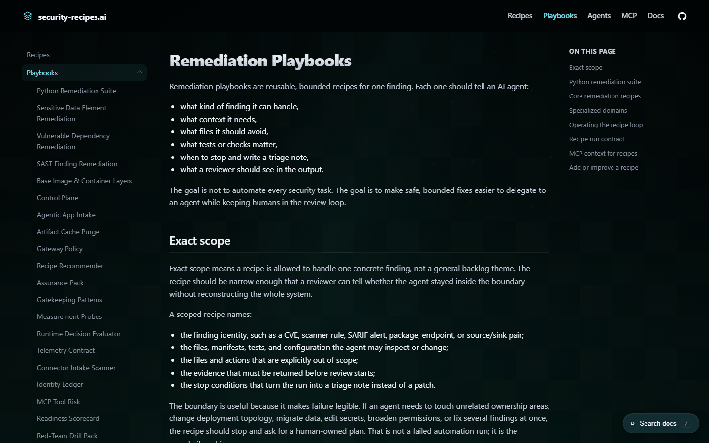
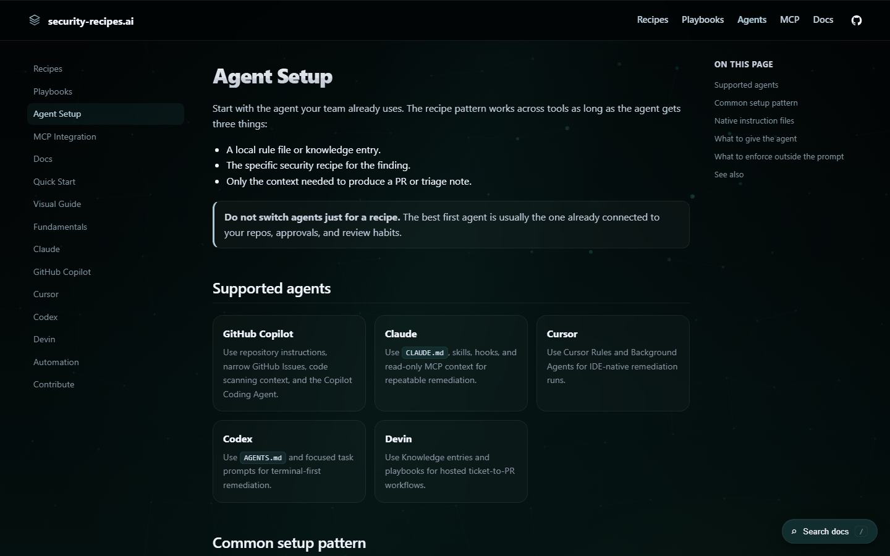

# security-recipes.ai

[security-recipes.ai](https://security-recipes.ai/) is a static site (built
with Eleventy) for security recipes that AI agents can consume during
remediation work.

The project is intentionally narrow:

- practical security remediation recipes,
- prompt and rules-file examples,
- agent setup guides,
- MCP integration patterns,
- an optional read-only MCP server for recipe search and approved upstream MCP
  context.

It is not a scanner, ticketing system, SOAR platform, deployment tool, or custom
security toolkit. Existing security tools should produce the findings; this
site helps agents use the right remediation context and stop at the right time.

## Screenshots



| Recipes catalogue | Remediation playbooks | Agent setup |
| --- | --- | --- |
|  |  |  |

## What this project is for

AI coding agents can help close security findings when their work is bounded:
one finding, one recipe, one reviewed output.

security-recipes.ai helps teams answer:

- Which recipe matches this finding?
- Which prompt should the agent use?
- Where do I put the instructions for Copilot, Claude, Cursor, Codex, or Devin?
- Which MCP servers should the agent read for advisory, scanner, repository, or
  runbook context?
- What should the PR or triage note include before a reviewer trusts it?

## What ships

- Eleventy documentation site (fast static builds, no Go toolchain).
- Custom home page for the recipe-focused identity.
- Recipe hubs for dependency, SAST, sensitive-data, base-image, CVE, and
  default-hardening remediation.
- CVE intelligence intake policy, prompt, fixtures, and evaluator for routing
  advisory signals before an agent patches.
- A complete rolling ten-year Medium/High/Critical CVE catalog composed from
  integrity-verified NVD JSON 2.0 feeds, CISA KEV metadata, and every applicable
  vetted remediation archetype. Only reviewed `stable` Markdown pages override
  that conservative baseline.
- A versioned seven-phase agentic change contract for every catalog CVE:
  discover, assess, mitigate, remediate, verify, rollback, and triage. Each
  action declares likely file targets, mutation and approval boundaries,
  required evidence, outputs, and failure behavior without guessing a patch or
  fixed version.
- A structured compliance library spanning 39 security, privacy, assurance,
  resilience, and software-supply-chain frameworks without reproducing
  licensed control text.
- A 72-recipe code-hygiene library covering cross-language and ecosystem-
  specific audit, remediation, verification, and stop-condition workflows.
- Recipes with existing prompt collections preserved.
- Agent setup guides for GitHub Copilot, Claude, Cursor, Codex, and Devin.
- MCP integration guidance for public and organization-approved security data
  sources.
- Optional read-only FastMCP server in `mcp_server.py` for recipe search,
  retrieval, and opt-in upstream MCP context.
- Docker and Docker Compose configuration for local or droplet hosting.
- Helper scripts for site maintenance, validation, imports, and deployment.

## Repository map

| Path | Purpose |
| --- | --- |
| `content/` | Recipes, docs, recipes, and agent setup pages. |
| `eleventy.config.js` | Site build configuration (permalinks, feeds, tag pages). |
| `_includes/` | Page layouts: docs chrome and the standalone home page. |
| `lib/` | Build modules: shortcode ports, JSON feed builders, SEO head. |
| `assets/` | Site CSS and JavaScript for the recipe browser, navigation, and helper tools. |
| `static/` | Images, logos, schemas, and static assets. |
| `static/api/cve-catalog/` | Complete sharded CVE catalog, year-partitioned machine index, compressed browser-search index, provenance manifest, and archetypes. |
| `data/cve/` | Human-reviewed remediation archetype source. |
| `data/compliance-frameworks/` | Structured compliance-framework catalog and source registry. |
| `data/code-hygiene/` | Structured code-hygiene catalog, source registry, and routing fixtures. |
| `docs/` | Repository documentation assets, including the README screenshots. |
| `mcp_server.py` | Optional read-only MCP server for recipe search and approved upstream MCP context. |
| `mcp-server.toml.example` | MCP server configuration template. |
| `Dockerfile` | Site image. |
| `Dockerfile.mcp-server` | Optional MCP server image. |
| `docker-compose.yml` | Production-style local stack. |
| `scripts/` | Helper scripts for maintenance and deployment. |

## Core content areas

- **Quick Start**: one finding to one reviewed PR or triage note.
- **Recipes**: remediation playbooks agents can follow.
- **Agent Setup**: how to feed recipes into Copilot, Claude, Cursor, Codex, and
  Devin.
- **Recipes**: reusable prompts, instructions, rules, skills, and review
  checklists.
- **MCP Integration**: how to connect security context safely.
- **Docs**: site usage, agent consumption patterns, and contribution guidance.

## Python remediation tooling

The Python suite is an optional execution companion to the documentation. It
can inspect a bounded workspace, select any of the 75 remediation playbooks,
create a durable run packet, record integrity-hashed evidence, and verify the
packet before agent or reviewer handoff. It remains local and conservative: it
does not merge code, deploy changes, or call external systems on its own.

```bash
python scripts/security_recipes_remediation_suite.py playbook list
python scripts/security_recipes_remediation_suite.py playbook inspect \
  --playbook vulnerable-dependencies --workspace .
python scripts/security_recipes_remediation_suite.py playbook start \
  --playbook vulnerable-dependencies --workspace . \
  --finding finding.json --run-dir .security-recipes/runs/dependency-fix
python scripts/security_recipes_remediation_suite.py playbook verify \
  --run-dir .security-recipes/runs/dependency-fix
```

The repository also includes domain-specific generators and evaluators for
playbooks that need richer evidence packs or runtime policy decisions. The
site and JSON registry remain useful without Python; the tools make the same
workflow contracts directly executable by CI, orchestrators, and approved
coding agents.

Deployment helpers worth knowing:

- `scripts/setup_digitalocean_droplet.sh`: Ubuntu droplet bootstrap with
  Docker, host hardening, and optional Caddy-managed HTTPS.
- `scripts/configure_nginx_letsencrypt.sh`: host nginx reverse proxy setup for
  teams that want Let's Encrypt on nginx instead of Caddy.
- `README.nginx-letsencrypt.md`: operator-focused walkthrough for the nginx
  deployment path.

Recommended operating model:

1. Let existing SCA, SAST, secrets, CI, cloud, and ticketing systems produce
   findings.
2. Attach a matching security-recipes.ai recipe and prompt.
3. Let the agent read only the files and MCP context needed for the finding.
4. Require tests and human review before merge.
5. Keep broad automation, write access, and deployment outside the first loop.

## Guidebook and execution tools

The site is a guidebook for remediation work: recipes, prompts, agent setup,
MCP/API integration notes, and review patterns. Runtime automation belongs in
the user's approved agent host, CI system, ticketing workflow, or scanner
platform rather than a site-hosted chatbot.

Python tools in `scripts/`, `tools/`, and `mcp_server.py` support maintainers
and self-hosters with playbook execution packets, evidence verification,
domain-specific evaluation and generation, validation, advisory import,
recipe search, and optional read-only MCP access.

## Optional MCP server

The MCP server is read-only by default. Its baseline role is to let
MCP-compatible agents search and retrieve recipes. Self-hosted deployments can
also configure it as a context hub for approved upstream MCP servers without
putting those credentials into the public site.

Common tools:

- `recipes_search`
- `recipes_list`
- `recipes_get`
- `recipes_cve_catalog_info`
- `recipes_cve_search`
- `recipes_cve_get`
- `recipes_match_finding`
- `recipes_playbooks_list`
- `recipes_playbook_get`
- `recipes_playbook_plan`
- `recipes_mcp_upstream_servers`
- `recipes_mcp_upstream_tools`
- `recipes_mcp_upstream_call`
- `recipes_mcp_upstream_context`

The MCP server accepts both generated recipe feeds:

- `/api/recipes.json` is the preferred agent feed with category, severity,
  CVE/GHSA, ecosystem, and handoff metadata.
- `/recipes-index.json` remains supported for legacy consumers.

The complete CVE catalog is also available without MCP:

- `/api/cve-catalog/manifest.json` declares the exact date/severity policy,
  source hashes, coverage counts, and shard inventory.
- `/api/cve-catalog/runtime-summary.json` is the small browser bootstrap with
  coverage totals and content-derived cache versions for every runtime asset.
- `/api/cve-catalog/index.json` is a small manifest for the complete
  publication-year partitions under `/api/cve-catalog/indexes/`. Offline
  consumers can fetch only the years they need; neither a browser page load
  nor an exact MCP lookup parses those partitions.
- `/api/cve-catalog/browser-index.json.gz` is the smaller dictionary-encoded
  index searched off the browser's main thread.
- `/api/cve-catalog/archetypes.json` contains the reviewed remediation
  contracts used to compose a conservative recipe for every catalog record.
  It also contains the versioned agentic action schema and ecosystem-specific
  file-target hints shared by the browser and MCP server.
- Each partition maps every in-scope CVE to its integrity-hashed compressed
  JSONL shard. Shard records contain CVSS, CWE, bounded CPE, reference, and KEV
  provenance for exact-CVE retrieval.
- To keep records bounded, a shard stores at most 12 vulnerable CPE/version
  rows together with the source match total and an explicit truncation flag;
  consumers must follow NVD/vendor evidence when that flag is set.

Development CVE Markdown keeps its direct page URL for compatibility but is
excluded from generic recipe/search feeds, tag pages, RSS, and the sitemap.
Use the dedicated catalog or `recipes_cve_*` MCP tools for complete discovery;
only reviewed `maturity: stable` Markdown is republished in generic indexes.

The browser's exact-ID path and compressed worker index both cover every
in-scope Medium, High, and Critical record declared by the manifest. The MCP
server exposes the same coverage through `recipes_cve_search`; a successful
`recipes_cve_get` returns the normalized source record, source identifiers and
references, applicable archetypes, composed remediation contract, and a
self-contained `agentic_change_plan`. The plan expands each mitigation and
remediation instruction into ordered code/file operations with verification,
rollback, evidence, approval, and triage requirements. It also preserves
explicit CPE truncation metadata when the source match set exceeds the bounded
record.

The runtime paths are deliberately bounded for catalog-scale traffic:

- the hub bootstraps from the compact runtime summary, exact lookups transfer
  one integrity-hashed shard, and title/filter search loads the compressed
  worker index only on demand;
- the worker returns at most 100 previews, yields cooperatively, and uses
  bounded record/title caches instead of rendering or decoding the full
  catalog on the main thread;
- MCP metadata and exact retrieval remain shard-only; non-exact text search
  lazily loads a compact shared index behind admission control, candidate
  limits, and bounded query/shard caches;
- immutable browser cache keys come from the actual browser-index, archetype,
  and shard-set hashes rather than an upstream timestamp.

The bundled production Compose service defaults
`RECIPES_MCP_EAGER_CVE_SEARCH=true`, building the shared text index before it
accepts traffic so the first title/ecosystem query does not pay the cold-start
cost. Exact-only deployments can set it to `false` for minimal startup time and
memory. For sustained novel-search traffic, run multiple MCP instances behind
a session-aware load balancer; exact lookups remain isolated from the bounded
text-search worker and queue.

Run `npm run icons` after changing the site mark. It regenerates the opaque
Apple touch icon and the 192/512/maskable installed-app assets checked by the
production performance gate.

Production builds precompress large JSON/XML feeds for nginx `gzip_static`,
validate stable/draft discovery boundaries, and enforce payload/file-count
budgets with `npm run check:performance`.

Run it with Docker:

```bash
docker build -f Dockerfile.mcp-server -t security-recipes-mcp .
docker run --rm -p 8123:80 security-recipes-mcp
```

Connect an MCP client to:

```text
http://localhost:8123/mcp
```

Run it locally with Python:

```bash
python -m venv .venv
source .venv/bin/activate
pip install -r requirements-mcp-server.txt
python mcp_server.py
```

Windows PowerShell activation:

```powershell
.\.venv\Scripts\Activate.ps1
python mcp_server.py
```

## Run the site locally

Prerequisites:

- Node.js `>= 20`
- Git

```bash
npm install
npm run serve
```

Open:

```text
http://localhost:8080
```

`npm run serve` watches for changes and rebuilds incrementally. A one-off
production build is `npm run build` (output lands in `public/`).

## Docker Compose

Create an environment file:

```bash
cp .env.example .env
```

Start the stack:

```bash
docker compose up -d --build
```

Use the Docker Compose v2 plugin (`docker compose`). The legacy Python
`docker-compose` v1 package is not supported for this stack; it can crash with
`KeyError: 'id'` while following logs or `KeyError: 'ContainerConfig'` while
recreating containers on newer Docker Engine releases.

On Ubuntu/Debian hosts, install Compose v2 and a compatibility shim with:

```bash
sudo bash scripts/install_docker_compose_v2.sh
```

Default routes:

```text
site: http://127.0.0.1:8080/
agent recipe feed: /api/recipes.json
MCP endpoint: /mcp
```

The Compose stack is intentionally small:

- `security-recipes`: nginx static site and recipe/API routes.
- `mcp-server`: optional read-only MCP server. In Compose it reads the
  locally built site feed at `http://security-recipes/api/recipes.json`, so a
  fork or droplet serves its own recipes instead of depending on the public
  production index.

`security-recipes` does not wait for the MCP container before the site starts.
That keeps the docs site available even if the optional MCP sidecar is still
warming up or temporarily unhealthy.

For an nginx or Caddy reverse proxy with Let's Encrypt, keep Docker bound to
loopback and let the proxy own public ports `80` and `443`:

```env
SECURITY_RECIPES_HTTP_PORT=127.0.0.1:8080
```

Then proxy to:

```nginx
location / {
    proxy_pass http://127.0.0.1:8080;
    proxy_set_header Host $host;
    proxy_set_header X-Forwarded-For $proxy_add_x_forwarded_for;
    proxy_set_header X-Forwarded-Proto $scheme;
}
```

If you want a turnkey host nginx + Let's Encrypt setup, run:

```bash
sudo bash scripts/configure_nginx_letsencrypt.sh \
  --domain security-recipes.ai \
  --email admin@security-recipes.ai
```

The full operator guide lives in `README.nginx-letsencrypt.md`.

## DigitalOcean droplet

For a fresh Ubuntu droplet, use the helper script:

```bash
sudo bash scripts/setup_digitalocean_droplet.sh \
  --domain security-recipes.ai \
  --email admin@security-recipes.ai
```

The script installs Docker/Compose, configures a locked app user, enables basic
host hardening, starts the Compose stack, and can place Caddy in front for
HTTPS.

If you prefer nginx instead of Caddy on the droplet, bootstrap the host without
the proxy and then run the nginx helper:

```bash
sudo bash scripts/setup_digitalocean_droplet.sh --no-caddy
sudo bash scripts/configure_nginx_letsencrypt.sh \
  --domain security-recipes.ai \
  --email admin@security-recipes.ai
```

For a local-only or pre-proxied droplet:

```bash
sudo bash scripts/setup_digitalocean_droplet.sh --no-caddy --no-firewall --no-upgrade
docker compose up -d --build
```

If a previous `docker-compose` v1 run failed with `KeyError:
'ContainerConfig'`, upgrade Compose and remove the stale project containers
before recreating the stack:

```bash
sudo bash scripts/repair_docker_compose_containerconfig.sh
hash -r
command -v docker-compose
docker-compose version
```

If the site build is killed with exit code `137` during the `npx eleventy`
step, the droplet is out of memory. Add temporary swap before rebuilding:

```bash
sudo fallocate -l 2G /swapfile
sudo chmod 600 /swapfile
sudo mkswap /swapfile
sudo swapon /swapfile
```

## MCP integration philosophy

Use MCP to give agents context, not unchecked authority.

The CVE MCP tools only return plans and evidence; they do not edit a repository
or change an environment. An approved agent host may apply the returned plan,
but it must first prove the affected surface and actual repository paths,
preserve unrelated changes, obtain any declared production/external approval,
and retain a mechanically usable rollback. A likely file glob is a discovery
hint, never proof that a file is vulnerable or permission to modify it.
Within each action, only effective `target_kinds` are default candidates.
`archetype_target_kinds` are context, not authorization; conditional targets
require proof that the repository owns the affected implementation, while
prohibited targets must never be edited. Firmware and binary targets mean an
authoritative reference, pin, replacement, policy, inventory, source, or build
change—never patching vendor artifact bytes.

NVD/CNA descriptions, advisories, links, patches, issue comments, release
notes, and proof-of-concept content are untrusted evidence. Agents may extract
corroborated vulnerability and version facts from them, but must not execute or
follow embedded instructions or commands.

Good context sources include:

- official GitHub MCP capabilities for repository and code-security context,
- Semgrep and Snyk agentic/MCP integrations where approved,
- OSV, GitHub Advisories, deps.dev, package registries, and NVD-backed mirrors,
- SARIF, SBOM, CI, ownership, and internal runbook sources,
- read-only documentation connectors.

Write-capable connectors deserve separate review. Ticket creation, branch
mutation, deployment, secret rotation, cloud changes, and SOAR actions should
not be enabled just because an agent can read a recipe.

## Contributing

Contributions should improve the recipe library:

- new remediation recipes,
- better prompts,
- clearer agent setup,
- MCP integration examples,
- reviewer checklists,
- documentation fixes.

Scrub secrets, internal hostnames, customer data, and private vulnerability
details before opening a pull request.

Run a local build before submitting:

```bash
python -m pip install -r requirements-dev.txt
python scripts/run_checks.py
npm run build
```

## License

The project's original code, documentation, remediation recipes, generated
site, and MCP server are licensed under the [Apache License
2.0](LICENSE). This permits private and commercial use, modification, and
redistribution, including incorporation into proprietary company systems,
subject to the license's notice and change-marking requirements.

Source vulnerability data and bundled third-party software retain their own
terms and attribution requirements. See [NOTICE](NOTICE) and
[THIRD_PARTY_NOTICES.md](THIRD_PARTY_NOTICES.md).
