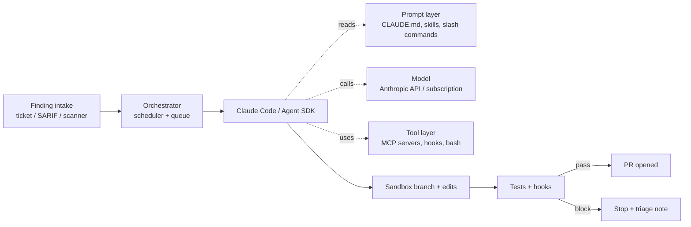


**Outcome.** A Claude Code agent picks up findings from any source
(SARIF, ticket, message), runs the matching skill, and ships a PR — with
hooks blocking unsafe edits before they happen.


Claude — via **Claude Code**, the **Claude Agent SDK**, and **MCP** — can
drive end-to-end remediation: triage, fix, test, and ship. Skills encode
your house rules; hooks enforce them; MCP servers bring in your real
context.

## Prerequisites

- Claude Code installed (or the Claude Agent SDK for headless workflows)
- An Anthropic API key **or** a Claude Pro / Team / Enterprise subscription
- An MCP connector for the system that owns your findings
- A `CLAUDE.md` at the repo root

## General onboarding

The public path — what any individual or team can do today via
Anthropic's documented setup.

1. **Pick a plan.** Claude Code works with Pro, Team, or
   Enterprise Claude subscriptions, or with an Anthropic Console
   API key. See [Claude.com pricing](https://claude.com/pricing).
2. **Install Claude Code.** Use the installer for your OS — see
   the section below, or Anthropic's
   [install overview](https://code.claude.com/docs/en/overview).
3. **First run.** `claude` in any project directory; sign in on
   first launch. See the
   [quickstart](https://code.claude.com/docs/en/quickstart).
4. **Configure the repo.** Commit a `CLAUDE.md` at the repo
   root for house rules, add skills under `.claude/skills/`, and
   (optionally) hooks under `.claude/settings.json`. See
   [hooks](https://code.claude.com/docs/en/hooks).
5. **Wire MCP servers** via `.mcp.json` to give Claude tools
   beyond local files. See
   [Claude Code MCP](https://code.claude.com/docs/en/mcp).
6. **Automate in CI** with the Claude Code GitHub Action or the
   Agent SDK. See
   [GitHub Actions](https://code.claude.com/docs/en/github-actions)
   and
   [Agent SDK overview](https://code.claude.com/docs/en/agent-sdk/overview).
7. **Review trust + compliance** at
   [trust.anthropic.com](https://trust.anthropic.com).

**Vendor-side reference index:**

- [Claude Code overview](https://code.claude.com/docs/en/overview) — install + first-run
- [Quickstart](https://code.claude.com/docs/en/quickstart)
- [Setup (advanced)](https://code.claude.com/docs/en/setup) — manual updates, uninstall, proxies
- [Agent SDK overview](https://code.claude.com/docs/en/agent-sdk/overview)
- [GitHub Actions](https://code.claude.com/docs/en/github-actions)
- [MCP](https://code.claude.com/docs/en/mcp)
- [Hooks](https://code.claude.com/docs/en/hooks)
- [Pricing](https://claude.com/pricing)
- [Anthropic trust & compliance](https://trust.anthropic.com)

## Enterprise onboarding


**Placeholder — customize for your organization.** Replace the
steps and links below with your internal process for getting a
Claude license, a workspace, and the permissions this recipe
expects. The structure is a starting point so every recipe on
this site has a consistent "how does my team actually start
using this at my company?" section. Forks of this project are
expected to fill this in for their own organizations.


1. **Request access.** File an IT ticket for a Claude Team or
   Enterprise seat. Internal link:
   [Request Claude access](#placeholder-itsm-link).
2. **Join the workspace.** Accept the invite to your org's Anthropic
   Console workspace once Security approves. Internal link:
   [Anthropic Console workspace](#placeholder-workspace-link).
3. **Bind to corporate SSO / MFA.** Bind the account to your
   identity provider per the standard IT guide. Internal link:
   [SSO enrollment](#placeholder-sso-link).
4. **Scope GitHub / GitLab access.** Make sure the Claude Code
   integration (and any Claude-facing MCP connectors) is installed
   on the org and granted to the repos this recipe targets —
   nothing broader.
5. **Complete internal training.** Read the internal rules of
   engagement for using Claude Code on production repos before
   running any recipe end-to-end. Internal link:
   [InfoSec AI usage policy](#placeholder-policy-link).

## Install Claude Code

Anthropic's [install configurator](https://code.claude.com/docs/en/overview)
is the source of truth. The commands below are the current options.


  
```bash
# Native installer — auto-updates in the background
curl -fsSL https://claude.ai/install.sh | bash

# Start Claude Code in any project (you'll be prompted to sign in on first run)
cd your-project
claude
```
  
  
```bash
# Homebrew cask — does NOT auto-update; run `brew upgrade claude-code` periodically
brew install --cask claude-code

# Latest channel (ships new versions as soon as they're released):
# brew install --cask claude-code@latest
```
  
  
```powershell
# Requires Git for Windows: https://git-scm.com/downloads/win
irm https://claude.ai/install.ps1 | iex
```
  
  
```batch
REM Requires Git for Windows: https://git-scm.com/downloads/win
curl -fsSL https://claude.ai/install.cmd -o install.cmd && install.cmd && del install.cmd
```
  
  
```powershell
winget install Anthropic.ClaudeCode
```
  


Verify the install with `claude --version`. When authentication is
interactive (the default), running `claude` opens a browser for sign-in.
For headless / CI use, set `ANTHROPIC_API_KEY` instead — see
[third-party integrations](https://code.claude.com/docs/en/third-party-integrations)
to run on Bedrock, Vertex AI, or Azure Foundry.


**IDE plugins.** Claude Code also ships as a
[VS Code / Cursor extension](https://marketplace.visualstudio.com/items?itemName=anthropic.claude-code),
a [JetBrains plugin](https://plugins.jetbrains.com/plugin/27310-claude-code-beta-),
and a [native Desktop app](https://claude.com/download). All surfaces share
the same `CLAUDE.md`, skills, and MCP config.


## Recipe steps

### 1. Commit `CLAUDE.md` at the repo root

`CLAUDE.md` is the file Claude Code reads before every session. Put
your house rules here — how to build, test, name branches, and what
the agent should never touch.

```markdown
# CLAUDE.md

## Project
Payment service. Node.js 20, TypeScript, Fastify, Postgres.

## Build & test
- Install: `pnpm install`
- Build:   `pnpm build`
- Test:    `pnpm test`        (unit)
- Test:    `pnpm test:int`    (integration, requires Postgres)
- Lint:    `pnpm lint --fix`

Always run `pnpm lint --fix && pnpm test` before opening a PR.

## Remediation conventions
- Branch: `fix/<finding-id>` (e.g. `fix/CVE-2026-1234`)
- Commit: Conventional Commits. `fix(deps):`, `fix(sec):`, etc.
- PR title: `fix: <one line>`
- PR body: must link the finding ID and explain blast radius.

## Never touch without explicit instruction
- `**/migrations/**`     — DB schema migrations
- `**/terraform/**`      — infra
- `**/*.generated.ts`    — codegen output
- `packages/*/package-lock.json` unless the task is a dep bump

## Out-of-scope questions
If the fix would change a public API or a DB column, **stop and ask**.
```


**Keep it short.** `CLAUDE.md` is injected into every session. A
400-line rulebook crowds out the actual task. Aim for under 100
lines; push details into skills.


### 2. Build a remediation skill

Skills are reusable, version-controlled recipes that Claude Code
auto-loads when the task description matches. Put them in
`.claude/skills/<name>/SKILL.md`.

```markdown
---
name: remediate-cve
description: >
  Use this skill whenever a CVE / SCA finding is provided (by ID,
  advisory link, or ticket). Upgrades the affected package, updates
  lockfiles, adds a test where practical, and opens a PR.
---

# remediate-cve

## When to use
Trigger on: CVE IDs, GHSA IDs, Snyk SNYK-* identifiers, or a Jira /
Linear ticket whose title mentions "vulnerability", "CVE", or
"dependency upgrade".

## Workflow
1. Read the advisory. Record affected package, affected range, and
   fixed version.
2. Read `package.json` / `go.mod` / `requirements.txt` and find how
   the affected package enters the dep tree.
3. Branch: `git switch -c fix/<finding-id>`.
4. Upgrade the smallest thing that fixes the finding.
   - Direct dep: bump in manifest.
   - Transitive only: try lockfile override (`overrides`, `resolutions`).
5. Regenerate lockfile with the correct package manager.
6. Run `pnpm test` (or the project's test command from CLAUDE.md).
7. If tests pass, open a PR. If not, stop and summarize.

## Output
- Branch pushed.
- PR opened, linked to finding ID.
- PR body explains: what changed, why, blast radius, rollback plan.

## Never
- Never cross a major version without explicitly stating "major bump
  required" in the PR body.
- Never disable a test to make CI green.
- Never commit to the lockfile without running the package manager.
```

You can have many skills. A good starter set:
`remediate-cve`, `remediate-secret`, `remediate-lint`,
`triage-finding`.

### 3. Configure pre-tool hooks

Hooks are deterministic checks that run **before** Claude calls a
tool. If the hook exits non-zero, the tool call is blocked — the
model literally cannot do the thing. Put hooks in
`.claude/settings.json`.

```json
{
  "hooks": {
    "PreToolUse": [
      {
        "matcher": "Edit|Write",
        "hooks": [
          { "type": "command", "command": ".claude/hooks/block-risky-paths.sh" },
          { "type": "command", "command": ".claude/hooks/require-test-if-code.sh" }
        ]
      },
      {
        "matcher": "Bash",
        "hooks": [
          { "type": "command", "command": ".claude/hooks/no-dangerous-shell.sh" }
        ]
      }
    ],
    "PostToolUse": [
      {
        "matcher": "Edit|Write",
        "hooks": [
          { "type": "command", "command": ".claude/hooks/scan-secrets.sh" }
        ]
      }
    ]
  }
}
```

Example hook: `.claude/hooks/block-risky-paths.sh`

```bash
#!/usr/bin/env bash
set -euo pipefail
# Reads the pending tool call from stdin as JSON.
INPUT=$(cat)
PATH_ARG=$(echo "$INPUT" | jq -r '.tool_input.file_path // empty')

case "$PATH_ARG" in
  */migrations/*|*/terraform/*|*.generated.*)
    echo "BLOCKED: $PATH_ARG is in a protected path (see CLAUDE.md)" >&2
    exit 2
    ;;
esac
exit 0
```


**Hooks are trust boundaries.** Anything that would be catastrophic
to get wrong (lockfile edits during a non-dep-bump task, writes to
`migrations/`, pushes to `main`) belongs in a hook — not in a
prompt instruction. The model can ignore a prompt; it cannot
override a hook.


### 4. Wire an MCP server for your scanner

MCP is how Claude Code reaches your real data. The agent should be
able to `list_findings`, `get_finding(id)`, and close the finding
on merge — without you pasting anything.

`.mcp.json` at the repo root:

```json
{
  "mcpServers": {
    "snyk": {
      "command": "npx",
      "args": ["-y", "@snyk/mcp-server"],
      "env": {
        "SNYK_TOKEN": "${env:SNYK_READONLY_TOKEN}"
      }
    },
    "jira": {
      "command": "npx",
      "args": ["-y", "@modelcontextprotocol/server-jira"],
      "env": {
        "JIRA_BASE_URL": "https://example.atlassian.net",
        "JIRA_API_TOKEN": "${env:JIRA_TOKEN}",
        "JIRA_USER_EMAIL": "${env:JIRA_USER}"
      }
    },
    "github": {
      "command": "npx",
      "args": ["-y", "@modelcontextprotocol/server-github"],
      "env": {
        "GITHUB_PERSONAL_ACCESS_TOKEN": "${env:GH_TOKEN}"
      }
    }
  }
}
```

Start **read-only**. Add write scopes only after you've watched the
agent run for a week and know the tool calls you need.

See the [MCP Server Access]() page for
the wider connector catalog.

### 5. Automate with the Agent SDK (batch mode)

For scheduled or webhook-driven runs, drive Claude headlessly from
CI using the **Claude Agent SDK** (renamed from "Claude Code SDK" —
see the [migration guide](https://code.claude.com/docs/en/agent-sdk/migration-guide)).

Install:

```bash
# TypeScript
npm install @anthropic-ai/claude-agent-sdk

# Python
pip install claude-agent-sdk
```

Run a batch of findings:

```typescript
import { query } from "@anthropic-ai/claude-agent-sdk";
import { readFileSync } from "node:fs";

for (const finding of await queue.next(20)) {
  const systemPrompt = readFileSync("./CLAUDE.md", "utf8");

  for await (const message of query({
    prompt: `Use the remediate-cve skill on ${finding.id}.`,
    options: {
      cwd: finding.repoPath,
      model: "Opus 4.7",
      customSystemPrompt: systemPrompt,
      allowedTools: ["Read", "Edit", "Bash", "mcp__snyk", "mcp__github"],
      mcpServers: {
        snyk:   { command: "npx", args: ["-y", "@snyk/mcp-server"] },
        github: { command: "npx", args: ["-y", "@modelcontextprotocol/server-github"] },
      },
      hooks: {
        PreToolUse: [
          { matcher: "Edit|Write", hooks: [/* callback here */] },
        ],
      },
      maxTurns: 30,
    },
  })) {
    if ("result" in message) await queue.record(finding.id, message);
  }
}
```

The SDK takes the same `CLAUDE.md`, skills (`.claude/skills/*/SKILL.md`),
and MCP config as interactive Claude Code — your batch runs inherit
the same rules. For the full API, see
[Agent SDK overview](https://code.claude.com/docs/en/agent-sdk/overview)
and [TypeScript / Python reference](https://code.claude.com/docs/en/agent-sdk/typescript).

### 6. Dispatch from GitHub, Jira, Linear, or any webhook

Claude Code runs fine interactively, but the recipe earns its keep
when findings *dispatch themselves*. Pick whichever input your
org already has:


  
Run the [official Claude Code GitHub Actions integration](https://code.claude.com/docs/en/github-actions)
to react to issues, PRs, or workflow events — no driver script needed.

```yaml
# .github/workflows/claude-remediate.yml
name: Claude remediate
on:
  issues:
    types: [labeled]

permissions:
  contents: write
  issues: write
  pull-requests: write

jobs:
  remediate:
    if: github.event.label.name == 'claude-remediate'
    runs-on: ubuntu-latest
    steps:
      - uses: actions/checkout@v4
      - uses: anthropics/claude-code-action@v1
        with:
          anthropic_api_key: ${{ secrets.ANTHROPIC_API_KEY }}
          prompt: |
            Use the `remediate-cve` skill on issue
            #${{ github.event.issue.number }}:
            ${{ github.event.issue.body }}
```
  
  
For finer-grained control, POST to your own runner on label or
`issue_comment`. The Action invokes the Agent SDK with the finding
context:

```yaml
# .github/workflows/claude-dispatch.yml
on:
  issues: { types: [labeled] }
  issue_comment: { types: [created] }

jobs:
  dispatch:
    if: |
      (github.event.label.name == 'claude-remediate') ||
      contains(github.event.comment.body, '/claude remediate')
    runs-on: ubuntu-latest
    steps:
      - uses: actions/checkout@v4
      - uses: actions/setup-node@v4
        with: { node-version: 20 }
      - run: npm install @anthropic-ai/claude-agent-sdk
      - run: node scripts/claude-dispatch.mjs
        env:
          ANTHROPIC_API_KEY: ${{ secrets.ANTHROPIC_API_KEY }}
          ISSUE_NUMBER: ${{ github.event.issue.number }}
          ISSUE_BODY:   ${{ github.event.issue.body }}
          GH_TOKEN:     ${{ secrets.GITHUB_TOKEN }}
```
  
  
Use a Jira Automation rule (or Linear webhook) to POST to a small
intake service that then triggers a GitHub Actions
`workflow_dispatch`. This keeps the ticket and the fix linked
without special-casing either system:

```bash
# Jira Automation → Send web request → POST to your intake
curl -sS -X POST https://api.github.com/repos/$OWNER/$REPO/actions/workflows/claude-dispatch.yml/dispatches \
  -H "Authorization: Bearer $GH_PAT" \
  -H "Accept: application/vnd.github+json" \
  -d '{"ref":"main","inputs":{"ticket_key":"'"$ISSUE_KEY"'","brief":"'"$ISSUE_SUMMARY"'"}}'
```

The workflow then reads the ticket via MCP (`@modelcontextprotocol/server-jira`)
for full context, runs the skill, opens a PR, and posts the PR URL
back to the ticket as a comment.
  
  
For a nightly sweep of the open backlog, use a
[Claude Code Routine](https://code.claude.com/docs/en/routines) (hosted)
or a GitHub Actions schedule:

```yaml
on:
  schedule:
    - cron: "0 3 * * *"   # 03:00 UTC

jobs:
  sweep:
    runs-on: ubuntu-latest
    steps:
      - uses: actions/checkout@v4
      - uses: anthropics/claude-code-action@v1
        with:
          anthropic_api_key: ${{ secrets.ANTHROPIC_API_KEY }}
          prompt: |
            Use the `triage-finding` skill to sweep open findings
            in the Snyk MCP. Cap at 5 PRs per run.
```
  


Whichever path you pick, the agent writes the PR — branch protections
and required CI are what gate the merge. The ticket system is where
the paper trail lives; use MCP connectors so Claude can comment on
the source ticket when the PR opens, so the ticket/PR/finding triple
stays tracked.

## Verification

Run `claude` in a sample repo and ask it to remediate a known finding.
You should see:

- the `remediate-cve` skill kick in automatically,
- hooks fire (and block) on any risky edit attempts — test this by
  asking the agent to "add a comment to `migrations/001_init.sql`"
  and confirming it's blocked,
- a PR with a test, a summary, and a link back to the finding,
- the MCP connector marking the finding resolved on merge.

## Orchestration: what stays constant, what changes

The orchestration spine — how a finding becomes a PR — is the
piece you want to design once and leave alone. Everything else
(the wording of the prompt, the model behind it, the MCP tools it
can reach) is expected to evolve as you learn and as better
pieces ship. Keeping those concerns separate is what makes the
system maintainable.



What is **constant** (build once, leave alone):

- The intake → queue → sandbox → review → merge loop.
- The branch-naming, PR template, and labelling conventions.
- The "one finding, one PR" rule and the revert policy.
- The separation between prompt, model, and tool layers.

What **evolves** (expected to change, often):

- **Prompt.** `CLAUDE.md` gets refined quarterly. Skills under
  `.claude/skills/*/SKILL.md` are added, split, and deprecated.
  Slash-command wording gets tuned based on reviewer feedback.
- **Model.** Upgrade the Claude model version as newer ones
  improve on your evals. The orchestration doesn't change; the
  model string does.
- **Tools.** New MCP servers get added as you connect new
  sources of context (ticket systems, scanners, runbooks).
  `PreToolUse` / `PostToolUse` hooks are added as new guardrails
  earn their place.

The payoff: when you swap the model or add an MCP connector, you
do **not** rewrite the dispatch loop, the review policy, or the
PR template — those have already earned their keep.

## Guardrails

- **Skills over prompts.** Anything you'd paste repeatedly belongs in a
  skill. Skills are reviewable, version-controlled, and testable.
- **Hooks are hard stops.** Use hooks for invariants you never want the
  model to violate — they run locally, deterministically, before the
  tool call.
- **MCP = least privilege.** Give the agent a read-only token unless a
  specific flow explicitly needs write.
- **No auto-merge.** Claude opens PRs; humans merge them. Full stop.

## Troubleshooting

- **Skill isn't triggering.** Check the `description:` frontmatter —
  that's what the matcher reads. Make it unambiguous about
  *when* to use the skill.
- **Hook always exits 0 but isn't blocking.** Exit code 2 is the
  block signal for `PreToolUse`. Exit 0 allows; exit 1 is a
  non-blocking warning.
- **MCP tool not visible.** Run `/mcp` inside Claude Code — it
  lists the loaded servers and their tools. If yours is missing,
  the server crashed at startup; check stderr.

## See also

- Anthropic: [Claude Code overview](https://code.claude.com/docs/en/overview) · [quickstart](https://code.claude.com/docs/en/quickstart) · [setup](https://code.claude.com/docs/en/setup)
- Anthropic: [Agent SDK overview](https://code.claude.com/docs/en/agent-sdk/overview) · [hooks](https://code.claude.com/docs/en/hooks) · [MCP](https://code.claude.com/docs/en/mcp) · [skills](https://code.claude.com/docs/en/skills)
- Anthropic: [GitHub Actions integration](https://code.claude.com/docs/en/github-actions) · [GitLab CI/CD](https://code.claude.com/docs/en/gitlab-ci-cd)
- [MCP Server Access]() — connector catalog
- Recipe: [Cursor]() — similar MCP + rules pattern
- [Prompt Library]() — share your Claude skills & hooks
