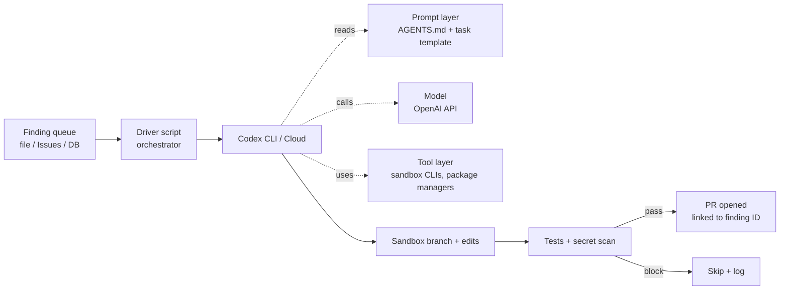


**Outcome.** A nightly Codex job pulls the open remediation backlog,
attempts each fix in an isolated sandbox, and posts PRs with detailed
remediation notes.


OpenAI's Codex (CLI + cloud agent) is purpose-built for sandboxed,
repo-aware tasks — a strong fit for **batch** remediation jobs. The
recipe is: a small driver script, a standing `AGENTS.md`, and a
per-task prompt template. Codex handles the rest inside its sandbox.

## Prerequisites

- Codex CLI or Codex Cloud access
- Org-level API key with appropriate quota
- A queue (file, table, or Issues label) listing findings to remediate
- Containerised CI runner with Docker / sandbox support

## General onboarding

The public path — what any individual or team can do today using
OpenAI's documented Codex CLI flow.

1. **Get an OpenAI account.** Sign up at
   [platform.openai.com](https://platform.openai.com/) or
   sign in with ChatGPT. An active paid plan (or API credit) is
   required. See
   [OpenAI API pricing](https://openai.com/api/pricing).
2. **Install the Codex CLI.** See the section below, or
   Anthropic's — sorry, OpenAI's —
   [quickstart](https://developers.openai.com/codex/quickstart).
3. **Authenticate.** Use OAuth (`codex login`), device-code
   flow (`codex login --device-auth`), or an API key. See
   [authentication](https://developers.openai.com/codex/auth).
4. **Configure the repo.** Add `AGENTS.md` at the repo root for
   house rules and a `.codex/config.toml` for per-repo tooling
   preferences. See
   [Codex config reference](https://developers.openai.com/codex/config-basic).
5. **Run non-interactively** with `codex exec --full-auto
   --json` for CI / scheduled workflows. See
   [non-interactive mode](https://developers.openai.com/codex/noninteractive).
6. **Pick the right model.** Start with `gpt-5.3-codex`; the
   [models page](https://developers.openai.com/codex/models)
   lists what's available.
7. **Review enterprise privacy + trust.** See
   [OpenAI enterprise privacy](https://openai.com/enterprise-privacy)
   and
   [trust.openai.com](https://trust.openai.com).

**Vendor-side reference index:**

- [Codex CLI docs](https://developers.openai.com/codex/cli)
- [Codex quickstart](https://developers.openai.com/codex/quickstart)
- [Authentication](https://developers.openai.com/codex/auth)
- [CLI command reference](https://developers.openai.com/codex/cli/reference)
- [Non-interactive mode (`codex exec`)](https://developers.openai.com/codex/noninteractive)
- [Models](https://developers.openai.com/codex/models)
- [Config reference](https://developers.openai.com/codex/config-basic)
- [OpenAI enterprise privacy](https://openai.com/enterprise-privacy)
- [API pricing](https://openai.com/api/pricing)
- [OpenAI trust & compliance](https://trust.openai.com)

## Enterprise onboarding


**Placeholder — customize for your organization.** Replace the
steps and links below with your internal process for getting an
OpenAI / Codex enterprise API key, approving use of the hosted
endpoints, and standing up the sandbox this recipe expects. The
structure is a starting point so every recipe on this site has a
consistent "how does my team actually start using this at my
company?" section. Forks of this project are expected to fill
this in for their own organizations.


1. **Request access.** File an IT ticket for an OpenAI API key on
   your org's enterprise account. Internal link:
   [Request OpenAI / Codex access](#placeholder-itsm-link).
2. **Issue a scoped API key.** Your platform team issues a
   least-privilege key with the quota and model allowlist this
   recipe needs (e.g. `gpt-5.3-codex` only). Internal link:
   [API key request](#placeholder-key-link).
3. **Bind to corporate SSO.** Enterprise OpenAI accounts support
   SSO — bind the account to your identity provider per the
   standard IT guide. Internal link:
   [SSO enrollment](#placeholder-sso-link).
4. **Approve the hosted endpoint.** Get the OpenAI API added to
   your egress allowlist for the CI runner that will execute the
   Codex driver. Internal link:
   [Egress allowlist request](#placeholder-egress-link).
5. **Complete internal training.** Read the internal rules of
   engagement for hosted-LLM use on production repos, and confirm
   the data-handling classification for anything you send to the
   API. Internal link:
   [InfoSec AI usage policy](#placeholder-policy-link).

## Install the Codex CLI

Requires Node.js 18+. See the official
[install / quickstart](https://developers.openai.com/codex/quickstart)
for the authoritative steps.


  
```bash
npm i -g @openai/codex
```
  
  
```bash
brew install --cask codex
```
  
  
```bash
npm i -g @openai/codex
```
  
  
```bash
# Inside WSL2 Ubuntu
npm i -g @openai/codex
```
  


Authenticate with `codex login`:

- **ChatGPT OAuth (default):** `codex login` opens a browser — works for
  ChatGPT Plus / Pro / Business / Enterprise plans.
- **Device code (headless):** `codex login --device-auth` prints a code
  to pair from another device.
- **API key (CI):** `printenv OPENAI_API_KEY | codex login --with-api-key`.

Confirm with `codex --version`. For CI runs, set `OPENAI_API_KEY` as a
secret; for ChatGPT-plan auth in CI, pre-bake the auth token into the
runner image. See [authentication](https://developers.openai.com/codex/auth)
for the full matrix.

## Recipe steps

### 1. Commit `AGENTS.md` at the repo root

`AGENTS.md` is Codex's session-level system prompt. Treat it like a
contributing guide written for a new engineer who needs to be
productive in 10 minutes.

```markdown
# AGENTS.md

## Project
Payments service. Node.js 20, TypeScript, Fastify, Postgres.
Monorepo managed by pnpm workspaces (`packages/*`).

## Setup
- Install: `pnpm install --frozen-lockfile`
- Build:   `pnpm -r build`
- Test:    `pnpm -r test`
- Lint:    `pnpm -r lint`

## Conventions
- TypeScript, strict mode. No `any` without a comment explaining why.
- Errors: never swallow; wrap with context.
- Tests: Vitest. Put unit tests next to code; integration tests in
  `test/integration/`.

## Remediation rules
- Branch: `fix/<finding-id>` (e.g. `fix/CVE-2026-1234`).
- PR title: `fix: <one-line summary>`.
- PR body: must link the finding ID and note blast radius.

## Out of scope
Do not modify (without explicit instruction):
- `db/migrations/**`
- `infra/terraform/**`
- `**/*.generated.ts`
- `pnpm-lock.yaml` unless the task is an explicit dep bump.

## Stop conditions
Stop and ask a human before:
- changing a public API signature,
- changing a DB column or constraint,
- disabling or skipping any test,
- upgrading across a major version.
```

### 2. Write a driver script

The driver reads findings off a queue, fills a prompt template, and
invokes Codex in full-auto inside a sandbox. Keep it small — this
is the piece you rely on for years.

```bash
#!/usr/bin/env bash
# scripts/remediate.sh
# Uses `codex exec` (the non-interactive subcommand) with --full-auto
# so the agent can read, edit, run commands, and use the network inside
# its sandbox without prompting. See:
# https://developers.openai.com/codex/noninteractive
set -euo pipefail

QUEUE="${1:?usage: remediate.sh <queue-file>}"
WORKDIR=$(mktemp -d)
trap 'rm -rf "$WORKDIR"' EXIT

# Pin the model string in one place — upgrade here when a new Codex
# model ships. Valid strings today include `gpt-5.3-codex` (Codex-tuned)
# and `gpt-5.4` (general); see https://developers.openai.com/codex/models
CODEX_MODEL="${CODEX_MODEL:-gpt-5.3-codex}"

while IFS= read -r finding_id; do
  echo "→ remediating $finding_id"

  # Fresh clone per finding, so branches never cross-contaminate.
  git clone --depth 1 "$REPO_URL" "$WORKDIR/$finding_id"
  pushd "$WORKDIR/$finding_id" >/dev/null

  # Fill the per-task prompt (envsubst only substitutes listed vars).
  export FINDING_ID="$finding_id"
  PROMPT=$(envsubst '$FINDING_ID' < ../../prompts/remediate.tmpl.md)

  # Invoke Codex non-interactively with a hard wall-clock cap.
  # --full-auto enables workspace-write + network inside the sandbox.
  # --json streams structured events to stdout for replay/audit.
  timeout 20m codex exec \
      --full-auto \
      --model "$CODEX_MODEL" \
      --json \
      "$PROMPT" \
      > "../../logs/$finding_id.jsonl" \
    || { echo "✗ $finding_id: codex failed"; popd; continue; }

  # Open the PR (Codex pushed the branch; we add the tracking metadata).
  gh pr create \
    --title "fix: remediate $finding_id" \
    --body "Closes $finding_id. Session log: logs/$finding_id.jsonl" \
    --base main \
    --head "fix/$finding_id" \
    --draft

  popd >/dev/null
done < "$QUEUE"
```


**`codex exec` vs interactive `codex`.** `codex exec` is the
non-interactive subcommand designed for scripts and CI — it streams
output to stdout (or JSONL with `--json`) and exits when the task is
complete. Interactive `codex` opens the TUI and is not suitable for
headless runs. See the [command reference](https://developers.openai.com/codex/cli/reference)
for every flag.


### 3. Define a per-task prompt template

Keep task-specific wording out of `AGENTS.md` — put it in a
template the driver fills in per finding.

```markdown
<!-- prompts/remediate.tmpl.md -->
You are remediating a security finding.

Finding ID: $FINDING_ID

Steps:
1. Look up $FINDING_ID in the advisory database via the
   `advisory` CLI tool available in the sandbox.
2. Identify the affected package and fixed version.
3. Branch: `fix/$FINDING_ID`.
4. Apply the minimum change that closes the finding.
5. Run `pnpm -r lint --fix && pnpm -r test`.
6. If tests pass, commit and push the branch. If not, stop and
   write a summary to `REMEDIATION_NOTES.md` explaining what you
   tried and why it did not work.

Do not touch files outside the scope declared in AGENTS.md.
Do not disable tests.
```

### 4. Run in a sandbox

`codex --full-auto` grants file + network access. **Never** run it
on a developer laptop or a shared runner with production
credentials. The driver above spawns fresh clones; run the whole
thing inside a Docker container:

```dockerfile
# ci/codex-sandbox.Dockerfile
FROM node:20-bookworm-slim

RUN apt-get update && apt-get install -y --no-install-recommends \
      git curl jq gettext-base ca-certificates \
      python3 python3-pip \
    && rm -rf /var/lib/apt/lists/*

RUN npm install -g @openai/codex pnpm gh

WORKDIR /workspace
COPY scripts/ ./scripts/
COPY prompts/ ./prompts/

ENTRYPOINT ["/workspace/scripts/remediate.sh"]
```

### 5. Run it from CI on a schedule (and wire it to tickets)

The driver can be triggered by whatever surface your findings arrive
on. Pick one — they all use the same Docker sandbox + queue.txt
contract.


  
```yaml
# .github/workflows/codex-remediate.yml
name: Nightly Codex remediation
on:
  schedule:
    - cron: "0 3 * * *"   # 03:00 UTC nightly
  workflow_dispatch:

jobs:
  remediate:
    runs-on: ubuntu-latest
    permissions:
      contents: read
      pull-requests: write
    steps:
      - uses: actions/checkout@v4
      - name: Build sandbox
        run: docker build -f ci/codex-sandbox.Dockerfile -t codex-sandbox .
      - name: Fetch open findings
        run: gh api /repos/${{ github.repository }}/dependabot/alerts \
              --jq '.[] | select(.state=="open") | .number' > queue.txt
        env: { GH_TOKEN: ${{ secrets.GITHUB_TOKEN }} }
      - name: Run Codex
        run: |
          docker run --rm \
            -v "$PWD/queue.txt:/workspace/queue.txt:ro" \
            -e OPENAI_API_KEY=${{ secrets.OPENAI_API_KEY }} \
            -e REPO_URL=https://x-access-token:${{ secrets.GITHUB_TOKEN }}@github.com/${{ github.repository }} \
            codex-sandbox /workspace/queue.txt
```
  
  
```yaml
# .github/workflows/codex-on-label.yml
name: Codex on label
on:
  issues:
    types: [labeled]

jobs:
  remediate:
    if: github.event.label.name == 'codex-remediate'
    runs-on: ubuntu-latest
    permissions:
      contents: read
      issues: write
      pull-requests: write
    steps:
      - uses: actions/checkout@v4
      - run: docker build -f ci/codex-sandbox.Dockerfile -t codex-sandbox .
      - run: echo "${{ github.event.issue.number }}" > queue.txt
      - run: |
          docker run --rm \
            -v "$PWD/queue.txt:/workspace/queue.txt:ro" \
            -e OPENAI_API_KEY=${{ secrets.OPENAI_API_KEY }} \
            -e REPO_URL=https://x-access-token:${{ secrets.GITHUB_TOKEN }}@github.com/${{ github.repository }} \
            codex-sandbox /workspace/queue.txt
      - run: |
          gh issue comment ${{ github.event.issue.number }} \
            --body "Codex finished — see PRs linked above."
        env: { GH_TOKEN: ${{ secrets.GITHUB_TOKEN }} }
```
  
  
```yaml
# .github/workflows/codex-on-dependabot.yml
# Kicks off the moment a new dependabot security advisory lands.
name: Codex on dependabot alert
on:
  dependabot_alert:
    types: [created, reopened]

jobs:
  remediate:
    runs-on: ubuntu-latest
    permissions:
      contents: read
      pull-requests: write
      security-events: read
    steps:
      - uses: actions/checkout@v4
      - run: docker build -f ci/codex-sandbox.Dockerfile -t codex-sandbox .
      - run: echo "${{ github.event.alert.number }}" > queue.txt
      - run: |
          docker run --rm \
            -v "$PWD/queue.txt:/workspace/queue.txt:ro" \
            -e OPENAI_API_KEY=${{ secrets.OPENAI_API_KEY }} \
            -e REPO_URL=https://x-access-token:${{ secrets.GITHUB_TOKEN }}@github.com/${{ github.repository }} \
            codex-sandbox /workspace/queue.txt
```
  
  
Configure a Jira Automation rule (or Linear webhook) to POST to a
GitHub `workflow_dispatch` endpoint — that's the easiest way to keep
the ticket/PR paper trail without running an always-on intake service:

```bash
# Jira Automation → Send web request → POST
curl -sS -X POST \
  https://api.github.com/repos/$OWNER/$REPO/actions/workflows/codex-remediate.yml/dispatches \
  -H "Authorization: Bearer $GH_PAT" \
  -H "Accept: application/vnd.github+json" \
  -d '{
        "ref": "main",
        "inputs": {
          "ticket_key": "'"$TICKET_KEY"'",
          "brief":      "'"$TICKET_SUMMARY"'"
        }
      }'
```

In the workflow, accept `workflow_dispatch.inputs.ticket_key` and
`brief`, write them to `queue.txt` / the prompt template, and when
the PR opens, POST its URL back to the ticket via the REST API
(Jira `/rest/api/3/issue/{key}/comment`, Linear `commentCreate`).
  


### 6. Add cost + safety guardrails

- **Per-task token cap** at the Codex CLI level
  (`--max-tokens`).
- **Per-job wall-clock cap** via the driver's `timeout 20m`.
- **Daily PR cap** — if the driver has already opened N PRs today,
  it exits early. Compute this with a quick `gh pr list --search`
  before the loop.
- **Kill switch** — if a repo gets the `codex-paused` label on any
  issue, the driver skips that repo entirely.

## Verification

Queue a single low-risk finding and run the driver manually. Codex
should produce:

- a clean PR with a test and a remediation summary,
- a sandbox that cleaned up after itself,
- no secrets in logs,
- a session-log artifact you can replay.

If any of those are missing, fix them before scaling up — batch jobs
amplify small mistakes very quickly.

## Orchestration: what stays constant, what changes

Codex's batch-remediation recipe leans heavily on a **driver
script** — a small orchestrator that reads findings off a queue,
fills a prompt template, invokes Codex in a sandbox, and opens a
PR. The driver is the stable spine; everything it feeds Codex is
expected to change over time.



What is **constant** (build once, leave alone):

- The driver script itself — queue poll, prompt fill, Codex
  invocation, PR open, session log capture.
- The sandbox container image and its tool allowlist.
- The per-task token cap, per-job wall-clock cap, and the
  kill-switch label.
- The PR template and the "link back to finding ID" requirement.

What **evolves** (expected to change, often):

- **Prompt.** `AGENTS.md` gets tuned quarterly. The task template
  (the narrow instructions inserted per finding) is iterated
  based on reviewer feedback.
- **Model.** The OpenAI model string is upgraded as newer Codex
  / GPT releases meaningfully improve on your labelled set. The
  driver doesn't care which model it's talking to.
- **Tools.** New ecosystem package managers, new scanners, and
  new registries plug in as additional sandbox CLIs the driver
  mounts. The orchestrator's control flow doesn't change.

This separation is what lets you migrate models or add an
ecosystem without rewriting the batch pipeline.

## Guardrails

- **Sandbox only.** `--full-auto` grants file & network access — never
  run it on the host.
- **Quota per repo.** Cap how many PRs Codex may open in 24h per repo
  to avoid spam.
- **Secret scanning.** Route Codex output through your secret scanner
  before committing — LLMs occasionally inline env values into patches.
- **Session logs are evidence.** Keep the `--session-log` artifact for
  every run. When a reviewer asks "why did the agent do that?", the
  log is the answer.

## Troubleshooting

- **Codex exhausts iterations.** Lower `--max-iterations` and
  sharpen the task template — 30 is generous; 10 is usually enough
  for a single-dep bump.
- **Lockfile churn.** Add a pre-commit hook in the sandbox that runs
  `pnpm install --frozen-lockfile` to catch drift before pushing.
- **PRs opened against the wrong base.** Pin `--base main` in the
  driver; some repos default to `develop`.

## See also

- OpenAI: [Codex CLI docs](https://developers.openai.com/codex/cli) · [quickstart](https://developers.openai.com/codex/quickstart) · [authentication](https://developers.openai.com/codex/auth)
- OpenAI: [`codex exec` (non-interactive mode)](https://developers.openai.com/codex/noninteractive) · [CLI reference](https://developers.openai.com/codex/cli/reference) · [models](https://developers.openai.com/codex/models)
- [MCP Server Access]() — expose sandboxed tools as MCP for richer context
- Recipe: [Devin]() — end-to-end agent alternative
- [Prompt Library]() — share your Codex driver prompts
