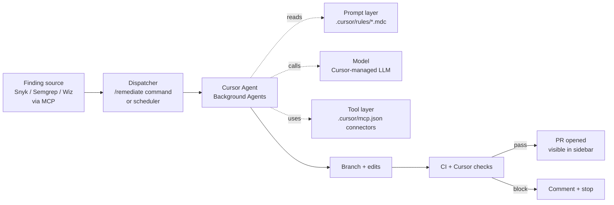


**Outcome.** Engineers see open security findings inside Cursor and can
dispatch a Background Agent to fix any of them with one click — or schedule
them for autonomous overnight runs.


Cursor's Agent (and Background Agents) can be steered with project-level
rules and MCP servers to handle remediation queues without ever leaving
the editor. Engineers get a consistent "open finding → branched PR"
loop whether they invoke it by hand or the scheduler does it overnight.

## Prerequisites

- Cursor **Business** or **Enterprise** plan
- Background Agents enabled for your workspace
- An MCP server that exposes your security findings (Snyk, Semgrep, Wiz, etc.)
- A repo with at least one reproducible test command
- GitHub / GitLab / Bitbucket integration connected to the Cursor workspace

## General onboarding

The public path to getting Cursor — what any individual engineer
or team can do today without waiting on an enterprise rollout.

1. **Pick a plan.** Cursor's Pro tier is enough to evaluate
   rules, custom commands, and MCP. Background Agents and
   Automations require **Business** or **Enterprise**.
   See [Cursor plans & pricing](https://cursor.com/pricing).
2. **Install the editor.** Download Cursor from
   [cursor.com](https://cursor.com/) and sign in.
3. **Connect your source host.** Link GitHub / GitLab /
   Bitbucket so Cursor can open PRs on your behalf. See
   [Cursor docs home](https://docs.cursor.com).
4. **Add project rules.** Create `.cursor/rules/*.mdc` files in
   the repo. See
   [Project rules](https://cursor.com/docs/rules#project-rules).
5. **Install MCP servers.** Wire up `.cursor/mcp.json` per
   [Cursor MCP](https://docs.cursor.com/context/mcp).
6. **Enable Background Agents + Automations** (Business /
   Enterprise). See
   [Background Agents](https://docs.cursor.com/en/background-agent)
   and
   [Automations](https://cursor.com/docs/cloud-agent/automations).
7. **Review privacy + data-handling.** See
   [Cursor security & privacy](https://docs.cursor.com/account/privacy).

**Vendor-side reference index:**

- [Cursor docs home](https://docs.cursor.com)
- [Project rules (`.cursor/rules/*.mdc`)](https://cursor.com/docs/rules#project-rules)
- [Custom slash commands (`.cursor/commands/*.md`)](https://cursor.com/docs/cli/reference/slash-commands)
- [Background Agents](https://docs.cursor.com/en/background-agent)
- [Automations (scheduled + event-driven runs)](https://cursor.com/docs/cloud-agent/automations)
- [MCP](https://docs.cursor.com/context/mcp)
- [Plans & pricing](https://cursor.com/pricing)
- [Security & privacy](https://docs.cursor.com/account/privacy)

## Enterprise onboarding


**Placeholder — customize for your organization.** Replace the
steps and links below with your internal process for getting a
Cursor Business / Enterprise seat, enabling Background Agents,
and granting the repo scope this recipe expects. The structure
is a starting point so every recipe on this site has a
consistent "how does my team actually start using this at my
company?" section. Forks of this project are expected to fill
this in for their own organizations.


1. **Request access.** File an IT ticket for a Cursor Business or
   Enterprise seat on your org's workspace. Internal link:
   [Request Cursor access](#placeholder-itsm-link).
2. **Join the workspace.** Accept the invite to your org's Cursor
   workspace once Security approves. Internal link:
   [Cursor workspace](#placeholder-workspace-link).
3. **Bind to corporate SSO / SAML.** Cursor Business / Enterprise
   supports SAML SSO — bind the account to your identity provider
   per the standard IT guide. Internal link:
   [SSO enrollment](#placeholder-sso-link).
4. **Turn on Background Agents.** Ask your Cursor admin to enable
   Background Agents for your workspace and pin the set of repos
   they're allowed to operate on. Internal link:
   [Background Agents rollout plan](#placeholder-rollout-link).
5. **Complete internal training.** Read the internal rules of
   engagement for Cursor Agent and Background Agent usage on
   production repos before running any recipe. Internal link:
   [InfoSec AI usage policy](#placeholder-policy-link).

## Recipe steps

### 1. Write project rules under `.cursor/rules/`

Rules are markdown files with frontmatter. Each rule declares **when**
it should be injected into the agent's context (via `globs:` or
`alwaysApply:`). A minimal remediation ruleset:


  
```markdown
---
description: Standard remediation workflow for security findings.
alwaysApply: true
---

# Remediation conventions

- Branch: `fix/<finding-id>`
- Commit: Conventional Commits. Start with `fix(sec):` or `fix(deps):`.
- PR title: `fix: <one-line>`
- PR body must link the finding ID and describe blast radius.

## Before opening a PR
1. Run `pnpm lint --fix && pnpm test`.
2. If any test was added or changed, explain why in the PR body.
3. If you could not fix the root cause in a single PR, open the
   PR anyway with a clear "partial fix" label and next-steps.

## Never
- Never disable a test to make CI green.
- Never modify a lockfile outside an explicit dep-bump task.
- Never push directly to `main`.
```
  
  
```markdown
---
description: Test requirements for any code change.
globs: ["src/**/*.{ts,tsx,js}"]
---

# Tests

- Any change in `src/` must have a corresponding test or a
  justification comment in the PR.
- New behavior → new test. Bug fix → regression test.
- Use the existing test helpers in `test/utils/`. Do not create
  parallel frameworks.
- `pnpm test` is authoritative. If it passes, the agent may push.
```
  
  
```markdown
---
description: Paths the agent must not modify without explicit permission.
alwaysApply: true
---

# Do not modify

- `db/migrations/**`       — DB schema migrations
- `infra/terraform/**`     — infra-as-code
- `**/*.generated.ts`      — generated code
- `.github/CODEOWNERS`     — review routing

If the task *requires* editing any of these, stop and summarize the
change you would make. Do not edit until the human says "proceed".
```
  



**Confirm rules are loading.** In a Cursor chat, open the context
panel on the right — loaded rule files appear there. If your rules
aren't listed, no amount of prompting will save you: fix the glob
or `alwaysApply` first.


### 2. Install MCP connectors via `.cursor/mcp.json`

Repo-level MCP config lives at `.cursor/mcp.json`. A starter
configuration for a security-focused setup:

```json
{
  "mcpServers": {
    "snyk": {
      "command": "npx",
      "args": ["-y", "@snyk/mcp-server"],
      "env": { "SNYK_TOKEN": "${SNYK_READONLY_TOKEN}" }
    },
    "jira": {
      "command": "npx",
      "args": ["-y", "@modelcontextprotocol/server-jira"],
      "env": {
        "JIRA_BASE_URL": "https://example.atlassian.net",
        "JIRA_API_TOKEN": "${JIRA_TOKEN}",
        "JIRA_USER_EMAIL": "${JIRA_USER}"
      }
    },
    "github": {
      "command": "npx",
      "args": ["-y", "@modelcontextprotocol/server-github"],
      "env": { "GITHUB_PERSONAL_ACCESS_TOKEN": "${GH_TOKEN}" }
    }
  }
}
```

Start **read-only**. After each MCP tool appears in the agent's
context panel, you know it loaded successfully.

See [MCP Server Access]() for the
catalog and the integration shape for new sources.

### 3. Add a `/remediate` custom command

Cursor lets you bind a repeatable prompt to a slash command. Put
this in `.cursor/commands/remediate.md` (the filename becomes the
command name — no frontmatter required):

```markdown
# Remediate the next open security finding

Use the `snyk` MCP to call `list_findings(status="open", severity=["high","critical"])`.

Pick the first finding. For that finding:

1. Call `get_finding(id)` and read the advisory.
2. Branch: `fix/<finding-id>`.
3. Apply the minimum change that closes the finding. Prefer the
   smallest version bump; prefer direct deps over transitive
   overrides.
4. Update lockfiles via the correct package manager.
5. Run `pnpm lint --fix && pnpm test`. Stop and summarize if tests fail.
6. Push and open a PR. Link the finding ID in the PR body.
7. Call `mark_resolved(id)` on merge — not before.
```

Invoke from chat with `/remediate`.

### 4. Configure Background Agents

Background Agents run headlessly on Cursor's infra. Configure in
**Settings → Background Agents**:

- **Branch naming:** `fix/${finding_id}`
- **PR template:** paste your standard PR template; include the
  finding ID placeholder.
- **Required CI checks:** pin the checks that must be green.
- **Auto-merge:** **OFF**. Never turn this on.
- **Permissions:** give read access to the repo; write goes through
  the PR the agent opens.

### 5. Dispatch via Cursor Automations, GitHub, Jira, or webhooks

Cursor Automations is the supported way to run a Background Agent
on a **schedule**, on an **event** (GitHub issue opened, webhook
received, Slack message posted), or from an **ad-hoc chat
invocation**. Pick the trigger that matches your queue — the
underlying Background Agent, branch naming, and PR policy stay
identical across all of them.


  
```yaml
# Settings → Automations → New Automation
name: Nightly remediation sweep
trigger:
  type: schedule
  cron: "0 2 * * *"          # 02:00 daily (build region)
command: /remediate
repo: example-org/payments-service
baseBranch: main
timeout: 30m
maxRuns: 5                   # cap open PRs per run
```
A 5-PR-per-run cap keeps the reviewer queue sane; adjust up once
the signal-to-noise is proven.
  
  
```yaml
# Settings → Automations → New Automation
name: Remediate on security label
trigger:
  type: github.issue.labeled
  repo: example-org/payments-service
  label: "security:remediate"
command: |
  The issue body contains a finding ID. Run /remediate restricted
  to that finding only. Link the PR back to the issue on success.
baseBranch: main
maxRuns: 1
```
Engineers (or the scanner's auto-filer) label an issue
`security:remediate` and Cursor opens a scoped PR against it.
  
  
```yaml
# .github/workflows/cursor-dispatch.yml
name: Dispatch Cursor remediation
on:
  workflow_dispatch:
    inputs:
      finding_id:
        description: Scanner finding ID
        required: true

jobs:
  dispatch:
    runs-on: ubuntu-latest
    steps:
      - name: Call Cursor Automations webhook
        env:
          CURSOR_WEBHOOK: ${{ secrets.CURSOR_AUTOMATION_WEBHOOK }}
        run: |
          curl -fsSL -X POST "$CURSOR_WEBHOOK" \
            -H "Content-Type: application/json" \
            -d "{\"finding_id\":\"${{ inputs.finding_id }}\"}"
```
Useful when your SOAR / scanner already has a "dispatch to
GitHub Actions" adapter — you keep one integration point.
  
  
```bash
# Jira / Linear webhook → Cursor Automations webhook
# Configure the webhook URL from Settings → Automations → Webhook trigger.

curl -fsSL -X POST "$CURSOR_AUTOMATION_WEBHOOK" \
  -H "Content-Type: application/json" \
  -d '{
    "finding_id": "CVE-2026-1234",
    "ticket": "SEC-4821",
    "source": "jira"
  }'
```
Jira automation rule or Linear webhook POSTs to the Cursor
Automation URL. The Background Agent runs `/remediate` scoped to
that finding and links back to the ticket in the PR body.
  


## Verification

Run `/remediate` interactively on a known finding. The agent should
produce:

- a branch (e.g. `fix/CVE-2026-1234`),
- a code change with an accompanying test,
- a PR linked to the finding ID,

all visible in the Cursor sidebar **before** any code touches `main`.

Then let the scheduled Background Agent run overnight. In the
morning you should see up to 5 draft PRs, each linked back to the
finding it's fixing.

## Orchestration: what stays constant, what changes

Cursor's orchestration splits across two surfaces — the
**interactive Agent** for engineer-driven fixes, and
**Background Agents** for the headless batch queue. The queue,
the dispatcher, and the review policy are shared; everything
else is swappable.



What is **constant** (build once, leave alone):

- The `/remediate` command and the Background Agent scheduler
  cron.
- Branch naming (`fix/<finding-id>`), PR template, and required
  CI checks under **Settings → Background Agents**.
- The "open PR, never merge" policy.
- The MCP allowlist shape — read-only by default, write tools
  gated per-flow.

What **evolves** (expected to change, often):

- **Prompt.** `.cursor/rules/*.mdc` files are split, merged, and
  re-scoped with different glob patterns as the ruleset matures.
  New rules get added; stale ones get removed.
- **Model.** Cursor's underlying model changes as Cursor ships
  upgrades; the orchestration is indifferent.
- **Tools.** New MCP connectors show up in `.cursor/mcp.json`
  whenever a new finding source or context source is integrated
  — the scheduler and the review loop don't care.

Decoupling these layers is what lets a security team upgrade
rules or add a scanner without rewriting the dispatch logic.

## Guardrails

- **Rules enforcement.** Confirm `.cursor/rules/` files appear in the
  agent's context panel. If rules aren't loading, nothing else will save
  you from drift.
- **MCP tool allowlist.** Restrict which MCP tools the agent can call.
  Read-only is the right default; escalate explicitly.
- **Require a human on the PR.** Cursor Background Agents can open PRs —
  do **not** give them merge permissions.
- **Rate caps on scheduler.** A nightly cap of 5 PRs per repo prevents
  a bad rule from flooding the reviewer queue.

## Troubleshooting

- **`/remediate` says "no findings found".** Check the MCP server is
  loaded (context panel) and the token has read scope on the scanner's
  findings API.
- **Rules aren't being applied.** Verify the glob in frontmatter
  actually matches the files Cursor is editing; test with a concrete
  path, not a wildcard you assume will match.
- **Background Agent opens PRs against `main`.** In the scheduler
  config, ensure `baseBranch` is set correctly — some orgs use
  `develop` or `release/*`.

## See also

- Cursor docs: [Background Agents](https://docs.cursor.com/en/background-agent)
- Cursor docs: [Automations (scheduled + event-driven)](https://cursor.com/docs/cloud-agent/automations)
- Cursor docs: [Project rules](https://cursor.com/docs/rules#project-rules)
- Cursor docs: [Custom slash commands](https://cursor.com/docs/cli/reference/slash-commands)
- Cursor docs: [MCP](https://docs.cursor.com/context/mcp)
- [MCP Server Access]() — connector catalog
- Recipe: [Claude]() — similar MCP + hooks patterns
- [Prompt Library]() — share your `.cursor/rules` files
