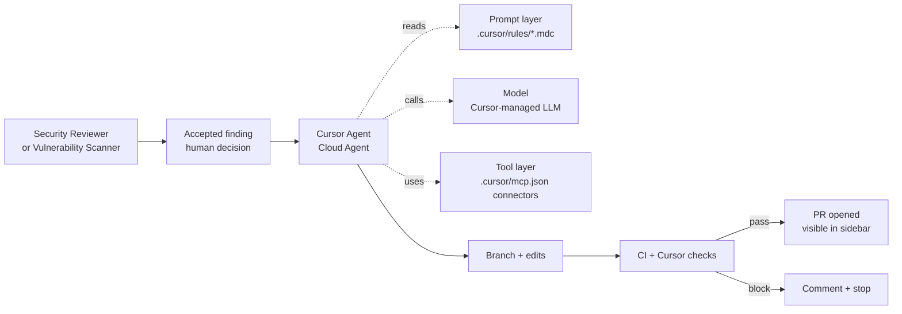

---
title: Cursor AI Vulnerability Remediation
linkTitle: Cursor
weight: 3
date: 2026-04-21
lastmod: 2026-08-21
description: Use Cursor Security Agents, Agent, and Cloud Agents to find and remediate vulnerabilities with bounded context, tests, rollback, and reviewed pull requests.
sidebar:
  open: true
---


**Outcome.** Cursor Security Agents identify changed-code and codebase
risk; engineers validate one finding and hand it to an Agent or Cloud Agent
for a reviewed remediation pull request.



**In a hurry?** The
[**Quick Start**]()
is a five-minute path to your first agentic remediation PR with
Cursor. Come back here for the full recipe once that loop is working.


Cursor's Security Agents, interactive Agent, and Cloud Agents can be
steered with project-level rules and MCP servers. Engineers get a
consistent "validate finding → bounded patch → reviewed PR" loop while
keeping discovery and remediation as separate decisions.

Use the [bounded remediation workflow]()
to establish scope, verification, rollback, and reviewer evidence before
configuring Cursor.

For a package advisory, pair that workflow with the
[Cursor vulnerable-dependency recipe]()
for ready-to-use project rules and task instructions.
For a detected secret or PII leak, use the
[Cursor sensitive-data remediation recipe]().

## Remediate a vulnerability with Cursor

Use [Cursor Security Agents](https://cursor.com/docs/security-agents) to
produce the finding, then hand an accepted finding to a Cursor Agent or
Cloud Agent for the code change. Rechecked against the live Security Agents
docs on August 23, 2026: both agent types still run on Cloud Agents through
[Automations](https://cursor.com/automations/from-cursor/security).
`/review-security` is still documented for Cursor 3.7+. Current Security
Agents docs no longer label the feature beta; they describe team-usage
billing. The [April 30, 2026 product update](https://cursor.com/changelog/04-30-26)
is the launch note that called Security Review a Teams and Enterprise beta.

1. Configure a **Security Reviewer** for pull-request or merge-request
   events, or a **Vulnerability Scanner** for scheduled scans of the
   repository at rest, in
   [Security Agents Automations](https://cursor.com/automations/from-cursor/security).
   Add the relevant checks, repository instructions,
   and at least one tool or MCP.
2. Review the reported code path, severity, and remediation guidance.
   Confirm the issue is reachable and not blocked by an existing control.
3. Start an agent task scoped to that finding. Require the smallest safe
   change, a regression test, the repository's normal checks, and a pull
   request—never a direct merge.
4. Review the diff and run artifacts before merging. In Cursor 3.7 or
   later, use `/review-security` to review the branch against its base
   before pushing.

Security Reviewer covers changed code; Vulnerability Scanner searches for
risk already present in the codebase. Both run on Cloud Agents through
Cursor Automations and are billed from the team usage pool. See the
[official product update](https://cursor.com/changelog/04-30-26) for the
Teams and Enterprise launch note.

## Prerequisites

- Cursor team usage access for Security Agents, which run on Cloud Agents
- Security Agents configured for the repository in Cursor Automations
- At least one approved tool or MCP available to each Security Agent
- A repo with at least one reproducible test command
- The relevant source-host integration connected to the Cursor workspace

## General onboarding

The public path to getting Cursor — what any individual engineer
or team can do today without waiting on an enterprise rollout.

1. **Pick a plan.** Cursor's individual plans can evaluate local
   Agent workflows, rules, custom commands, and MCP. Security Agents
   are billed at the team usage level and require Cloud Agents. See
   [Cursor plan documentation](https://docs.cursor.com/account/pricing)
   and the [April 30, 2026 launch note](https://cursor.com/changelog/04-30-26).
2. **Install the editor.** Download Cursor from
   [cursor.com](https://cursor.com/) and sign in.
3. **Connect your source host.** Link GitHub / GitLab /
   Bitbucket so Cursor can open PRs on your behalf. See
   [Cursor docs home](https://docs.cursor.com).
4. **Add project rules.** Create `.cursor/rules/*.mdc` files in
   the repo. See
   [Project rules](https://cursor.com/docs/rules#project-rules).
5. **Install MCP servers.** Wire up `.cursor/mcp.json` per
   [Cursor MCP](https://docs.cursor.com/context/mcp).
6. **Configure Security Agents.** Use
   [Security Agents in Automations](https://cursor.com/automations/from-cursor/security)
   to add a Security Reviewer, Vulnerability Scanner, or both.
7. **Review privacy + data-handling.** See
   [Cursor security & privacy](https://docs.cursor.com/account/privacy).

**Vendor-side reference index:**

- [Cursor docs home](https://docs.cursor.com)
- [Security Agents](https://cursor.com/docs/security-agents)
- [Security Agents in Automations](https://cursor.com/automations/from-cursor/security)
- [Cloud Agents](https://cursor.com/blog/cloud-agents)
- [Project rules (`.cursor/rules/*.mdc`)](https://cursor.com/docs/rules#project-rules)
- [Custom slash commands (`.cursor/commands/*.md`)](https://cursor.com/docs/cli/reference/slash-commands)
- [MCP](https://docs.cursor.com/context/mcp)
- [Cursor plan documentation](https://docs.cursor.com/account/pricing)
- [Security & privacy](https://docs.cursor.com/account/privacy)

## Enterprise onboarding


**Enterprise access is organization-specific.** Before using Cursor
agents on company code, confirm the approved plan, identity and privacy
controls, and the exact repositories that Security and Cloud Agents may
access with your security and platform owners. The checklist below
defines the decisions to record; feature names and availability vary by
plan.


1. **Request access.** File an IT ticket through your organization's
   approved service catalog for a Cursor Teams or Enterprise seat.
2. **Join the workspace.** Accept the invite to your org's Cursor
   workspace once Security approves.
3. **Bind to corporate SSO / SAML.** Bind the account to your
   identity provider using the controls available on the approved plan.
4. **Turn on Security and Cloud Agents.** Ask your Cursor admin to
   configure the Security Reviewer or Vulnerability Scanner and pin the
   set of repositories Cloud Agents may operate on.
5. **Complete internal training.** Read the internal rules of
   engagement for Cursor Agent and Cloud Agent usage on
   production repos before running any recipe, including your
   organization's AI usage policy.

## Recipe steps

### 1. Write project rules under `.cursor/rules/`

Rules are markdown files with frontmatter. Each rule declares **when**
it should be injected into the agent's context (via `globs:` or
`alwaysApply:`). A minimal remediation ruleset:


  
```markdown
---
description: Standard remediation workflow for security findings.
alwaysApply: true
---

# Remediation conventions

- Branch: `fix/<finding-id>`
- Commit: Conventional Commits. Start with `fix(sec):` or `fix(deps):`.
- PR title: `fix: <one-line>`
- PR body must link the finding ID and describe blast radius.

## Before opening a PR
1. Run `pnpm lint --fix && pnpm test`.
2. If any test was added or changed, explain why in the PR body.
3. If you could not fix the root cause in a single PR, open the
   PR anyway with a clear "partial fix" label and next-steps.

## Never
- Never disable a test to make CI green.
- Never modify a lockfile outside an explicit dep-bump task.
- Never push directly to `main`.
```
  
  
```markdown
---
description: Test requirements for any code change.
globs: ["src/**/*.{ts,tsx,js}"]
---

# Tests

- Any change in `src/` must have a corresponding test or a
  justification comment in the PR.
- New behavior → new test. Bug fix → regression test.
- Use the existing test helpers in `test/utils/`. Do not create
  parallel frameworks.
- `pnpm test` is authoritative. If it passes, the agent may push.
```
  
  
```markdown
---
description: Paths the agent must not modify without explicit permission.
alwaysApply: true
---

# Do not modify

- `db/migrations/**`       — DB schema migrations
- `infra/terraform/**`     — infra-as-code
- `**/*.generated.ts`      — generated code
- `.github/CODEOWNERS`     — review routing

If the task *requires* editing any of these, stop and summarize the
change you would make. Do not edit until the human says "proceed".
```
  



**Confirm rules are loading.** In a Cursor chat, open the context
panel on the right — loaded rule files appear there. If your rules
aren't listed, no amount of prompting will save you: fix the glob
or `alwaysApply` first.


### 2. Install MCP connectors via `.cursor/mcp.json`

Repo-level MCP config lives at `.cursor/mcp.json`. A starter
configuration for a security-focused setup:

```json
{
  "mcpServers": {
    "snyk": {
      "command": "npx",
      "args": ["-y", "@snyk/mcp-server"],
      "env": { "SNYK_TOKEN": "${SNYK_READONLY_TOKEN}" }
    },
    "jira": {
      "command": "npx",
      "args": ["-y", "@modelcontextprotocol/server-jira"],
      "env": {
        "JIRA_BASE_URL": "https://example.atlassian.net",
        "JIRA_API_TOKEN": "${JIRA_TOKEN}",
        "JIRA_USER_EMAIL": "${JIRA_USER}"
      }
    },
    "github": {
      "command": "npx",
      "args": ["-y", "@modelcontextprotocol/server-github"],
      "env": { "GITHUB_PERSONAL_ACCESS_TOKEN": "${GH_TOKEN}" }
    }
  }
}
```

Start **read-only**. After each MCP tool appears in the agent's
context panel, you know it loaded successfully.

See [MCP Integration]() for the
catalog and the integration shape for new sources.

### 3. Add a `/remediate` custom command

Cursor lets you bind a repeatable prompt to a slash command. Put
this in `.cursor/commands/remediate.md` (the filename becomes the
command name — no frontmatter required):

```markdown
# Remediate the next open security finding

Use the `snyk` MCP to call `list_findings(status="open", severity=["high","critical"])`.

Pick the first finding. For that finding:

1. Call `get_finding(id)` and read the advisory.
2. Branch: `fix/<finding-id>`.
3. Apply the minimum change that closes the finding. Prefer the
   smallest version bump; prefer direct deps over transitive
   overrides.
4. Update lockfiles via the correct package manager.
5. Run `pnpm lint --fix && pnpm test`. Stop and summarize if tests fail.
6. Push and open a PR. Link the finding ID in the PR body.
7. Call `mark_resolved(id)` on merge — not before.
```

Invoke from chat with `/remediate`.

### 4. Configure Security Agents

Open the [Security Agents dashboard](https://cursor.com/docs/security-agents)
and choose the agent that matches the question:

- **Security Reviewer** runs on pull-request or merge-request events and
  reviews changed code before merge.
- **Vulnerability Scanner** runs on a schedule and searches the repository
  at rest for pre-existing risk.

For each agent, select the repository, add the relevant built-in checks and
custom instructions, and configure at least one approved tool or MCP. Start
with read-only context. Keep the threat and repository instructions narrow
enough that a reviewer can explain why each finding was produced.

### 5. Hand an accepted finding to an Agent

Security Agents report findings; do not assume that a report authorizes a
code change or automatically produces a pull request.

1. Confirm the vulnerable path and record the finding ID, affected files,
   and validation evidence.
2. Start an interactive Agent or Cloud Agent task scoped to that one
   finding. Include the accepted remediation constraints and the repository's
   supported test commands.
3. Require a branch and reviewed pull request, with no unrelated refactor
   and no direct merge.
4. Before pushing, run `/review-security` against the branch's base and
   resolve or document every supported finding.

Use the Vulnerability Scanner's dashboard schedule for recurring discovery.
Keep issue trackers and external scanner webhooks as context sources unless
you have separately reviewed and approved a concrete automation integration.

## Verification

Run `/remediate` interactively on a known finding. The agent should
produce:

- a branch (e.g. `fix/CVE-2026-1234`),
- a code change with an accompanying test,
- a PR linked to the finding ID,

all visible in the Cursor sidebar **before** any code touches `main`.

Then run the configured Vulnerability Scanner on its schedule. Its findings
should remain separate from remediation tasks until a person accepts them.

## Orchestration: what stays constant, what changes

Cursor's orchestration spans Security Agents for discovery and review,
then an **interactive Agent** or **Cloud Agent** for an accepted fix. The
finding evidence, repository rules, and review policy are shared; the
discovery trigger and remediation session remain separate.


```mermaid
flowchart LR
    A[Security Reviewer<br/>or Vulnerability Scanner] --> B[Accepted finding<br/>human decision]
    B --> C[Cursor Agent<br/>Cloud Agent]
    C -.reads.-> P[Prompt layer<br/>.cursor/rules/*.mdc]
    C -.calls.-> M[Model<br/>Cursor-managed LLM]
    C -.uses.-> T[Tool layer<br/>.cursor/mcp.json connectors]
    C --> D[Branch + edits]
    D --> E[CI + Cursor checks]
    E -->|pass| F[PR opened<br/>visible in sidebar]
    E -->|block| G[Comment + stop]
```

What is **constant** (build once, leave alone):

- The one-finding task contract and repository rules.
- Branch naming (`fix/<finding-id>`), PR template, and required CI checks.
- The "open PR, never merge" policy.
- The MCP allowlist shape — read-only by default, write tools
  gated per-flow.

What **evolves** (expected to change, often):

- **Prompt.** `.cursor/rules/*.mdc` files are split, merged, and
  re-scoped with different glob patterns as the ruleset matures.
  New rules get added; stale ones get removed.
- **Model.** Cursor's underlying model changes as Cursor ships
  upgrades; the orchestration is indifferent.
- **Tools.** New MCP connectors show up in `.cursor/mcp.json`
  whenever a new finding source or context source is integrated
  — the scheduler and the review loop don't care.

Decoupling these layers is what lets a security team upgrade
rules or add a scanner without rewriting the dispatch logic.

## Guardrails

- **Rules enforcement.** Confirm `.cursor/rules/` files appear in the
  agent's context panel. If rules aren't loading, nothing else will save
  you from drift.
- **MCP tool allowlist.** Restrict which MCP tools the agent can call.
  Read-only is the right default; escalate explicitly.
- **Require a human on the PR.** Cursor Cloud Agents can open PRs —
  do **not** give them merge permissions.
- **Bound scheduled discovery.** Start with a narrow repository and cadence;
  expand only after reviewers confirm useful signal.

## Troubleshooting

- **`/remediate` says "no findings found".** Check the MCP server is
  loaded (context panel) and the token has read scope on the scanner's
  findings API.
- **Rules aren't being applied.** Verify the glob in frontmatter
  actually matches the files Cursor is editing; test with a concrete
  path, not a wildcard you assume will match.
- **Cloud Agent targets the wrong base.** State the required base branch in
  the task and repository rules; some repositories use `develop` or
  `release/*`.

## See also

- Cursor docs: [Security Agents](https://cursor.com/docs/security-agents)
- Cursor: [Cloud Agents](https://cursor.com/blog/cloud-agents)
- Cursor docs: [Project rules](https://cursor.com/docs/rules#project-rules)
- Cursor docs: [Custom slash commands](https://cursor.com/docs/cli/reference/slash-commands)
- Cursor docs: [MCP](https://docs.cursor.com/context/mcp)
- [MCP Integration]() — connector catalog
- Recipe: [Claude]() — similar MCP + hooks patterns
- [Recipes]() — share your `.cursor/rules` files
