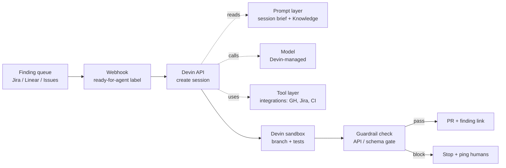


**Outcome.** Devin sessions are automatically created from your security
backlog, each running an end-to-end remediation playbook against the
affected repository.


Devin is a fully autonomous engineering agent — well suited to multi-step
remediation work that spans repos, CI, and ticket systems. Unlike the
other recipes on this site, Devin owns its own sandbox and integrations;
your job is mainly to encode the runbook as a Knowledge entry and
trigger sessions at the right moments.

## Prerequisites

- Devin team workspace (Cognition)
- API access enabled and a Devin API key issued
- Source repos connected via the Devin GitHub / GitLab integration
- A queue of findings (Jira, Linear, GitHub Issues, etc.)

## General onboarding

The public path — what any team can do today using Cognition's
documented flow.

1. **Pick a plan.** Devin offers Team and Enterprise tiers. API
   access, Knowledge, and Playbooks are on all paid tiers. See
   [Devin pricing](https://devin.ai/pricing).
2. **Sign up** at [devin.ai](https://devin.ai/) and create a
   workspace.
3. **Connect your source host.** Install the GitHub / GitLab
   integration from **Workspace → Integrations** so Devin can
   clone repos and open PRs. See
   [Devin Integrations](https://docs.devin.ai/integrations).
4. **Document your runbooks as Knowledge entries.** Knowledge
   is Devin's long-term memory — used at the start of every
   session. See [Devin Knowledge](https://docs.devin.ai/product-guides/knowledge).
5. **Author Playbooks for repeatable tasks** you can invoke by
   name. See [Devin Playbooks](https://docs.devin.ai/product-guides/using-playbooks).
6. **Mint an API key** at **Workspace → Settings → API keys**
   and start dispatching sessions via
   [`POST /v1/sessions`](https://docs.devin.ai/api-reference/sessions/create-a-new-devin-session).


**Vendor-side reference index:**

- [Devin docs home](https://docs.devin.ai)
- [API: `POST /v1/sessions`](https://docs.devin.ai/api-reference/sessions/create-a-new-devin-session)
- [API: list sessions](https://docs.devin.ai/api-reference/sessions/list-sessions)
- [Knowledge](https://docs.devin.ai/product-guides/knowledge)
- [Playbooks](https://docs.devin.ai/product-guides/using-playbooks)
- [Integrations (GitHub, GitLab, Jira, Linear, Slack)](https://docs.devin.ai/integrations)
- [Pricing](https://devin.ai/pricing)
- [Cognition trust & security](https://devin.ai/trust)

API base URL: `https://api.devin.ai/v1`. Authenticate with a
workspace API key as `Authorization: Bearer <token>`.

## Enterprise onboarding


**Placeholder — customize for your organization.** Replace the
steps and links below with your internal process for getting a
Devin workspace seat, connecting your source repos, and issuing
the scoped API key this recipe expects. The structure is a
starting point so every recipe on this site has a consistent
"how does my team actually start using this at my company?"
section. Forks of this project are expected to fill this in for
their own organizations.


1. **Request access.** File an IT ticket for a Devin seat on your
   org's Cognition workspace. Internal link:
   [Request Devin access](#placeholder-itsm-link).
2. **Join the workspace.** Accept the invite to your org's Devin
   workspace once Security approves. Internal link:
   [Devin workspace](#placeholder-workspace-link).
3. **Bind to corporate SSO.** Devin Team / Enterprise supports SSO
   — bind the account to your identity provider per the standard
   IT guide. Internal link:
   [SSO enrollment](#placeholder-sso-link).
4. **Connect the right repos.** Your Devin admin installs the
   GitHub / GitLab integration and grants it to only the repos this
   recipe targets — nothing broader. Internal link:
   [Repo connection checklist](#placeholder-repo-link).
5. **Complete internal training.** Read the internal rules of
   engagement for autonomous-agent usage on production repos,
   including ACU budget caps and the "no auto-merge" policy.
   Internal link:
   [InfoSec AI usage policy](#placeholder-policy-link).

## Recipe steps

### 1. Document your runbook as a Devin Knowledge entry

Knowledge entries are Devin's long-term memory for your org. The
agent reads relevant entries at the start of every session based
on tags + repo. Create one for remediation:

```markdown
---
title: Security Remediation Runbook
tags: [remediation, security, cve, sde, process]
repos: ["*"]
---

# Security Remediation Runbook

## Branch & commit conventions
- Branch: `fix/<finding-id>` (e.g. `fix/CVE-2026-1234`)
- Commit: Conventional Commits (`fix(sec):`, `fix(deps):`)
- PR title: `fix: <one-line summary>`
- PR description must include:
  - Finding ID (as a link if available)
  - Blast radius (files touched, public APIs affected)
  - Verification steps (tests run, manual checks)

## Stop and ask
Before doing any of the following, pause and message the channel
subscribed to this session:
- Changing a public API contract
- Changing a DB column (name, type, nullability)
- Upgrading across a major version
- Disabling or skipping tests

## Review loop
- Open PRs as DRAFT.
- Tag `@security-reviewers` as reviewer.
- Do not merge. Ever.

## Ecosystem-specific notes

### Node / pnpm
- Respect `pnpm-workspace.yaml` — upgrade at the workspace root,
  not inside a single package, unless the affected dep is only
  used there.
- After any dep change, run `pnpm install --frozen-lockfile` in
  CI before pushing.

### Python
- Prefer `uv add <pkg>@<version>` over hand-editing
  `requirements.txt`. If the repo uses plain pip, re-pin via
  `pip-compile` or regenerate `requirements.txt` from a
  `requirements.in`.

### Go
- Use `go get -u` for the specific module, then `go mod tidy`.
- Run `govulncheck` and confirm the finding is no longer reachable.
```

Additional Knowledge entries worth creating: one per repo with the
build/test commands, one for your PR template, one for per-
ecosystem test runners.

### 2. Configure reproducible setup for each repo

Devin's sandbox should boot into a known-good state. Under
**Workspace → Repositories → <your repo> → Setup**, record the
exact commands Devin should run on first connect:

```bash
# Repository setup — payments-service
corepack enable
pnpm install --frozen-lockfile
pnpm -r build
# Smoke test to prove the sandbox is healthy
pnpm -r test -- --reporter=dot --bail
```

Devin caches this across sessions, so after the first run these
are fast.

### 3. Mint a scoped Devin API key

In **Workspace → Settings → API keys**, create a key named
`remediation-webhook`. Scope: "Create sessions only." Store the
key as a secret in the ticket system / CI that will POST to the
API.

### 4. Webhook your backlog into Devin

When a finding enters "ready-for-agent" (a Jira status, a Linear
label, a GitHub Issues tag), POST to `/v1/sessions`. The body
becomes Devin's task brief.

Valid `POST /v1/sessions` body fields include `prompt`,
`idempotent`, `knowledge_ids`, `playbook_id`, `max_acu_limit`,
`secret_ids`, `snapshot_id`, `tags`, `title`, and `unlisted`. The
repo Devin operates on is selected via the connected GitHub /
GitLab integration (and named inside the `prompt`), not by a
`repos` body field.


  
```yaml
# .github/workflows/devin-dispatch.yml
name: Dispatch to Devin on security label
on:
  issues:
    types: [labeled]

jobs:
  dispatch:
    if: github.event.label.name == 'ready-for-agent'
    runs-on: ubuntu-latest
    steps:
      - name: Create Devin session
        env:
          DEVIN_API_KEY: ${{ secrets.DEVIN_API_KEY }}
          REPO: ${{ github.repository }}
          ISSUE_NUM: ${{ github.event.issue.number }}
          ISSUE_TITLE: ${{ github.event.issue.title }}
          ISSUE_BODY: ${{ github.event.issue.body }}
        run: |
          BRIEF=$(cat <<EOF
          Remediate GitHub issue #${ISSUE_NUM} in ${REPO}.
          Follow the "Security Remediation Runbook" Knowledge entry.
          Open a DRAFT pull request linked back to the issue.

          Issue title: ${ISSUE_TITLE}

          Issue body:
          ${ISSUE_BODY}
          EOF
          )

          jq -n \
            --arg prompt "$BRIEF" \
            --arg title "Remediate #${ISSUE_NUM} in ${REPO}" \
            '{prompt: $prompt,
              title: $title,
              idempotent: true,
              tags: ["remediation","github-issue"]}' \
          | curl -fsSL -X POST https://api.devin.ai/v1/sessions \
              -H "Authorization: Bearer $DEVIN_API_KEY" \
              -H "Content-Type: application/json" \
              --data @-
```
Label a GitHub issue `ready-for-agent` → Devin creates a session,
branches the connected repo, and opens a draft PR linked back.
  
  
```yaml
# .github/workflows/devin-webhook.yml
name: Devin dispatch via webhook
on:
  repository_dispatch:
    types: [security-finding]

jobs:
  dispatch:
    runs-on: ubuntu-latest
    steps:
      - name: Create Devin session from scanner payload
        env:
          DEVIN_API_KEY: ${{ secrets.DEVIN_API_KEY }}
          FINDING_ID: ${{ github.event.client_payload.finding_id }}
          FINDING_BODY: ${{ github.event.client_payload.description }}
        run: |
          jq -n \
            --arg prompt "Remediate finding ${FINDING_ID}. Details:\n${FINDING_BODY}" \
            --arg title "Devin: ${FINDING_ID}" \
            '{prompt: $prompt,
              title: $title,
              idempotent: true,
              tags: ["remediation","webhook"]}' \
          | curl -fsSL -X POST https://api.devin.ai/v1/sessions \
              -H "Authorization: Bearer $DEVIN_API_KEY" \
              -H "Content-Type: application/json" \
              --data @-
```
Your scanner (Snyk, Wiz, Semgrep) POSTs to the GitHub
`/repos/{owner}/{repo}/dispatches` endpoint with `event_type:
security-finding`; this workflow picks it up and hands off to
Devin. Works the same shape for Bitbucket Pipelines or GitLab CI.
  
  
```
# Jira → Automation → "Send web request"
Method:  POST
URL:     https://api.devin.ai/v1/sessions
Headers: Authorization: Bearer {{DEVIN_API_KEY}}
         Content-Type: application/json

Body:
{
  "prompt": "Remediate {{issue.key}} ({{issue.summary}}) in the connected repo. Follow the Security Remediation Runbook. Issue body:\n\n{{issue.description}}",
  "title": "Devin: {{issue.key}}",
  "idempotent": true,
  "tags": ["remediation","jira","{{issue.key}}"]
}
```
Trigger: "Issue transitioned to *Ready-for-Agent*." The automation
rule calls Devin's API directly — no Action needed in the middle.
  
  
```js
// Cloudflare Worker handling Linear's outbound webhook
export default {
  async fetch(request, env) {
    const event = await request.json();
    if (event.type !== "Issue" || event.data.state.name !== "Ready-for-Agent") {
      return new Response("ignored", { status: 204 });
    }
    const body = {
      prompt: `Remediate Linear issue ${event.data.identifier} ` +
              `(${event.data.title}) in the connected repo. Follow ` +
              `the Security Remediation Runbook.\n\n${event.data.description ?? ""}`,
      title: `Devin: ${event.data.identifier}`,
      idempotent: true,
      tags: ["remediation", "linear", event.data.identifier],
    };
    const res = await fetch("https://api.devin.ai/v1/sessions", {
      method: "POST",
      headers: {
        "Authorization": `Bearer ${env.DEVIN_API_KEY}`,
        "Content-Type": "application/json",
      },
      body: JSON.stringify(body),
    });
    return new Response(await res.text(), { status: res.status });
  },
};
```
Linear webhook (state change → *Ready-for-Agent*) posts here; the
Worker forwards to Devin. Subscribe to `Issue.update` only.
  
  
```yaml
# .github/workflows/devin-nightly.yml
name: Nightly Devin remediation sweep
on:
  schedule:
    - cron: "0 2 * * *"   # 02:00 UTC
  workflow_dispatch:

jobs:
  sweep:
    runs-on: ubuntu-latest
    steps:
      - name: Create a Devin session per high/critical finding
        env:
          DEVIN_API_KEY: ${{ secrets.DEVIN_API_KEY }}
          SNYK_TOKEN: ${{ secrets.SNYK_TOKEN }}
        run: |
          for FINDING_ID in $(./scripts/list-open-findings.sh --severity high,critical | head -5); do
            jq -n --arg id "$FINDING_ID" \
              '{prompt: ("Remediate finding " + $id + " per the Security Remediation Runbook. Open a draft PR."),
                title: ("Devin: " + $id),
                idempotent: true,
                tags: ["remediation","scheduled"]}' \
            | curl -fsSL -X POST https://api.devin.ai/v1/sessions \
                -H "Authorization: Bearer $DEVIN_API_KEY" \
                -H "Content-Type: application/json" \
                --data @-
          done
```
A nightly sweep caps the reviewer queue: at most 5 new Devin PRs
per night while the human review rate is being calibrated.
  


### 5. Add a standing guardrail prompt

Include this line in *every* session brief (append it in the
webhook handler):

> Stop and ask on Slack before making any change to a public API
> contract, a database schema, or a file under `db/migrations/`.

This keeps Devin autonomous on the easy 80% and collaborative on
the rest.

### 6. Wire PR review + finding closure

Devin opens PRs against the configured default branch. Make sure:

- `CODEOWNERS` routes to a security-reviewer team for
  remediation PRs.
- The repo's branch protection requires those reviewers and green
  CI.
- A small Action closes the source finding when the PR merges:

```yaml
# .github/workflows/close-on-merge.yml
name: Close finding on merge
on:
  pull_request:
    types: [closed]
jobs:
  close:
    if: github.event.pull_request.merged == true
    runs-on: ubuntu-latest
    steps:
      - name: Close linked issue
        run: |
          ISSUE=$(echo "${{ github.event.pull_request.body }}" \
                  | grep -oP '#\K[0-9]+' | head -1)
          [ -n "$ISSUE" ] && \
            gh issue close "$ISSUE" --repo ${{ github.repository }}
        env: { GH_TOKEN: ${{ secrets.GITHUB_TOKEN }} }
```

## Verification

Trigger one finding manually. Devin should:

- spin up a session within a minute or two,
- branch the repo,
- attempt a fix,
- run tests,
- open a draft PR linked back to the finding.

Review the **session replay** in the Devin workspace to confirm
the runbook was followed and no unexpected commands were issued.
If the replay shows the agent skipped a step, fix the Knowledge
entry — don't patch the symptom in the prompt.

## Orchestration: what stays constant, what changes

Devin's orchestration is unusually simple — your ticket system's
webhook creates a Devin session with a task brief, Devin runs
end-to-end in its managed sandbox, and replies with a PR. The
**webhook + Knowledge entry + PR review gate** is the stable
spine; everything Devin reads during a session is expected to
change over time.



What is **constant** (build once, leave alone):

- The `ready-for-agent` → webhook → `/sessions` POST contract.
- The Knowledge entries you treat as authoritative (runbook,
  commit conventions, PR template).
- The scoped API token, per-session ACU cap, per-day ACU cap,
  and the review policy ("no auto-merge, ever").
- The "stop and ask if you'd change a public API contract or a
  schema" standing instruction.

What **evolves** (expected to change, often):

- **Prompt.** The session-brief template is iterated as you
  learn which framings reduce reviewer pushback. Knowledge
  entries are added and pruned.
- **Model.** Devin's underlying engine changes as Cognition
  upgrades it — you benefit from better models without touching
  the webhook plumbing.
- **Tools.** New integrations (a new ticket system, a new CI
  platform, a new scanner) slot in as additional sandbox tools.
  The session lifecycle doesn't change.

This is why investing in Knowledge entries pays compound
interest: they're the layer that changes, the rest of the
orchestration is write-once.

## Guardrails

- **Scope the repo list.** Devin only operates on repos you've explicitly
  connected — keep this list tight.
- **Require human review.** Treat Devin PRs like any other contributor's
  PR: required reviewers, passing CI, no auto-merge.
- **Budget caps.** Configure per-session and per-day ACU (agent compute
  unit) caps in the Devin workspace settings.
- **Standing "stop" rules.** Every session brief includes the
  API / schema / migrations "stop and ask" clause.

## Troubleshooting

- **Devin keeps asking for repo setup.** The per-repo setup
  commands didn't run — check **Workspace → Repositories →
  Setup** and re-save them. Verify the first-run output in the
  session replay.
- **Session ignores your runbook.** Knowledge entries are
  retrieved by tag + repo match. Confirm the `tags:` and
  `repos:` frontmatter cover the current session's context.
- **Session opened a PR in the wrong branch.** Add an explicit
  `base:` to the session brief: "Open the PR against `main`,
  not `develop`."

## See also

- Cognition: [Devin docs home](https://docs.devin.ai)
- Devin API: [`POST /v1/sessions`](https://docs.devin.ai/api-reference/sessions/create-a-new-devin-session)
- Devin docs: [Knowledge](https://docs.devin.ai/product-guides/knowledge) · [Playbooks](https://docs.devin.ai/product-guides/using-playbooks) · [Integrations](https://docs.devin.ai/product-guides/integrations)
- [MCP Server Access]() — exposing richer context to agents
- Recipe: [Codex]() — for similar batch flows
- [Prompt Library]() — share your Devin session briefs (see `prompt-library/devin/` for live examples)
