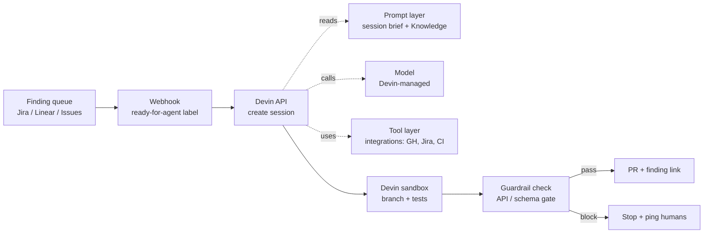

---
title: Devin Vulnerability Remediation
linkTitle: Devin
weight: 2
date: 2026-04-21
lastmod: 2026-07-21
description: Use Cognition Devin to remediate vulnerability backlogs with isolated sessions, bounded playbooks, verification evidence, rollback, and reviewed pull requests.
sidebar:
  open: true
---


**Outcome.** Devin Security Swarm validates repository findings, then an
accepted finding is assigned to Devin for a bounded remediation session
and reviewed pull request.



**In a hurry?** The
[**Quick Start**]()
is a five-minute path to your first agentic remediation PR with
Devin. Come back here for the full recipe once that loop is working.


Devin Security Swarm provides the native scan-to-remediation workflow.
For other multi-step work that spans repos, CI, and ticket systems, Devin
also supports isolated engineering sessions, Knowledge, Playbooks, and
API-driven dispatch.

Use the [agent remediation guide]()
to set the scope, stop conditions, evidence, and approval model before
encoding the runbook in Devin.

For recurring package advisories, use the
[scheduled Devin vulnerability-remediation recipe]()
as the agent-ready playbook for the queue-to-PR loop.
For a sensitive-data finding, use the
[scheduled Devin SDE remediation recipe]().

## Remediate a vulnerability with Devin

Use [Security Swarm](https://docs.devin.ai/work-with-devin/security-swarm)
for Devin's native finding-to-pull-request workflow.

1. Open **Security**, start a scan for the affected repository, and keep
   interactive mode on for the first run. Review the proposed threat model
   before investigation begins.
2. Inspect the finding's reachable path, severity, exploitability,
   confidence, validation result, and artifacts. A risky pattern is a lead,
   not proof.
3. For an accepted finding, choose **Assign to Devin**. Supply remediation
   constraints: the smallest safe change, a focused regression test,
   supported build and test commands, and no unrelated refactor.
4. Review the remediation session and pull request, rerun the relevant
   tests or reproducer, and keep the finding open until the fix is merged
   and verified.

Organizations that want Cognition engineers to help clear an existing
backlog and establish continuous discovery can evaluate the separate
[Security Vulnerability Remediation Program](https://devin.ai/security-program);
it is an eligible-enterprise engagement, not a self-serve prerequisite.

## Prerequisites

- Security Swarm access in the Devin workspace
- One supported source repository connected to the workspace
- An approved threat model or Security Swarm profile for the first scan
- A reproducible test command and a human pull-request reviewer

## General onboarding

The public path — what any team can do today using Cognition's
documented flow.

1. **Pick a plan.** Devin currently offers Free, Pro, Max, Teams, and
   Enterprise plans; feature availability differs by plan. See
   [Devin pricing](https://devin.ai/pricing).
2. **Sign up** at [devin.ai](https://devin.ai/) and create a
   workspace.
3. **Connect your source host.** Install the GitHub / GitLab
   integration from **Workspace → Integrations** so Devin can
   clone repos and open PRs. See
   [Devin Integrations](https://docs.devin.ai/integrations/overview).
4. **Run the first Security Swarm scan interactively.** Review the
   generated threat model before accepting any finding. See
   [Security Swarm](https://docs.devin.ai/work-with-devin/security-swarm).
5. **Document your runbooks as Knowledge entries.** Knowledge
   is Devin's long-term memory — used at the start of every
   session. See [Devin Knowledge](https://docs.devin.ai/product-guides/knowledge).
6. **Author Playbooks for repeatable tasks** you can invoke by
   name. See [Devin Playbooks](https://docs.devin.ai/product-guides/using-playbooks).
7. **For separate API automation only, mint a scoped credential** at
   **Workspace → Settings → Service users** and dispatch sessions via
   [`POST /v3/organizations/{org_id}/sessions`](https://docs.devin.ai/api-reference/v3/sessions/post-organizations-sessions).


**Vendor-side reference index:**

- [Devin docs home](https://docs.devin.ai)
- [Security Swarm](https://docs.devin.ai/work-with-devin/security-swarm)
- [Security Vulnerability Remediation Program](https://devin.ai/security-program)
- [API: `POST /v3/organizations/{org_id}/sessions`](https://docs.devin.ai/api-reference/v3/sessions/post-organizations-sessions)
- [API overview and migration notes](https://docs.devin.ai/api-reference/overview)
- [Authentication](https://docs.devin.ai/api-reference/authentication)
- [API: list sessions](https://docs.devin.ai/api-reference/v3/sessions/organizations-sessions)
- [Knowledge](https://docs.devin.ai/product-guides/knowledge)
- [Playbooks](https://docs.devin.ai/product-guides/using-playbooks)
- [Integrations (GitHub, GitLab, Jira, Linear, Slack)](https://docs.devin.ai/integrations/overview)
- [Pricing](https://devin.ai/pricing)
- [Cognition trust & security](https://docs.devin.ai/admin/security)

Current organization API base URL: `https://api.devin.ai/v3/organizations/{org_id}`.
Authenticate with a Devin service-user credential as
`Authorization: Bearer <token>`. The older v1/v2 APIs remain
documented as legacy APIs during migration, but new automation
should start on v3.

## Enterprise onboarding


**Enterprise access is organization-specific.** Before using Devin on
company code, confirm the approved workspace, identity and data-handling
controls, exact repository integration scope, and service-user credential
lifecycle with your security and platform owners. The checklist below
defines the decisions to record; feature names and availability vary by
plan.


1. **Request access.** File an IT ticket through your organization's
   approved service catalog for a Devin seat on the Cognition workspace.
2. **Join the workspace.** Accept the invite to your org's Devin
   workspace once Security approves.
3. **Bind to corporate identity.** Use the SSO and identity controls
   required by your approved Devin plan and internal access policy.
4. **Connect the right repos.** Your Devin admin installs the
   GitHub / GitLab integration and grants it to only the repos this
   recipe targets — nothing broader — using the approved connection
   checklist.
5. **Complete internal training.** Read the internal rules of
   engagement for autonomous-agent usage on production repos,
   including workspace spend limits and the "no auto-merge" policy.
   Follow your organization's AI usage policy throughout the run.

## Recipe steps

### 1. Document your runbook as a Devin Knowledge entry

Knowledge entries are Devin's long-term memory for your org. The
agent reads relevant entries at the start of every session based
on tags + repo. Create one for remediation:

```markdown
---
title: Security Remediation Runbook
tags: [remediation, security, cve, sde, process]
repos: ["*"]
---

# Security Remediation Runbook

## Branch & commit conventions
- Branch: `fix/<finding-id>` (e.g. `fix/CVE-2026-1234`)
- Commit: Conventional Commits (`fix(sec):`, `fix(deps):`)
- PR title: `fix: <one-line summary>`
- PR description must include:
  - Finding ID (as a link if available)
  - Blast radius (files touched, public APIs affected)
  - Verification steps (tests run, manual checks)

## Stop and ask
Before doing any of the following, pause and message the channel
subscribed to this session:
- Changing a public API contract
- Changing a DB column (name, type, nullability)
- Upgrading across a major version
- Disabling or skipping tests

## Review loop
- Open PRs as DRAFT.
- Tag `@security-reviewers` as reviewer.
- Do not merge. Ever.

## Ecosystem-specific notes

### Node / pnpm
- Respect `pnpm-workspace.yaml` — upgrade at the workspace root,
  not inside a single package, unless the affected dep is only
  used there.
- After any dep change, run `pnpm install --frozen-lockfile` in
  CI before pushing.

### Python
- Prefer `uv add <pkg>@<version>` over hand-editing
  `requirements.txt`. If the repo uses plain pip, re-pin via
  `pip-compile` or regenerate `requirements.txt` from a
  `requirements.in`.

### Go
- Use `go get -u` for the specific module, then `go mod tidy`.
- Run `govulncheck` and confirm the finding is no longer reachable.
```

Additional Knowledge entries worth creating: one per repo with the
build/test commands, one for your PR template, one for per-
ecosystem test runners.

### 2. Configure reproducible setup for each repo

Devin's sandbox should boot into a known-good state. Under
**Workspace → Repositories → <your repo> → Setup**, record the
exact commands Devin should run on first connect:

```bash
# Repository setup — payments-service
corepack enable
pnpm install --frozen-lockfile
pnpm -r build
# Smoke test to prove the sandbox is healthy
pnpm -r test -- --reporter=dot --bail
```

Devin caches this across sessions, so after the first run these
are fast.

### 3. Mint a scoped Devin API key

In **Workspace → Settings → Service users**, create a service user
named `remediation-webhook` with the org-level session permission
required by the current API. Store both `DEVIN_API_KEY` and
`DEVIN_ORG_ID` as secrets in the ticket system / CI that will POST
to the API. Add `ImpersonateOrgSessions` only if the automation uses
`create_as_user_id`.

### 4. Webhook your backlog into Devin

When a finding enters "ready-for-agent" (a Jira status, a Linear
label, a GitHub Issues tag), POST to
`/v3/organizations/{org_id}/sessions`. The body becomes Devin's
task brief.

Common `POST /v3/organizations/{org_id}/sessions` body fields include
`prompt`, `title`, `tags`, `repos`, `knowledge_ids`, `playbook_id`,
`max_acu_limit`, `secret_ids`, `session_links`, and
`create_as_user_id`. Use `repos` when the connected GitHub / GitLab
integration should be constrained to specific repositories.


  
```yaml
# .github/workflows/devin-dispatch.yml
name: Dispatch to Devin on security label
on:
  issues:
    types: [labeled]

jobs:
  dispatch:
    if: github.event.label.name == 'ready-for-agent'
    runs-on: ubuntu-latest
    steps:
      - name: Create Devin session
        env:
          DEVIN_API_KEY: ${{ secrets.DEVIN_API_KEY }}
          DEVIN_ORG_ID: ${{ secrets.DEVIN_ORG_ID }}
          REPO: ${{ github.repository }}
          ISSUE_NUM: ${{ github.event.issue.number }}
          ISSUE_TITLE: ${{ github.event.issue.title }}
          ISSUE_BODY: ${{ github.event.issue.body }}
        run: |
          BRIEF=$(cat <<EOF
          Remediate GitHub issue #${ISSUE_NUM} in ${REPO}.
          Follow the "Security Remediation Runbook" Knowledge entry.
          Open a DRAFT pull request linked back to the issue.

          Issue title: ${ISSUE_TITLE}

          Issue body:
          ${ISSUE_BODY}
          EOF
          )

          jq -n \
            --arg prompt "$BRIEF" \
            --arg title "Remediate #${ISSUE_NUM} in ${REPO}" \
            --arg repo "$REPO" \
            '{prompt: $prompt,
              title: $title,
              repos: [$repo],
              tags: ["remediation","github-issue"]}' \
          | curl -fsSL -X POST "https://api.devin.ai/v3/organizations/${DEVIN_ORG_ID}/sessions" \
              -H "Authorization: Bearer $DEVIN_API_KEY" \
              -H "Content-Type: application/json" \
              --data @-
```
Label a GitHub issue `ready-for-agent` → Devin creates a session,
branches the connected repo, and opens a draft PR linked back.
  
  
```yaml
# .github/workflows/devin-webhook.yml
name: Devin dispatch via webhook
on:
  repository_dispatch:
    types: [security-finding]

jobs:
  dispatch:
    runs-on: ubuntu-latest
    steps:
      - name: Create Devin session from scanner payload
        env:
          DEVIN_API_KEY: ${{ secrets.DEVIN_API_KEY }}
          DEVIN_ORG_ID: ${{ secrets.DEVIN_ORG_ID }}
          REPO: ${{ github.repository }}
          FINDING_ID: ${{ github.event.client_payload.finding_id }}
          FINDING_BODY: ${{ github.event.client_payload.description }}
        run: |
          jq -n \
            --arg prompt "Remediate finding ${FINDING_ID}. Details:\n${FINDING_BODY}" \
            --arg title "Devin: ${FINDING_ID}" \
            --arg repo "$REPO" \
            '{prompt: $prompt,
              title: $title,
              repos: [$repo],
              tags: ["remediation","webhook"]}' \
          | curl -fsSL -X POST "https://api.devin.ai/v3/organizations/${DEVIN_ORG_ID}/sessions" \
              -H "Authorization: Bearer $DEVIN_API_KEY" \
              -H "Content-Type: application/json" \
              --data @-
```
Your scanner (Snyk, Wiz, Semgrep) POSTs to the GitHub
`/repos/{owner}/{repo}/dispatches` endpoint with `event_type:
security-finding`; this workflow picks it up and hands off to
Devin. Works the same shape for Bitbucket Pipelines or GitLab CI.
  
  
```
# Jira → Automation → "Send web request"
Method:  POST
URL:     https://api.devin.ai/v3/organizations/{{DEVIN_ORG_ID}}/sessions
Headers: Authorization: Bearer {{DEVIN_API_KEY}}
         Content-Type: application/json

Body:
{
  "prompt": "Remediate {{issue.key}} ({{issue.summary}}) in the connected repo. Follow the Security Remediation Runbook. Issue body:\n\n{{issue.description}}",
  "title": "Devin: {{issue.key}}",
  "tags": ["remediation","jira","{{issue.key}}"]
}
```
Trigger: "Issue transitioned to *Ready-for-Agent*." The automation
rule calls Devin's API directly — no Action needed in the middle.
  
  
```js
// Cloudflare Worker handling Linear's outbound webhook
export default {
  async fetch(request, env) {
    const event = await request.json();
    if (event.type !== "Issue" || event.data.state.name !== "Ready-for-Agent") {
      return new Response("ignored", { status: 204 });
    }
    const body = {
      prompt: `Remediate Linear issue ${event.data.identifier} ` +
              `(${event.data.title}) in the connected repo. Follow ` +
              `the Security Remediation Runbook.\n\n${event.data.description ?? ""}`,
      title: `Devin: ${event.data.identifier}`,
      tags: ["remediation", "linear", event.data.identifier],
    };
    const res = await fetch(`https://api.devin.ai/v3/organizations/${env.DEVIN_ORG_ID}/sessions`, {
      method: "POST",
      headers: {
        "Authorization": `Bearer ${env.DEVIN_API_KEY}`,
        "Content-Type": "application/json",
      },
      body: JSON.stringify(body),
    });
    return new Response(await res.text(), { status: res.status });
  },
};
```
Linear webhook (state change → *Ready-for-Agent*) posts here; the
Worker forwards to Devin. Subscribe to `Issue.update` only.
  
  
```yaml
# .github/workflows/devin-nightly.yml
name: Nightly Devin remediation sweep
on:
  schedule:
    - cron: "0 2 * * *"   # 02:00 UTC
  workflow_dispatch:

jobs:
  sweep:
    runs-on: ubuntu-latest
    steps:
      - name: Create a Devin session per high/critical finding
        env:
          DEVIN_API_KEY: ${{ secrets.DEVIN_API_KEY }}
          DEVIN_ORG_ID: ${{ secrets.DEVIN_ORG_ID }}
          SNYK_TOKEN: ${{ secrets.SNYK_TOKEN }}
        run: |
          for FINDING_ID in $(./scripts/list-open-findings.sh --severity high,critical | head -5); do
            jq -n --arg id "$FINDING_ID" \
              '{prompt: ("Remediate finding " + $id + " per the Security Remediation Runbook. Open a draft PR."),
                title: ("Devin: " + $id),
                tags: ["remediation","scheduled"]}' \
            | curl -fsSL -X POST "https://api.devin.ai/v3/organizations/${DEVIN_ORG_ID}/sessions" \
                -H "Authorization: Bearer $DEVIN_API_KEY" \
                -H "Content-Type: application/json" \
                --data @-
          done
```
A nightly sweep caps the reviewer queue: at most 5 new Devin PRs
per night while the human review rate is being calibrated.
  


### 5. Add a standing guardrail prompt

Include this line in *every* session brief (append it in the
webhook handler):

> Stop and ask on Slack before making any change to a public API
> contract, a database schema, or a file under `db/migrations/`.

This keeps Devin autonomous on the easy 80% and collaborative on
the rest.

### 6. Wire PR review + finding closure

Devin opens PRs against the configured default branch. Make sure:

- `CODEOWNERS` routes to a security-reviewer team for
  remediation PRs.
- The repo's branch protection requires those reviewers and green
  CI.
- A small Action closes the source finding when the PR merges:

```yaml
# .github/workflows/close-on-merge.yml
name: Close finding on merge
on:
  pull_request:
    types: [closed]
jobs:
  close:
    if: github.event.pull_request.merged == true
    runs-on: ubuntu-latest
    steps:
      - name: Close linked issue
        run: |
          ISSUE=$(echo "${{ github.event.pull_request.body }}" \
                  | grep -oP '#\K[0-9]+' | head -1)
          [ -n "$ISSUE" ] && \
            gh issue close "$ISSUE" --repo ${{ github.repository }}
        env: { GH_TOKEN: ${{ secrets.GITHUB_TOKEN }} }
```

## Verification

Trigger one finding manually. Devin should:

- spin up a session within a minute or two,
- branch the repo,
- attempt a fix,
- run tests,
- open a draft PR linked back to the finding.

Review the **session replay** in the Devin workspace to confirm
the runbook was followed and no unexpected commands were issued.
If the replay shows the agent skipped a step, fix the Knowledge
entry — don't patch the symptom in the prompt.

## Orchestration: what stays constant, what changes

Devin's orchestration is unusually simple — your ticket system's
webhook creates a Devin session with a task brief, Devin runs
end-to-end in its managed sandbox, and replies with a PR. The
**webhook + Knowledge entry + PR review gate** is the stable
spine; everything Devin reads during a session is expected to
change over time.


```mermaid
flowchart LR
    A[Finding queue<br/>Jira / Linear / Issues] --> B[Webhook<br/>ready-for-agent label]
    B --> C[Devin API<br/>create session]
    C -.reads.-> P[Prompt layer<br/>session brief + Knowledge]
    C -.calls.-> M[Model<br/>Devin-managed]
    C -.uses.-> T[Tool layer<br/>integrations: GH, Jira, CI]
    C --> D[Devin sandbox<br/>branch + tests]
    D --> E[Guardrail check<br/>API / schema gate]
    E -->|pass| F[PR + finding link]
    E -->|block| G[Stop + ping humans]
```

What is **constant** (build once, leave alone):

- The `ready-for-agent` → webhook → `/sessions` POST contract.
- The Knowledge entries you treat as authoritative (runbook,
  commit conventions, PR template).
- The scoped repository access, bounded scan and remediation volume,
  and the review policy ("no auto-merge, ever").
- The "stop and ask if you'd change a public API contract or a
  schema" standing instruction.

What **evolves** (expected to change, often):

- **Prompt.** The session-brief template is iterated as you
  learn which framings reduce reviewer pushback. Knowledge
  entries are added and pruned.
- **Model.** Devin's underlying engine changes as Cognition
  upgrades it — you benefit from better models without touching
  the webhook plumbing.
- **Tools.** New integrations (a new ticket system, a new CI
  platform, a new scanner) slot in as additional sandbox tools.
  The session lifecycle doesn't change.

This is why investing in Knowledge entries pays compound
interest: they're the layer that changes, the rest of the
orchestration is write-once.

## Guardrails

- **Scope the repo list.** Devin only operates on repos you've explicitly
  connected — keep this list tight.
- **Require human review.** Treat Devin PRs like any other contributor's
  PR: required reviewers, passing CI, no auto-merge.
- **Budget caps.** Monitor plan quotas and on-demand credit settings, and
  cap scheduled scan and remediation volume while reviewers calibrate signal.
- **Standing "stop" rules.** Every session brief includes the
  API / schema / migrations "stop and ask" clause.

## Troubleshooting

- **Devin keeps asking for repo setup.** The per-repo setup
  commands didn't run — check **Workspace → Repositories →
  Setup** and re-save them. Verify the first-run output in the
  session replay.
- **Session ignores your runbook.** Knowledge entries are
  retrieved by tag + repo match. Confirm the `tags:` and
  `repos:` frontmatter cover the current session's context.
- **Session opened a PR in the wrong branch.** Add an explicit
  `base:` to the session brief: "Open the PR against `main`,
  not `develop`."

## See also

- Cognition: [Devin docs home](https://docs.devin.ai)
- Cognition: [Security Swarm](https://docs.devin.ai/work-with-devin/security-swarm)
- Cognition: [Security Vulnerability Remediation Program](https://devin.ai/security-program)
- Devin API: [`POST /v3/organizations/{org_id}/sessions`](https://docs.devin.ai/api-reference/v3/sessions/post-organizations-sessions)
- Devin docs: [Knowledge](https://docs.devin.ai/product-guides/knowledge) · [Playbooks](https://docs.devin.ai/product-guides/using-playbooks) · [Integrations](https://docs.devin.ai/integrations/overview)
- [MCP Server Access]() — exposing richer context to agents
- Recipe: [Codex]() — for similar batch flows
- [Recipes]() — share your Devin session briefs (see `recipes/devin/` for live examples)
