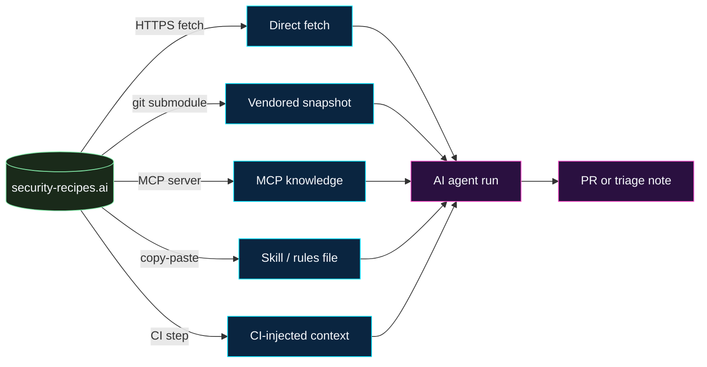


**What this page is.** A consumer's guide to using this site
*from inside* an AI agent. The site itself is a static Hugo
docs site; the prompts and recipes are markdown. This page
covers the five durable patterns for getting that markdown in
front of your agent at the right time, with the right scope,
and without the agent making things worse.


## The five integration shapes

There is no single right way to integrate. Pick the shape that
matches how your team already works:

1. **Direct fetch.** The agent fetches a recipe URL during a
   run when a finding matches it.
2. **Vendored snapshot.** A pinned snapshot of the recipes
   lives inside your repo (git submodule, a build-time copy,
   or a checked-in subset). The agent reads it from the
   filesystem.
3. **MCP knowledge server.** A read-only MCP server exposes
   the site's content as a search-and-fetch tool. The agent
   discovers and pulls recipes through MCP.
4. **Skill / rules-file inlining.** The recipes you actually
   use are inlined into the agent's native config —
   `CLAUDE.md`, `.cursor/rules/*.mdc`, `AGENTS.md`,
   `copilot-instructions.md`, a Devin Knowledge entry.
5. **CI-time injection.** The agent is invoked from a CI
   workflow that has already fetched the relevant recipe and
   pastes it into the agent's prompt as a tool result or
   context block.

The shapes are layered, not exclusive. Most mature programs
end up with **vendored snapshot + MCP for discovery + inlined
guardrails** — durability from the snapshot, breadth from MCP,
and load-bearing rules pinned in the agent's own config.



## Choosing a shape

The trade-offs are mostly about **freshness vs. control**:

| Shape | Freshness | Control | Audit | Best for |
| ----- | --------- | ------- | ----- | -------- |
| Direct fetch | Always-current | Lowest | Per-call HTTP log | One-off use, casual exploration |
| Vendored snapshot | Pinned | Highest | Git history | Production workflows that demand reproducibility |
| MCP knowledge | Always-current (via gateway TTL) | Medium | Per-tool-call audit | Multi-recipe, search-driven discovery |
| Skill / rules inline | Manual | Highest | Repo PRs | Load-bearing guardrails the agent must always follow |
| CI-injected | Always-current at CI time | Medium-high | CI logs | Deterministic, scheduled remediation |

A useful rule of thumb: **anything that can change the
agent's safety envelope** (guardrails, stop conditions, scope
restrictions) lives in the **inlined** shape, where it's
diff-reviewable. **Anything that's a per-finding playbook**
(a CVE recipe, a fix-shape catalogue) is fine to fetch live or
through MCP.

## Shape 1 — Direct fetch

The simplest pattern. When the agent encounters a finding it
recognises, it fetches the matching recipe URL and reads it
into context.

**How.**

- Every recipe page on this site has a stable URL — for
  example, [/prompt-library/cve/cve-2021-44228-log4shell/](https://security-recipes.ai/prompt-library/cve/cve-2021-44228-log4shell/).
- The agent's web-fetch tool (or its `WebFetch` equivalent)
  pulls the URL and returns the markdown body.
- The agent uses the recipe body as the prompt for the
  remediation run.

**When.** Good for one-off triage, prototypes, and small
teams that are comfortable with the agent reading from the
public internet at run time.

**Watch for.**

- **Prompt injection from the web.** The fetched page is
  effectively prompt input. The site is curated and reviewed
  — but a man-in-the-middled fetch, a typo'd domain, or a
  cache-poisoned proxy is not. Always fetch over HTTPS, pin
  the host, and treat fetched content as untrusted text.
- **Link rot.** A recipe URL might be renamed in a future
  edit. Pin a specific commit's view (see "Vendored
  snapshot") for production paths.
- **Rate limits.** If hundreds of agent runs all fetch in a
  burst, GitHub Pages and other static hosts will throttle.
  Cache locally.
- **The agent's interpretation of the page.** A recipe is
  written for a human reviewer to read end-to-end before
  running it. An agent that grabs only the prompt block and
  ignores the "Stop conditions" section is using the recipe
  wrong. The wrapper that drives the fetch should extract
  the whole recipe, not just the code block.

## Shape 2 — Vendored snapshot

A pinned copy of the recipes lives in your repo. The agent
reads from the working tree, not the live site.

**How.**

- **Git submodule** the site's content directory at a known
  commit:

  ```bash
  git submodule add \
    https://github.com/<owner>/<security-recipes-repo>.git \
    vendor/security-recipes
  cd vendor/security-recipes
  git checkout <pinned-commit>
  cd ../..
  git add vendor/security-recipes
  git commit -m "Pin security-recipes.ai snapshot"
  ```

- Or **subtree** for a flat history.
- Or a **build-time copy** — a CI step that downloads a
  release tarball from a specific tag and unpacks it into
  `vendor/security-recipes/`. Faster to onboard than a
  submodule; equally pinnable.

The agent's prompt names the path (`vendor/security-recipes/`)
and uses ordinary file-read tools to walk it. The recipes
become local context, not a network call.

**When.** This is the right shape for any production-shaped
remediation workflow. Pinning means the same recipe produces
the same agent behaviour across re-runs, audits, and
rollbacks.

**Watch for.**

- **Stale snapshot.** A recipe pinned to a 6-month-old commit
  may have a newer, better fix shape upstream. Schedule a
  cadence (monthly or quarterly) to bump the pin and
  re-validate.
- **Bumping is a reviewable PR.** Pinning is *not* a
  set-and-forget. Treat the bump as a normal PR with a diff
  reviewer can read.
- **Disk-size growth.** A full clone of the site is small,
  but the assets directory (images, CSS) is unnecessary for
  agents. Vendor only `content/` if size matters.

## Shape 3 — MCP knowledge server

A read-only MCP server exposes the site's content as a small
set of typed tools. The agent searches, lists, and fetches
recipes by name without knowing the site's URL structure.

**Tool surface.**

A reasonable minimum:

- `recipes_search(query)` — full-text search across the
  site's content. Returns a list of `{title, path, summary}`
  entries.
- `recipes_get(path)` — fetch the markdown body of a recipe
  by path.
- `recipes_list_by_category(category)` — list recipes under
  a category (`cve`, `classic-vulnerable-defaults`,
  `security-remediation`, etc.).
- `recipes_match_finding(finding)` — input a structured
  finding (CVE, package, rule ID, file pattern); return the
  best-matching recipe(s) with a confidence score.

**How.**

- Stand up a small MCP server that reads the vendored
  snapshot (Shape 2) or proxies the live site. The MCP spec
  for this shape is identical to a docs / wiki connector —
  any MCP framework (`@modelcontextprotocol/sdk`,
  `fastmcp`, language-equivalent) works.
- Register the server in your agent's MCP config (Claude
  Code's `.mcp.json`, Cursor's MCP settings, Codex's
  `AGENTS.md`-adjacent registration, etc.).
- Scope the server to **read-only**. It exposes no write
  tools.

**When.** This is the right shape when you have many
recipes and the agent needs to discover the right one rather
than be told. It also pairs well with the
[MCP gateway pattern]() —
expose the recipes connector behind your gateway with the
same audit / rate-limit / scope discipline as everything
else.

**Watch for.**

- **Tool description as prompt.** The descriptions of
  `recipes_search` etc. are visible to the agent and become
  prompt-layer input. Pin the descriptions and diff them on
  update — the same
  [tool-poisoning concern]()
  applies to your own connector.
- **Search relevance is the load-bearing knob.** A
  `recipes_search` that returns the wrong recipe at the top
  of the result set is silently routing the agent into the
  wrong fix. Tune relevance against a labelled set of real
  findings before declaring the connector ready.
- **Caching TTL.** Live-site MCP servers should cache; the
  TTL is how stale your runs can be. 24h is a sensible
  default for a production program.

## Shape 4 — Skill / rules-file inlining

The recipes that *must* shape the agent's behaviour every
run are pasted (or symlinked) into the agent's native
configuration file.

**Per-agent paths.**

- **Claude.** A Claude skill at `.claude/skills/<name>/SKILL.md`
  imports the recipe text. Or `CLAUDE.md` at the repo root
  with the full recipe inlined. Skills compose better; one
  skill per recipe class.
- **Cursor.** `.cursor/rules/<name>.mdc` per recipe class.
  Cursor reads these on every chat turn.
- **GitHub Copilot.** `.github/copilot-instructions.md`
  inlines the recipe (kept brief — Copilot's instruction
  budget is small). For longer recipes, point at a vendored
  path.
- **Codex.** `AGENTS.md` at the repo root inlines or
  references the recipe.
- **Devin.** Knowledge entries (one per recipe class)
  populated from the site's content directory.

**How.**

A small CI script copies the chosen recipes from the
vendored snapshot into the agent's config:

```bash
# Copy SAST and pickle recipes into the Claude skill
cp vendor/security-recipes/content/prompt-library/general/sast-finding-triage-and-fix.md \
   .claude/skills/sast-triage/SKILL.md

cp vendor/security-recipes/content/prompt-library/general/classic-vulnerable-defaults/python-pickle.md \
   .claude/skills/python-pickle/SKILL.md
```

Run the script in CI; commit the output. The agent reads
its config; the recipe is now *part of* the agent.

**When.** This is the right shape for **guardrails** —
"never touch these files," "always run the test suite,"
"open a PR, never merge." Anything that should be true on
*every* run of the agent in this repo, regardless of the
finding being remediated, lives here.

**Watch for.**

- **Token budget.** Inlining 20 recipes into `CLAUDE.md` or
  `AGENTS.md` will saturate the context window before any
  work happens. Keep the inlined set small; reach for MCP or
  vendored fetch for the long tail.
- **Drift.** Once inlined, the recipe is a fork. Add a CI
  check that compares the inlined copy to the vendored
  snapshot and fails if they diverge unexpectedly.
- **Per-agent quirks.** `CLAUDE.md` and `.cursor/rules/`
  honour the same markdown but apply different defaults
  around tool use; Copilot's instructions file has a hard
  size limit; Devin Knowledge entries are linked into
  sessions on a per-task basis. Inline what each agent
  reliably reads, not what you wish it would.

## Shape 5 — CI-time injection

A CI workflow finds the relevant recipe (by CVE ID, by
finding type, by changed file) and injects it into the
agent's prompt as a context block when the workflow
dispatches the agent run.

**How.**

```yaml
# .github/workflows/auto-remediate.yml (illustrative)
- name: Pick recipe
  id: pick
  run: |
    case "${{ github.event.client_payload.cve }}" in
      CVE-2021-44228) echo "path=vendor/security-recipes/content/prompt-library/cve/cve-2021-44228-log4shell.md" >> $GITHUB_OUTPUT ;;
      CVE-2024-3094)  echo "path=vendor/security-recipes/content/prompt-library/cve/cve-2024-3094-xz-utils.md" >> $GITHUB_OUTPUT ;;
      *)              echo "path=vendor/security-recipes/content/prompt-library/general/owasp-top-10-2026-remediate.md" >> $GITHUB_OUTPUT ;;
    esac

- name: Run agent
  run: |
    agent-cli run \
      --recipe "${{ steps.pick.outputs.path }}" \
      --finding-id "${{ github.event.client_payload.finding_id }}"
```

The agent CLI is whichever per-tool runner your team uses
(Copilot CLI, Claude Agent SDK, Cursor's headless runner,
Codex CLI, Devin's API). The recipe path is read by the
runner and pasted into the prompt.

**When.** This is the natural shape for the
[active workflows]()
on this site — SDE, vulnerable dependencies, SAST findings,
base-image bumps, cache quarantine. The workflow's
orchestrator is the CI; the recipe is the per-finding
playbook.

**Watch for.**

- **Recipe selection logic is its own attack surface.** A
  buggy `case` statement that picks the wrong recipe is
  exactly the kind of silent failure that causes mass-edit
  PRs. Test the picker with a sample of real findings
  before deploying.
- **Secrets in CI.** The agent's tokens, scoped credentials,
  and run identity all live in the CI environment. Apply the
  [admission and mid-run gates]()
  here, not just at the agent's tool layer.
- **Concurrency.** Two findings hitting the workflow at
  the same time should not produce conflicting PRs on the
  same lockfile. Serialise per-target.

## Per-agent walkthroughs

Each of the five agents on this site has its own configuration
shape. The walkthroughs below pair the shape choices above
with the agent's native primitives.

### GitHub Copilot

- **Inlined guardrails.** Add a `.github/copilot-instructions.md`
  pointing at the vendored snapshot for full recipes; inline
  the small list of guardrails Copilot must always honour
  (no auto-merge, no destructive git, scope to the finding).
- **Coding agent task prompts.** When dispatching Copilot's
  Coding Agent against a CVE, paste the relevant CVE recipe
  body into the issue / task description.
- **Dependabot assignees.** Configure Dependabot alerts to
  assign Copilot for routine bumps; the dispatch shape is
  documented under
  [Vulnerable Dependency Remediation]().
- See the [Copilot recipe page]()
  for full configuration.

### Claude

- **Skills.** One Claude skill per recipe class, imported
  from the vendored snapshot. The skill's `SKILL.md` is
  literally the recipe body; the skill's frontmatter scopes
  when it activates.
- **Hooks.** Add a `PreToolUse` hook that consults the
  vendored recipes when the agent starts a remediation —
  this is the on-ramp into the
  [runtime-controls]()
  pattern.
- **MCP.** Register a recipes MCP server in `.mcp.json` for
  search-driven discovery.
- See the [Claude recipe page]().

### Cursor

- **`.cursor/rules/*.mdc`.** One rule file per recipe class,
  vendored from the snapshot. Cursor's rule globs let you
  auto-activate per file path.
- **Background Agent prompts.** When kicking off a Cursor
  Background Agent for a remediation task, the recipe body
  is the prompt.
- See the [Cursor recipe page]().

### Codex

- **`AGENTS.md`.** Inline the small set of recipes Codex
  needs always-on; reference vendored paths for the long
  tail.
- **Task prompts.** Dispatch Codex against a finding by
  pasting the CVE or pattern recipe directly.
- See the [Codex recipe page]().

### Devin

- **Knowledge entries.** Each recipe class becomes a
  Knowledge entry. Devin pulls relevant entries into a
  session based on session context.
- **Playbooks.** Link Knowledge entries from playbooks for
  specific finding types.
- **Task prompts.** When opening a Devin session, the
  recipe body is the kickoff prompt.
- See the [Devin recipe page]().

## Cross-cutting concerns

These apply regardless of which shape(s) you adopt.

### Pin everything reproducible

A remediation that produces a different PR every time is not
a remediation; it's a moving target. Pin the recipe (commit
hash or tag), pin the agent's model version, pin the tool
catalogue. Each of those is an input the orchestrator
records on every run — so when an output looks wrong, you
can re-run with the same inputs and reproduce.

### Treat fetched recipes as untrusted text

Even when the source is this site, an agent that fetches
markdown from the web is reading prompt-layer input from a
network channel. Apply the same hygiene as you would to any
other untrusted input: HTTPS, integrity check, schema
validation on the parts you key off (the title, the
frontmatter), and assume the body could carry an injection
payload. The site is curated; your fetch path is not.

### One recipe per run

The pattern across the entire site is **one finding, one
PR.** That holds at the integration layer too. Don't
concatenate three recipes into a single agent prompt and
hope the agent sequences them correctly. Drive each
finding through its own run, with its own recipe, and let
the gatekeeping layer serialize them.

### Audit which recipe ran

Every agent PR opened against a security-recipes-driven
workflow should record:

- The recipe path (vendored, MCP, or live URL).
- The recipe's commit hash or fetch timestamp.
- The agent identity, model, and tool catalogue hash.
- The finding ID.

Without that quartet in the audit log, "which recipe wrote
this PR?" has no answer — and the
[reviewer playbook]()
depends on knowing.

### Don't paste prompts into the public internet

The recipes on this site are public. Some recipes a team
writes for its own repos are not. If your team forks
security-recipes.ai and adds private recipes, host the
private fork on internal infrastructure and integrate against
*that*. The public site is a starting point; private
specialisation is yours.

## What this page is not

- A vendor walkthrough for any single agent. Each per-agent
  page already covers configuration; this page is about
  how the *site itself* gets in front of the agent.
- A claim that integration is the hard part. It isn't. The
  hard part is which recipes you trust enough to run, the
  guardrails you wrap them in, and the reviewer-gating
  policy. The integration is mechanical — the gates are
  the design.

## See also

- [Quick Start]() — the fast
  path from "I read the site" to "I ran a recipe."
- [Agents]() — per-tool recipe
  pages for the five agents.
- [Prompt Library]() — the
  recipes you'd integrate.
- [MCP Servers]() — the
  connector layer Shape 3 builds on.
- [Gatekeeping Patterns]()
  — what wraps the integration once you have one.
- [Contribute]() — how to send
  back what you learn from your integration.
