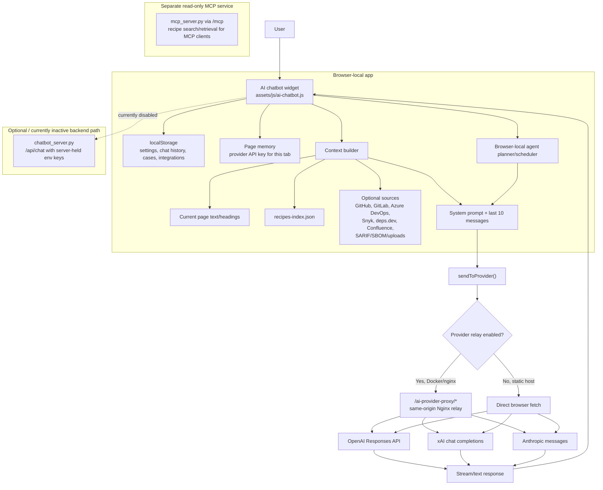

The SecurityRecipes chatbot is a browser-first assistant. It runs in the Hugo
site, builds a bounded prompt from the current page and selected context
sources, and sends that prompt to the user's selected AI provider.

The normal production path does **not** store model-provider API keys on the
server. Users bring their own OpenAI, xAI, or Anthropic credential in the
browser. Docker/nginx deployments can relay the current request through
same-origin `/ai-provider-proxy/*` routes, but the browser still supplies the
credential for that request.

## Architecture Decision

SecurityRecipes uses a **BYO-key, browser-local** chatbot architecture.

This is the preferred product direction because it keeps operating cost low,
avoids centralized model-provider billing, and limits how much sensitive
operator context the hosted site has to retain.

The design rules are:

- No model-provider API keys in `.env` for normal site operation.
- No server-held provider keys for production chat.
- Provider keys stay in page memory for the current tab/session.
- Chat history, settings, and local workbench artifacts remain browser-local.
- Same-origin relay routes may exist only as pass-through network plumbing.
- The relay must not log provider requests, persist provider request bodies, or
  forward unrelated browser cookies to AI providers.
- Any future backend scheduler, audit layer, or credential vault must be a
  separate architecture change, not an accidental expansion of the relay.

## Architecture

## Request Flow

1. The site loads the chatbot JavaScript and CSS on every page.
2. The user selects a provider and model, then pastes a provider credential.
3. Provider credentials are held in page memory. Chat history, settings,
   selected context sources, local cases, and integration configuration are
   stored in `localStorage`.
4. When the user sends a message, the chatbot loads `recipes-index.json`,
   collects the current page context, and refreshes any enabled external or
   uploaded context source.
5. `buildSystemPrompt()` combines the security-remediation instructions,
   selected context, browser-local activity, and recent chat transcript.
6. `sendToProvider()` sends the request to OpenAI, xAI, or Anthropic.
7. The response streams back into the chat UI and the cleaned transcript is
   saved locally.

## Active Provider Path

The active provider path is implemented in `assets/js/ai-chatbot.js`:

- `PROVIDERS` defines OpenAI, Grok/xAI, and Claude model options and endpoints.
- `providerEndpoint()` chooses either the same-origin relay endpoint or the
  direct provider endpoint.
- `callOpenAI()`, `callGrok()`, and `callClaude()` format provider-specific
  requests and parse provider-specific responses.
- `sendToProvider()` selects the provider call and requires a page-session
  credential before sending.
- `handleSend()` coordinates context loading, prompt construction, streaming,
  error handling, and activity logging.

Docker builds set `HUGO_PARAMS_AIPROVIDERRELAY="same-origin"`, which tells the
frontend to use the relay paths. The relay itself lives in
`docker/nginx/default.conf`:

- `/ai-provider-proxy/openai/` forwards the current request to OpenAI.
- `/ai-provider-proxy/xai/` forwards the current request to xAI.
- `/ai-provider-proxy/anthropic/` forwards the current request to Anthropic.

These Nginx routes forward only the current browser request to the selected
provider. They do not store provider credentials, and provider relay access
logging is disabled.

The relay is configured as pass-through infrastructure:

- `proxy_buffering off` preserves streaming responses.
- `proxy_request_buffering off` avoids buffering provider request bodies to
  temporary files before upstream forwarding.
- `access_log off` avoids writing provider call paths to the Nginx access log.
- `Cookie`, `Referer`, `Origin`, and `Proxy-Authorization` are cleared before
  forwarding to the provider.

## Context Sources

The default context is local and bounded:

- current page title, path, description, headings, excerpt, and query-matching
  snippets;
- relevant entries from `recipes-index.json`;
- recent chat messages;
- recent browser-local terminal and activity history.

Optional context can be enabled in Settings:

- GitHub repository files, issues, pull requests, and code scanning alerts;
- GitLab project and vulnerability finding summaries;
- Azure DevOps repository, pull request, and work item summaries;
- Microsoft Defender XDR and Sentinel incident samples;
- deps.dev advisory intelligence from GitHub Dependency Graph SBOM packages;
- Snyk issues and Confluence runbook search;
- local SARIF, scanner export, and SBOM uploads.

The frontend deliberately caps these inputs before inserting them into the
prompt. Examples include file-count limits, per-file text limits, alert/sample
limits, and total context character limits.

## Browser Agent Path

The **Agents** tab uses the same provider transport as chat. It builds a small
remediation contract from:

- selected model and provider;
- one repository or target scope;
- one recipe or workflow template;
- selected input channels;
- output route and approval gate.

The beta scheduler is browser-local. It can create plan drafts, saved local
actions, route-specific handoffs, case files, and reports. It does not create a
durable backend job, run unattended server work, merge code, deploy changes, or
rotate secrets.

## Inactive Server Chat Path

`chatbot_server.py` implements a separate `/api/chat` service that can use
server-held provider keys from environment variables such as `OPENAI_API_KEY`,
`XAI_API_KEY`, `GROK_API_KEY`, and `ANTHROPIC_API_KEY`.

That path is currently inactive in the browser frontend:

- `serverChatEndpoint()` returns an empty string.
- `callServerChat()` throws an error saying server-held provider keys are
  disabled.
- `docker-compose.yml` does not run the chatbot server by default.

This path is not the target production architecture. Keep it disconnected
unless the product direction explicitly changes from browser BYO-key to a
server-managed chat service.

## MCP Boundary

The hosted MCP server is separate from the browser chatbot. The MCP server in
`mcp_server.py` exposes read-only recipe search and retrieval over `/mcp` for
MCP-compatible clients.

The browser chatbot can attach MCP-adjacent context in two ways:

- Native browser sources for no-token public APIs such as deps.dev and OSV.dev,
  plus browser-collected context, uploaded artifacts, and direct API calls to
  configured external systems.
- A configured MCP HTTP gateway source. The browser calls one read-only-looking
  tool over HTTP and attaches bounded text context to chat or agent runs.

The browser chatbot does not launch local stdio MCP servers. Stdio-only
connectors should run in the agent host or behind an approved internal HTTP
gateway.

## Change Guidance

The recommended direction is to keep privacy and low operating cost as the
default design constraint:

| Goal | Recommended Change |
| --- | --- |
| Keep privacy and low infrastructure cost | Keep the BYO-key browser model. Use same-origin relay only as pass-through plumbing. |
| Improve same-origin reliability | Harden Nginx relay behavior without adding server-held provider keys, prompt storage, or provider billing. |
| Reduce browser credential exposure | Avoid storing integration tokens in `localStorage`; use short-lived tokens, OAuth, or a backend credential vault. |
| Add audit logs or abuse controls | Treat this as a new backend architecture, with explicit data-minimization rules and no full sensitive prompt storage by default. |
| Support unattended schedules | Add a backend job runner, job records, identity, retry policy, approval gates, run receipts, and revocation as a separate service. |
| Make MCP central to chat | Add a reviewed MCP HTTP gateway or backend orchestration layer; do not let the browser launch local stdio servers or inherit broad tool permissions. |
| Centralize provider billing | Do not do this by accident. It requires a deliberate move away from the current BYO-key model. |

## Files To Inspect

| File | Why It Matters |
| --- | --- |
| `assets/js/ai-chatbot.js` | Main chatbot UI, state, context builder, provider calls, browser agent, reports, and output routes. |
| `assets/css/ai-chatbot.css` | Chatbot and agent UI styling. |
| `layouts/partials/custom/head-end.html` | Loads chatbot assets and emits runtime configuration such as provider relay mode. |
| `docker/nginx/default.conf` | Same-origin provider relay, GitHub API relay, static site serving, and `/mcp` proxy. |
| `Dockerfile` | Builds the static site and enables same-origin provider relay mode for Docker runtime. |
| `chatbot_server.py` | Optional server-backed `/api/chat` implementation with environment-held provider keys. |
| `Dockerfile.chatbot-server` | Container image for the optional chat server. |
| `mcp_server.py` | Separate read-only MCP recipe server. |
