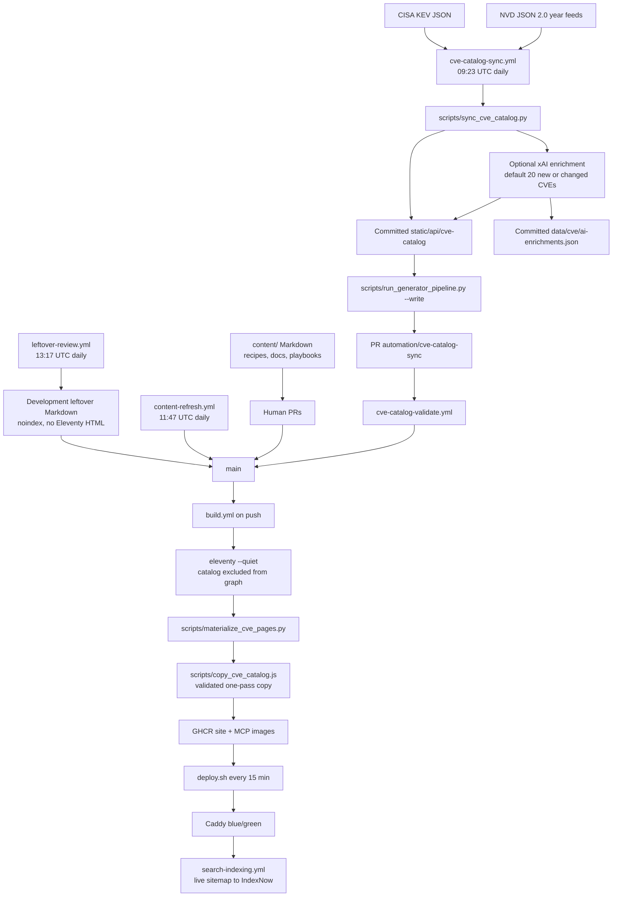

This is the site data pipeline: how public CVE feeds and repository Markdown
become the pages, catalogs, sitemaps, and MCP tools on
[security-recipes.ai](/). It is not the operator intake gate. That gate —
accept, contain, suppress, triage, or reject a signal before an agent patches —
lives on [CVE Intelligence Intake]().

Nothing here invents a source, a schedule, or a count. The jobs and scripts
named below are the ones in this repository.

## End to end

Two daily loops feed `main`. A third leftover-review loop rewrites development
Markdown and does not promote it. Push to `main` runs `build.yml`. The droplet
pulls the resulting images.

## Sources

The catalog job has two remote inputs:

| Source | URL / location | What it contributes |
| --- | --- | --- |
| NVD annual feeds | `https://nvd.nist.gov/feeds/json/cve/2.0` | CVE records, CVSS, CPE products, CWE, references. Integrity-hashed year files. |
| CISA KEV | `https://www.cisa.gov/sites/default/files/feeds/known_exploited_vulnerabilities.json` | Known-exploited flag and KEV dates, joined by CVE ID. Never used to invent a severity. |

Vendor and product names on a catalog row come from the NVD record (CPE). There
is no separate vendor-feed job. Human recipes and leftover-review may cite a
vendor advisory or a live GHAD row as evidence; those fetches are not catalog
ingest.

Recipe and docs pages start as Markdown under `content/`. Stable CVE Markdown
under `content/recipes/cve/` can override the composed catalog recipe for that
ID. Archetype text used to compose a conservative recipe lives in
`data/cve/remediation-archetypes.json`.

## Daily catalog sync

`.github/workflows/cve-catalog-sync.yml` runs at **09:23 UTC** and on
`workflow_dispatch`. It is the only job that refreshes
`static/api/cve-catalog`.

`scripts/sync_cve_catalog.py` then:

1. Fetches every NVD identifier-year feed from 2002 through the current year,
   so a publication-date window is exact (CVE year and publication year are not
   assumed to match).
2. Keeps records in the rolling **ten-year** window whose NVD-supplied CVSS
   observation has `baseScore >= 4.0`. Effective severity is Medium, High, or
   Critical — the highest supplied or derived severity. Low is out of catalog
   scope.
3. Joins CISA KEV by CVE ID.
4. Reapplies local Markdown from `content/recipes/cve/`.
5. Optionally asks xAI/Grok to enrich **new or source-changed** records.
   Default limit is **20** per run (`XAI_ENRICHMENT_LIMIT`, max 50). If
   `XAI_API_KEY` is missing, source sync still finishes and valid cached
   enrichments stay. Most catalog rows are not AI-enriched.
6. May write development drafts at
   `content/recipes/cve/ai-enrichment-cve-*.md`, owned by
   `data/cve/ai-generated-recipes.json`.

Outputs that get committed:

- `static/api/cve-catalog/` — shards, year indexes, `manifest.json`,
  `search-indexable.json`, `runtime-summary.json`
- `data/cve/ai-enrichments.json` — enrichment cache
- `data/cve/ai-generated-recipes.json` — generated-draft ledger

The job then runs `scripts/run_generator_pipeline.py --write` so checked-in
`data/evidence/` packs and `scripts/generated-output-ownership.json` stay in
dependency order with the new catalog. `scripts/validate_cve_catalog.py` and
the catalog unit tests must pass. `scripts/check_cve_catalog_update.py`
quarantines a suspicious delta (`automation:quarantine`) instead of merging it.

A change lands as PR branch `automation/cve-catalog-sync`. Exact-SHA
validation is `cve-catalog-validate.yml`. Merge is squash, and only when
repository variable `CVE_AUTO_MERGE_ENABLED=true`. After merge, `build.yml`
runs from the push (GitHub App) or a dispatched Build pinned to that SHA.

NVD feed bytes are cached in CI under `tmp/nvd-cve-feeds`. That directory is
not committed.

## Content loops

Catalog sync does not write playbooks, docs, or non-CVE recipes.

**Human PRs.** Reviewed Markdown under `content/` (including stable CVE
overrides) is the normal editorial path. A merge to `main` is enough to
trigger Build.

**`content-refresh.yml`.** Daily at **11:47 UTC**. Explicitly not CVE ingest.
If `XAI_API_KEY` is usable, `scripts/run_grok_agent.py` runs
`.github/prompts/content-refresh.md`: at most one bounded edit to reviewed
non-CVE workflows, playbooks, or recipes. Out of scope:
`content/recipes/cve/`, `data/cve/`, `static/api/cve-catalog/`. The agent
opens `automation/content-refresh-*` and labels it
`automation:content-refresh`. If the key is missing, the job is a no-op.

**`leftover-review.yml`.** Daily at **13:17 UTC**. Inactive until
`XAI_API_KEY` is set.
`scripts/pick_leftover_review_queue.py` selects leftover-gold pages under
`content/recipes/cve/`, ordered critical → high → medium → low, up to
`daily_limit` in `data/cve/leftover-review-state.json` (currently 100).
The Grok pass live-checks GHAD and NVD and **rewrites those files in place**.
It must not promote them to `maturity: stable` without a verified named floor.
The leftover-review prompt then requires
`scripts/sync_cve_catalog.py --markdown-only`. Those pages stay development.

## Committed vs generated at build

| Artifact | When it is produced | In git? |
| --- | --- | --- |
| `static/api/cve-catalog/` | Daily catalog sync, then committed | Yes |
| `data/cve/ai-enrichments.json` | Catalog sync cache | Yes |
| `data/evidence/` | `run_generator_pipeline.py --write` during catalog/content jobs | Yes |
| `content/**/*.md` | Humans, content-refresh, leftover-review, or catalog draft writer | Yes |
| Eleventy `public/` pages, feeds, sitemaps | `npm run build` / Docker builder | No (`public/` is gitignored) |
| `/cve/<ID>/index.html` for qualified IDs | `scripts/materialize_cve_pages.py` after Eleventy | No |
| MCP SQLite FTS | `scripts/build_cve_search_db.py` inside `Dockerfile.mcp-server` | No |

Most of `static/` still uses Eleventy passthrough copy, but
`static/api/cve-catalog/` is deliberately excluded from Eleventy's input and
passthrough graphs. After page materialization,
`scripts/copy_cve_catalog.js` validates the manifest-owned physical file set
and copies that catalog exactly once to `public/api/cve-catalog/`. This keeps a
large catalog from multiplying Eleventy dependency and copy work while serving
the same committed bytes at `/api/cve-catalog/`.

`eleventy --serve` does **not** run the CVE materializer or the post-build
catalog copy. A fresh checkout without `npm run build` has no
`public/cve/<ID>/` files and no copied `public/api/cve-catalog/`, although
Eleventy can still render the `/cve-database/` shell.

## Which CVE URLs are indexable

`scripts/sync_cve_catalog.py` writes `search-indexable.json`. A record is
qualified when it has a **stable Markdown override** or a **recipe-ready AI
enrichment** that is not blocked by
`ai_enrichment_review_status: human-reviewed-development-draft`.

That allowlist is the only CVE set that:

- is materialized as static `/cve/<ID>/` HTML (`index,follow`)
- is listed in year-partitioned `/sitemaps/cves-*.xml`

Every other in-catalog ID still has a `/cve/<ID>/` URL. nginx
`try_files` serves the static file when it exists; otherwise
`@cve_landing_runtime` proxies the paired MCP renderer. Those runtime pages
are `noindex,follow` and send `X-CVE-Cache`. They are not in the CVE
sitemaps.

Development leftover Markdown is stricter: `content/recipes/cve/cve.11tydata.js`
sets `permalink: false` unless the page is a pre-catalog historical stable
route. Leftover drafts emit **no Eleventy HTML**, stay `noindex`, and are not
attached to catalog shards as overrides. They can sit in git for review
without becoming a search result.

A few older reviewed recipes keep a static `/recipes/cve/<slug>/` route
(`canonical_cve_route: false`) because the rolling catalog does not carry
their year.

## Build

`build.yml` runs on push to `main` or `development`, on pull requests, and on
a SHA-pinned dispatch from catalog automation.

`npm run build` is:

1. `eleventy --quiet` — docs, recipes, `/cve-database/`, API JSON feeds,
   `sitemap.xml` index, `sitemaps/pages.xml`, `sitemaps/cves-*.xml`
2. `python scripts/materialize_cve_pages.py` — same MCP landing-page renderer
   the runtime fallback uses, written to `public/cve/<ID>/`
3. `node scripts/copy_cve_catalog.js` — validate and copy the catalog outside
   Eleventy's graph
4. `node scripts/prepare_static_assets.js`

Feeds Eleventy emits include `/api/recipes-index.json` (MCP recipe bodies) and
`/api/recipes.json`. The body-less `/recipes-index.json` is the in-browser
search index, not the MCP source.

On non-PR runs the workflow smoke-tests the Docker images, then the
`publish` job pushes immutable tags to GHCR:

- `ghcr.io/stevologic/security-recipes.ai-site:<sha>`
- `ghcr.io/stevologic/security-recipes.ai-mcp:<sha>`

`development` images get a `-development` suffix.

The expensive scale proof is intentionally separate from ordinary PR CI.
`cve-scale-gate.yml` runs monthly or manually with 500,000 real synthetic
records through the production build path, SQLite creation and required query
classes, revision-pinned exact lookup, output-size and memory budgets, and
49,000-URL sitemap partitioning. `scripts/cve_catalog_release.py` can also
package, validate, and atomically hydrate a deterministic content-addressed
catalog release. That is the local immutable-release primitive; production
still builds from the catalog committed with the selected SHA, so signed
descriptor publication and object-storage distribution remain future deploy
work rather than an undocumented dependency.

## Deploy

`build.yml` does not SSH to production. `deploy.sh` on the droplet does.

The script is written for a systemd timer or cron. The header example is
`*/15 * * * *`. It fetches `origin/main`, waits for the exact-commit Build
(and default-setup CodeQL on that push), hard-resets the checkout, pulls the
SHA-tagged site and MCP images, and blue/green swaps them behind Caddy. The
previous slot stays as a verified fallback. A failed candidate is rolled back.

After cutover it checks:

- `/.well-known/deploy-revision` matches the target SHA
- `/cve/CVE-2024-3400/` still has the indexable landing contract
- `/api/cve-catalog/manifest.json` `catalog_updated_at` is younger than
  `DEPLOY_CATALOG_MAX_AGE_HOURS` (default **36**)

`origin/development` is a separate slot on `dev.<apex>/` with
`X-Robots-Tag: noindex, nofollow, noarchive`.

## What humans and MCP see

**Browser.** Eleventy pages come from `content/`. `/cve-database/` uses the
small runtime summary and the revision-pinned SQLite search route instead of
loading every shard. Exact record reads use the same-origin
`/api/cve-catalog/records/<CVE-ID>` route advertised by `record_api`, with the
catalog revision required on every request; older runtime summaries retain a
bounded shard fallback for compatibility. Qualified CVEs are static files in
the site image. Everything else in scope is the MCP fallback page.

**MCP.** The paired MCP image is built from the **same commit**. It bakes
`static/api/cve-catalog` and builds `/app/runtime/cve-search.sqlite3` from
those shards. Exact CVE lookup is shard-native. Broad search uses that
SQLite file. Recipe tools do **not** read a second recipe store: they fetch
`/api/recipes-index.json` from the paired site container
(`RECIPES_MCP_SOURCE_INDEX_URL`, default
`http://security-recipes/api/recipes-index.json` in Compose). Evidence packs
are the committed `data/` files copied into the MCP image.

The public exact-record and search routes enforce revision matching, response
and concurrency bounds, same-origin request handling, and short-lived caching.
They return catalog facts; the MCP recipe tools continue to provide the
human-readable remediation, detection/triage guidance, verification steps,
and agentic change plan from the paired revision.

Local MCP against a laptop build needs a served index and
`RECIPES_MCP_ALLOWED_SOURCE_HOSTS=localhost`. A bare `GET /mcp` returns 406;
the server is streamable-HTTP.

## Search engines

`.github/workflows/search-indexing.yml` runs on push to `main` and daily at
**07:53 UTC**. It fetches the **live** `https://security-recipes.ai/sitemap.xml`,
walks child sitemaps, and POSTs those URLs to IndexNow. Google is not an
IndexNow consumer; it is expected to use the sitemap and Search Console.

`sitemaps/pages.xml` omits `noindex` pages, aliases, and redirects.
`sitemaps/cves-*.xml` lists only qualified canonical `/cve/<ID>/` URLs.

## Related

- [CVE Intelligence Intake]() —
  operator decisioning, not this pipeline
- [Content Verification]() — publish
  gates that the jobs above must still pass
- [How to use]() — reader view of qualified vs
  runtime CVE pages
