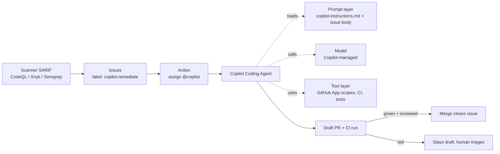


**Outcome.** Vulnerability findings flow from your scanner into a Copilot
Coding Agent task, which produces a reviewed pull request without manual
hand-off.


This recipe walks through turning GitHub Copilot — specifically **Copilot Chat**
and the **Copilot Coding Agent** — into a remediation pipeline that picks up
findings, opens branches, and ships PRs. Copilot is the shortest-setup
option on this site because it rides on primitives you already have:
Issues, labels, PRs, Actions, branch protections.

## Prerequisites

- GitHub Enterprise Cloud or Copilot **Business / Enterprise** license
- Copilot Coding Agent enabled at the org level
- A code scanning or SCA tool that emits SARIF (CodeQL, Snyk, Semgrep, etc.)
- Branch protections on `main` that require review and green CI

## General onboarding

The public path — what any individual or team can do today
without waiting on an enterprise rollout.

1. **Pick a plan.** A personal Copilot subscription is enough to
   try chat + inline suggestions. The **Copilot coding agent**
   requires **Copilot Business** or **Copilot Enterprise** on a
   GitHub org. See
   [Copilot plans & pricing](https://github.com/features/copilot/plans).
2. **Install Copilot in your editor** (VS Code, JetBrains,
   Visual Studio, Neovim) and sign in. See
   [GitHub Copilot docs home](https://docs.github.com/en/copilot).
3. **Add repository custom instructions.** Commit
   `.github/copilot-instructions.md` — this is the house prompt
   every coding-agent run reads. See
   [Add custom repository instructions](https://docs.github.com/en/copilot/how-tos/configure-custom-instructions/add-repository-instructions).
4. **Enable the Copilot coding agent.** Org admin switches it
   on at **Settings → Copilot → Policies**; then assign issues
   to `@copilot` to dispatch. See the
   [quickstart](https://docs.github.com/en/copilot/how-tos/use-copilot-agents/coding-agent).
5. **Extend with MCP (optional).** Add MCP servers at the org
   or repo level for richer context. See
   [Extend the coding agent with MCP](https://docs.github.com/en/copilot/how-tos/use-copilot-agents/coding-agent/extend-coding-agent-with-mcp).
6. **Read the best-practices guide** before dispatching agent
   tasks against production repos. See
   [Best practices for the Copilot coding agent](https://docs.github.com/en/copilot/get-started/best-practices).
7. **Review trust + data-handling** at the
   [GitHub Trust Center](https://github.com/trust-center).

**Vendor-side reference index:**

- [GitHub Copilot docs home](https://docs.github.com/en/copilot)
- [About the Copilot coding agent](https://docs.github.com/en/copilot/concepts/agents/cloud-agent/about-cloud-agent)
- [Use the Copilot coding agent (quickstart)](https://docs.github.com/en/copilot/how-tos/use-copilot-agents/coding-agent)
- [Best practices](https://docs.github.com/en/copilot/get-started/best-practices)
- [Custom instructions (`.github/copilot-instructions.md`)](https://docs.github.com/en/copilot/how-tos/configure-custom-instructions/add-repository-instructions)
- [Extend with MCP](https://docs.github.com/en/copilot/how-tos/use-copilot-agents/coding-agent/extend-coding-agent-with-mcp)
- [Plans & pricing](https://github.com/features/copilot/plans)
- [GitHub Trust Center](https://github.com/trust-center)

The feature is referred to as the **Copilot coding agent** (and
sometimes **Copilot cloud agent** in the UI). Both terms point at
the same surface: issues assigned to `@copilot` get picked up by
a managed GitHub Actions job that branches, iterates, and opens a
draft PR.

## Enterprise onboarding


**Placeholder — customize for your organization.** Replace the
steps and links below with your internal process for getting a
Copilot license, enabling the coding agent, and granting the
repo scope this recipe expects. The structure is a starting
point so every recipe on this site has a consistent "how does my
team actually start using this at my company?" section. Forks of
this project are expected to fill this in for their own
organizations.


1. **Request access.** File an IT ticket for a Copilot Business or
   Enterprise seat on your GitHub org. Internal link:
   [Request Copilot access](#placeholder-itsm-link).
2. **Get added to the Copilot team.** Your GitHub admin assigns you
   to the org's Copilot-licensed team. Internal link:
   [Copilot team membership](#placeholder-team-link).
3. **Enable the coding agent.** Ask your GitHub admin to flip
   **Settings → Copilot → Policies → Coding Agent** to *Enabled*
   for the orgs and repos this recipe targets. Internal link:
   [Coding agent rollout plan](#placeholder-rollout-link).
4. **Confirm SSO / SAML is enforced.** Copilot access must go
   through your corporate identity provider. Internal link:
   [SSO enrollment](#placeholder-sso-link).
5. **Complete internal training.** Read the internal rules of
   engagement for Copilot usage on production repos before
   dispatching any coding-agent task. Internal link:
   [InfoSec AI usage policy](#placeholder-policy-link).

## Recipe steps

### 1. Enable the Coding Agent at the org level

In the org settings, go to **Settings → Copilot → Policies** and:

- Enable **Copilot Coding Agent** for the repositories you want to
  automate (allowlist; don't turn it on org-wide until you've piloted).
- Under **Copilot Chat**, ensure **GitHub.com** is allowed (so the
  agent can read issues).
- Scope the GitHub App used by the agent to the minimum repos needed.

Per-repo, turn on:

- **Settings → Code security and analysis → Code scanning** (CodeQL
  default setup is fine to start).
- **Settings → Code security and analysis → Dependabot alerts** and
  **Dependabot security updates**.
- **Settings → Branches → Branch protection rules** for `main`:
  require PR review, require status checks, block force pushes.

### 2. Commit a `.github/copilot-instructions.md`

This file is Copilot's system prompt for the repo. The Coding Agent
reads it on every run. Keep it focused on *house rules* — things the
agent can't infer from the code.

```markdown
# Copilot instructions — payments-service

## Stack
Node.js 20, TypeScript, Fastify, Postgres, pnpm workspaces.

## Build & test commands
- Install: `pnpm install --frozen-lockfile`
- Lint:    `pnpm lint`
- Test:    `pnpm test`
- Build:   `pnpm build`

Always run `pnpm lint && pnpm test` before pushing.

## Branch & commit conventions
- Branch: `copilot/<finding-id>` (e.g. `copilot/CVE-2026-1234`)
- Commit: Conventional Commits (`fix(deps):`, `fix(sec):`).
- PR title: `fix: <one-line summary>`.
- PR description: must include the finding ID and a short
  blast-radius note.

## Files and areas you must NOT modify
- `db/migrations/**`         — any DB migration
- `infra/terraform/**`       — infra-as-code
- `**/*.generated.ts`        — generated code
- `pnpm-lock.yaml`           — only during an explicit dep-bump task

## Stop and ask (do not push)
- Any change to a public API contract.
- Any change to a DB column (name, type, nullability).
- Any skipped / disabled test.
```


**Instructions are not enforcement.** `copilot-instructions.md` is a
prompt, not a guarantee. Pair it with branch protections, required
CI checks, and the "Files to never modify" list in CODEOWNERS so
the rules are enforced by GitHub even if the model drifts.


### 3. Project findings into GitHub Issues

Most scanners support an issue-projection path natively. Wire it up
and label the issues `copilot-remediate`:


  
CodeQL results appear under **Security → Code scanning**. To
project them as Issues, use the [code-scanning-create-issue](https://github.com/marketplace/actions/create-issues-from-code-scanning-alerts)
action on a schedule:

```yaml
# .github/workflows/codeql-to-issues.yml
name: Project CodeQL alerts as issues
on:
  schedule:
    - cron: "0 7 * * 1-5"   # weekdays, 07:00 UTC
  workflow_dispatch:

permissions:
  issues: write
  security-events: read

jobs:
  project:
    runs-on: ubuntu-latest
    steps:
      - uses: advanced-security/code-scanning-create-issue@v1
        with:
          label: copilot-remediate
          severity: "error,warning"
```
  
  
Snyk writes issues via the Snyk GitHub integration; set the **Issue
label** to `copilot-remediate` in the Snyk org settings, or use
`snyk monitor --severity-threshold=high` in CI and project the
SARIF into issues with a scheduled workflow.
  
  
Semgrep Cloud Platform supports issue projection under
**Deployments → GitHub → Auto-project**. Configure the label as
`copilot-remediate`. For self-hosted, emit SARIF and use the
CodeQL recipe above.
  


### 4. Auto-assign labeled issues to `@copilot`

A tiny Action is all that's needed:

```yaml
# .github/workflows/assign-copilot.yml
name: Assign remediation issues to Copilot
on:
  issues:
    types: [labeled, opened]

permissions:
  issues: write

jobs:
  assign:
    if: contains(github.event.issue.labels.*.name, 'copilot-remediate')
    runs-on: ubuntu-latest
    steps:
      - run: |
          gh issue edit ${{ github.event.issue.number }} \
            --repo ${{ github.repository }} \
            --add-assignee "@copilot"
        env:
          GH_TOKEN: ${{ secrets.GITHUB_TOKEN }}
```

Copilot will open a draft PR within a minute or two of the
assignment, run CI, and push commits as it iterates.

### 5. Lock down the merge path

Never auto-merge Copilot PRs. Enforce at the branch-protection
layer:

- **Require a pull request before merging** → `1` reviewer minimum
  (or `CODEOWNERS` required).
- **Require status checks to pass** → pin the lint, test, and
  scanner workflows.
- **Do not allow** GitHub Apps to bypass required reviews.
- Add a `copilot-paused` label that your Action respects:

```yaml
# ... in assign-copilot.yml
    if: |
      contains(github.event.issue.labels.*.name, 'copilot-remediate') &&
      !contains(github.event.issue.labels.*.name, 'copilot-paused')
```

Flip the `copilot-paused` label across the org if you ever need a
kill switch.

### 6. Project findings from Jira, Linear, or scanners into GitHub Issues

Because the Coding Agent dispatches off GitHub Issues assigned to
`@copilot`, any external system can feed it by creating a labeled
issue. Pick the shape that matches where your backlog lives:


  
```
# Jira → Automation → "Send web request"
Method:  POST
URL:     https://api.github.com/repos/{owner}/{repo}/issues
Headers: Authorization: Bearer {{GH_PAT_WITH_ISSUES_WRITE}}
         Accept: application/vnd.github+json

Body:
{
  "title": "Remediate {{issue.key}}: {{issue.summary}}",
  "body":  "Source: Jira {{issue.key}}\n\n{{issue.description}}\n\n---\nAssigned to Copilot coding agent.",
  "labels": ["copilot-remediate"],
  "assignees": ["copilot"]
}
```
Trigger rule: *Issue transitioned → Ready-for-Agent*. Creates a
GitHub issue, labels it, and assigns `@copilot` in one hop.
  
  
```js
// Cloudflare Worker handling Linear's outbound webhook
export default {
  async fetch(request, env) {
    const event = await request.json();
    if (event.type !== "Issue" || event.data.state.name !== "Ready-for-Agent") {
      return new Response("ignored", { status: 204 });
    }
    const issue = event.data;
    const res = await fetch(
      `https://api.github.com/repos/${env.GH_OWNER}/${env.GH_REPO}/issues`,
      {
        method: "POST",
        headers: {
          "Authorization": `Bearer ${env.GH_PAT}`,
          "Accept": "application/vnd.github+json",
        },
        body: JSON.stringify({
          title: `Remediate ${issue.identifier}: ${issue.title}`,
          body: `Source: Linear ${issue.identifier}\n\n${issue.description ?? ""}`,
          labels: ["copilot-remediate"],
          assignees: ["copilot"],
        }),
      },
    );
    return new Response(await res.text(), { status: res.status });
  },
};
```
  
  
```yaml
# .github/workflows/scanner-to-copilot.yml
name: Scanner → Copilot coding agent
on:
  repository_dispatch:
    types: [security-finding]

permissions:
  issues: write

jobs:
  open-issue:
    runs-on: ubuntu-latest
    steps:
      - name: Create labeled issue for Copilot
        env:
          GH_TOKEN: ${{ secrets.GITHUB_TOKEN }}
          FINDING_ID: ${{ github.event.client_payload.finding_id }}
          FINDING_BODY: ${{ github.event.client_payload.description }}
        run: |
          gh issue create \
            --repo ${{ github.repository }} \
            --title "Remediate ${FINDING_ID}" \
            --body  "${FINDING_BODY}" \
            --label copilot-remediate \
            --assignee copilot
```
Your scanner POSTs to
`/repos/{owner}/{repo}/dispatches` with `event_type:
security-finding` — the workflow fans it out into a labeled issue
assigned to `@copilot`. Works the same for Snyk, Wiz, Semgrep, or
any tool with a webhook.
  
  
```yaml
# .github/workflows/nightly-copilot-sweep.yml
name: Nightly Copilot remediation sweep
on:
  schedule:
    - cron: "0 2 * * *"
  workflow_dispatch:

permissions:
  issues: write
  security-events: read

jobs:
  sweep:
    runs-on: ubuntu-latest
    steps:
      - name: Open issues for top-N open alerts
        env:
          GH_TOKEN: ${{ secrets.GITHUB_TOKEN }}
        run: |
          gh api "/repos/${{ github.repository }}/code-scanning/alerts?state=open&severity=error" \
            --jq '.[0:5][] | {rule: .rule.id, number: .number, desc: .rule.description}' \
            | while read -r row; do
                FID=$(echo "$row" | jq -r '.number')
                DESC=$(echo "$row" | jq -r '.desc')
                gh issue create \
                  --repo ${{ github.repository }} \
                  --title "Remediate CodeQL alert #${FID}" \
                  --body  "$DESC" \
                  --label copilot-remediate \
                  --assignee copilot
              done
```
Caps the queue: at most 5 Copilot PRs per night while the
reviewer team is calibrating volume.
  


### 7. (Optional) Wire MCP servers for richer context

The Coding Agent can call MCP tools configured in
**Settings → Copilot → MCP servers** at the org / repo level. Start
with read-only connectors: Jira (for ticket context), Confluence /
Notion (for runbooks), your scanner (to fetch advisory details the
issue body doesn't include).

See [MCP Server Access]() for the
wider catalog and integration shape.

## Verification

Open a test issue tagged `copilot-remediate` against a known vulnerable
dependency. Within a few minutes Copilot should:

- open a draft PR,
- update the manifest (and lockfile) to a patched version,
- run your CI,
- leave a written remediation summary on the PR.

Confirm that merging the PR closes the linked issue and that your scanner
re-runs and marks the finding resolved.

## Orchestration: what stays constant, what changes

Copilot's remediation recipe rides GitHub's own primitives —
Issues, labels, assignees, draft PRs, branch protections. That
makes the orchestration unusually **boring and durable**: a
small Action listens for a label and assigns the issue to
`@copilot`; everything else is stock GitHub. The stable spine is
the label-driven assignment + the merge-path lockdown;
everything Copilot reads per-run is expected to evolve.



What is **constant** (build once, leave alone):

- The label (`copilot-remediate`) + assignment Action.
- Branch protections on `main` — reviewers + green CI required,
  no auto-merge for the agent.
- The GitHub App token scope and the kill-switch label
  (`copilot-paused`).
- The PR → CI → review → merge → finding-closed loop.

What **evolves** (expected to change, often):

- **Prompt.** `.github/copilot-instructions.md` is iterated as
  house rules change. The issue-template body that becomes the
  Coding Agent's task brief is tuned per finding class.
- **Model.** Copilot's underlying model rolls forward inside the
  product — you inherit upgrades without touching the pipeline.
- **Tools.** New CI checks (SAST, SCA, license scanning) get
  wired into branch protections over time, tightening the
  merge gate without changing how findings get dispatched.

The GitHub-native orchestration is the reason Copilot has the
shortest setup curve — you don't build new plumbing, you
configure existing plumbing.

## Guardrails

- **Least-privilege token.** The Coding Agent uses a scoped GitHub App token.
  Make sure it cannot bypass branch protections.
- **Allowlist tool access.** In `copilot-instructions.md`, enumerate which
  commands and directories are in scope, and list what is off-limits.
- **CODEOWNERS as a hard stop.** Anything you can't afford the agent to
  change (migrations, IaC, API schemas) should require human CODEOWNERS
  approval so branch protection blocks the merge.
- **Cost caps.** Watch your premium-request usage in the Copilot usage report.
  The `copilot-paused` label is your kill-switch.

## Troubleshooting

- **Copilot didn't pick up the issue.** Check the org policy allows the
  repo, confirm the issue is assigned to `@copilot` (not just labeled),
  and verify the Copilot GitHub App has access to the repo.
- **PR is blocked by CI and Copilot gives up.** Add the specific failing
  check name to `copilot-instructions.md` with a hint on how to read it
  — e.g. "If `lint` fails, run `pnpm lint --fix` and commit the result."
- **Changes landing in protected paths.** Add those paths to
  `CODEOWNERS` with a required-reviewer team, and re-state them in
  `copilot-instructions.md`.

## See also

- GitHub: [About the Copilot coding agent](https://docs.github.com/en/copilot/concepts/agents/cloud-agent/about-cloud-agent)
- GitHub: [Use the Copilot coding agent](https://docs.github.com/en/copilot/how-tos/use-copilot-agents/coding-agent)
- GitHub: [Best practices for the Copilot coding agent](https://docs.github.com/en/copilot/get-started/best-practices)
- GitHub: [Add custom repository instructions](https://docs.github.com/en/copilot/how-tos/configure-custom-instructions/add-repository-instructions)
- GitHub: [Extend the coding agent with MCP](https://docs.github.com/en/copilot/how-tos/use-copilot-agents/coding-agent/extend-coding-agent-with-mcp)
- [MCP Server Access]() — add richer context
- Recipe: [Claude]() — deeper MCP-driven flows
- [Prompt Library]() — share your Copilot remediation prompts
