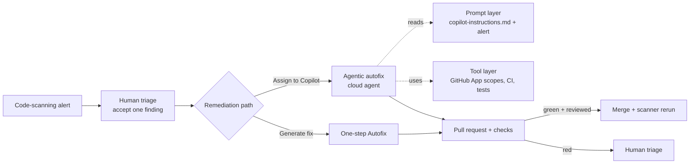

---
title: GitHub Copilot Vulnerability Remediation
linkTitle: GitHub Copilot
weight: 1
date: 2026-04-21
lastmod: 2026-08-21
description: Use GitHub Code Security, Copilot Autofix, and Copilot cloud agent to turn code-scanning alerts into tested vulnerability-remediation pull requests.
sidebar:
  open: true
---


**Outcome.** An accepted code-scanning alert goes directly to Copilot
Autofix or Copilot cloud agent, then returns as a reviewed pull request
with the original alert and verification evidence attached.



**In a hurry?** The
[**Quick Start**]()
is a five-minute path to your first agentic remediation PR with
GitHub Copilot. Come back here for the full recipe once that loop is
working.


This recipe uses **GitHub Code Security**, **Copilot Autofix**, and the
**Copilot cloud agent** to move from a code-scanning alert to a bounded,
reviewed patch. The workflow rides on GitHub's existing alerts, pull
requests, Actions, and branch protections.

First define the shared guardrails and proof requirements in the
[reviewed remediation workflow](),
then map them to Copilot's GitHub-native controls below.

For Dependabot and package advisories, use the
[GitHub Copilot vulnerable-dependency recipe]()
to turn those controls into a scoped issue-to-PR task.
For a detected secret or PII leak, use the
[GitHub Copilot sensitive-data remediation recipe]().

## Remediate a vulnerability with GitHub Copilot

Start from the code-scanning alert; do not copy it into a separate issue
unless your tracking policy requires one.

1. Open **Security and quality → Code scanning**, inspect the alert and
   its data flow, and confirm the repository's normal review and test gates
   are enabled.
2. If **Copilot cloud agent** is available, select **Assign to Copilot**.
   Agentic autofix explores the repository, proposes a change, reruns
   CodeQL where supported, and opens a pull request for review.
3. Otherwise select **Generate fix**, review the one-step
   [Copilot Autofix](https://docs.github.com/en/code-security/concepts/code-scanning/autofix-for-code-scanning)
   suggestion, and choose **Create PR with fix** only when the diff is
   appropriate.
4. Run the repository tests and code scanning again. Treat validation as
   best effort for custom queries, the security-extended suite, and
   third-party findings, then merge through the normal review process.

See GitHub's [alert-resolution workflow](https://docs.github.com/en/code-security/how-tos/manage-security-alerts/manage-code-scanning-alerts/resolve-alerts).
Rechecked August 23, 2026: one-step Copilot Autofix still does not require
a Copilot subscription for an eligible repository. GitHub still documents
Autofix as using OpenAI GPT-5.3-Codex. Do not pin that model name in
prompts. Agentic autofix is still a public preview; it uses Copilot cloud
agent and consumes the applicable AI credits.

## Prerequisites

- Code scanning enabled for the repository
- GitHub Code Security enabled where the repository's visibility and plan require it
- Optional access to Copilot cloud agent for agentic autofix
- Branch protections on `main` that require review and green CI

## General onboarding

The public path — what any individual or team can do today
without waiting on an enterprise rollout.

1. **Pick a plan.** One-step Copilot Autofix is available to eligible
   code-scanning repositories without a Copilot subscription. Copilot
   cloud agent is available on paid Copilot plans. See
   [Copilot plan documentation](https://github.com/features/copilot/plans).
2. **Install Copilot in your editor** (VS Code, JetBrains,
   Visual Studio, Neovim) and sign in. See
   [GitHub Copilot docs home](https://docs.github.com/en/copilot).
3. **Add repository custom instructions.** Commit
   `.github/copilot-instructions.md` — this is the house prompt
   every cloud-agent run reads. See
   [Add custom repository instructions](https://docs.github.com/en/copilot/how-tos/configure-custom-instructions/add-repository-instructions).
4. **Enable Copilot cloud agent when needed.** An organization admin
   controls access under **Settings → Copilot → Policies**. Code-scanning
   alerts can then expose **Assign to Copilot** for agentic autofix.
5. **Extend with MCP (optional).** Add MCP servers at the org
   or repo level for richer context. See
   [Extend the cloud agent with MCP](https://docs.github.com/en/copilot/how-tos/use-copilot-agents/coding-agent/extend-coding-agent-with-mcp).
6. **Read the best-practices guide** before dispatching agent
   tasks against production repos. See
   [Best practices for Copilot cloud agent](https://docs.github.com/en/copilot/get-started/best-practices).
7. **Review trust + data-handling** at the
   [GitHub Trust Center](https://github.com/trust-center).

**Vendor-side reference index:**

- [GitHub Copilot docs home](https://docs.github.com/en/copilot)
- [Copilot Autofix](https://docs.github.com/en/code-security/concepts/code-scanning/autofix-for-code-scanning)
- [Resolve code-scanning alerts](https://docs.github.com/en/code-security/how-tos/manage-security-alerts/manage-code-scanning-alerts/resolve-alerts)
- [GitHub Code Security features](https://docs.github.com/en/code-security/getting-started/github-security-features)
- [About Copilot cloud agent](https://docs.github.com/en/copilot/concepts/agents/cloud-agent/about-cloud-agent)
- [Best practices](https://docs.github.com/en/copilot/get-started/best-practices)
- [Custom instructions (`.github/copilot-instructions.md`)](https://docs.github.com/en/copilot/how-tos/configure-custom-instructions/add-repository-instructions)
- [Extend cloud agent with MCP](https://docs.github.com/en/copilot/how-tos/use-copilot-agents/coding-agent/extend-coding-agent-with-mcp)
- [Plan documentation](https://github.com/features/copilot/plans)
- [GitHub Trust Center](https://github.com/trust-center)

GitHub renamed the product to **Copilot cloud agent** in April 2026.
This guide uses the current name and treats direct
code-scanning alert assignment as the primary agentic remediation path.

## Enterprise onboarding


**Enterprise access is organization-specific.** Before assigning alerts
or repositories to Copilot cloud agent, confirm GitHub Code Security and
Copilot entitlements, SSO, organization policy, repository scope, and
branch-protection requirements with your GitHub and security owners. The
checklist below defines the decisions to record; feature names and
availability vary by plan.


1. **Request access.** File an IT ticket through your organization's
   approved service catalog for GitHub Code Security and, when needed,
   a paid Copilot seat with cloud-agent access.
2. **Get added to the Copilot team.** Your GitHub admin assigns you
   to the org's Copilot-licensed team through the normal membership process.
3. **Enable the cloud agent.** Ask your GitHub admin to enable
   Copilot cloud agent under **Settings → Copilot → Policies**
   for the orgs and repos this recipe targets under the approved rollout plan.
4. **Confirm SSO / SAML is enforced.** Copilot access must go
   through your corporate identity provider.
5. **Complete internal training.** Read the internal rules of
   engagement for Copilot usage on production repos before
   dispatching any cloud-agent task, including your organization's
   AI usage policy.

## Recipe steps

### 1. Enable code scanning and optional cloud-agent access

In the org settings, go to **Settings → Copilot → Policies** and:

- Enable **Copilot cloud agent** for the repositories you want to
  automate (allowlist; don't turn it on org-wide until you've piloted).
- Scope the GitHub App used by the agent to the minimum repos needed.

Per-repo, turn on:

- **Security and quality → Code scanning** (CodeQL
  default setup is fine to start).
- **Security and quality → Dependabot alerts** and
  **Dependabot security updates**.
- **Settings → Branches → Branch protection rules** for `main`:
  require PR review, require status checks, block force pushes.

### 2. Commit a `.github/copilot-instructions.md`

This file is Copilot's system prompt for the repo. Copilot cloud agent
reads it on every run. Keep it focused on *house rules* — things the
agent can't infer from the code.

```markdown
# Copilot instructions — payments-service

## Stack
Node.js 20, TypeScript, Fastify, Postgres, pnpm workspaces.

## Build & test commands
- Install: `pnpm install --frozen-lockfile`
- Lint:    `pnpm lint`
- Test:    `pnpm test`
- Build:   `pnpm build`

Always run `pnpm lint && pnpm test` before pushing.

## Branch & commit conventions
- Branch: `copilot/<finding-id>` (e.g. `copilot/CVE-2026-1234`)
- Commit: Conventional Commits (`fix(deps):`, `fix(sec):`).
- PR title: `fix: <one-line summary>`.
- PR description: must include the finding ID and a short
  blast-radius note.

## Files and areas you must NOT modify
- `db/migrations/**`         — any DB migration
- `infra/terraform/**`       — infra-as-code
- `**/*.generated.ts`        — generated code
- `pnpm-lock.yaml`           — only during an explicit dep-bump task

## Stop and ask (do not push)
- Any change to a public API contract.
- Any change to a DB column (name, type, nullability).
- Any skipped / disabled test.
```


**Instructions are not enforcement.** `copilot-instructions.md` is a
prompt, not a guarantee. Pair it with branch protections, required
CI checks, and the "Files to never modify" list in CODEOWNERS so
the rules are enforced by GitHub even if the model drifts.


### 3. Triage the code-scanning alert

Open **Security and quality → Code scanning** and read the full alert,
including the data flow and affected location. Confirm that the path is
reachable and that an existing control does not already block it. Record
the alert URL and any validation evidence in the review trail.

Do not create a duplicate issue just to reach Copilot. The code-scanning
alert itself is the native remediation object. Create or link a tracking
issue only when your organization's backlog policy requires one.

### 4. Choose agentic or one-step autofix

For one accepted alert, use the strongest option the repository exposes:

- **Assign to Copilot** starts agentic autofix. Copilot cloud agent can
  explore beyond the alert file, iterate on the change, rerun CodeQL where
  supported, and open a pull request.
- **Generate fix** requests one-step Copilot Autofix. Review the suggestion
  before selecting **Create PR with fix**.

Neither option replaces review. GitHub's CodeQL rerun is strongest for the
standard suite; custom queries, the security-extended suite, and third-party
results still need their own reproducer or scanner verification.

### 5. Lock down the merge path

Never auto-merge Copilot PRs. Enforce at the branch-protection
layer:

- **Require a pull request before merging** → `1` reviewer minimum
  (or `CODEOWNERS` required).
- **Require status checks to pass** → pin the lint, test, and
  scanner workflows.
- **Do not allow** GitHub Apps to bypass required reviews.
- Disable cloud-agent access under the Copilot policy when you need an
  organization-wide kill switch; one-step suggestions still require a person
  to create a pull request.

### 6. Handle external findings deliberately

Copilot Autofix is native to eligible code-scanning alerts. For a finding
that originates in Jira, Linear, or a third-party scanner, keep its source
record authoritative and validate it before dispatching remediation.

If the finding is also uploaded as a supported code-scanning alert, use the
alert workflow above. Otherwise create a normal, narrowly scoped cloud-agent
task only after acceptance. Include the finding ID, affected revision,
source link, reproducer, allowed files, test commands, and stop conditions.
Do not build an automatic issue-assignment bridge that turns every scanner
signal into a code-writing task.

### 7. (Optional) Wire MCP servers for richer context

Copilot cloud agent can call MCP tools configured in
**Settings → Copilot → MCP servers** at the org / repo level. Start
with read-only connectors: Jira (for ticket context), Confluence /
Notion (for runbooks), your scanner (to fetch advisory details the
issue body doesn't include).

See [MCP Integration]() for the
wider catalog and integration shape.

## Verification

Choose one reproducible code-scanning alert in a test repository. Confirm
that **Generate fix** or **Assign to Copilot** is available, then review the
resulting suggestion or pull request. The change should:

- remain scoped to the accepted alert,
- include or preserve focused regression coverage,
- pass the repository's required checks,
- rerun CodeQL where agentic autofix supports it, and
- leave enough evidence for a reviewer to reproduce the result.

After merge, rerun the authoritative scanner and confirm that the alert is
closed because the vulnerable path is gone—not merely because a PR merged.

## Orchestration: what stays constant, what changes

Copilot's remediation recipe rides GitHub's own primitives: code-scanning
alerts, Autofix, pull requests, Actions, and branch protections. The stable
spine is the accepted alert plus the merge-path lockdown; prompts, models,
and verification tools can evolve without copying every finding into a
second queue.


```mermaid
flowchart LR
    A[Code-scanning alert] --> B[Human triage<br/>accept one finding]
    B --> C{Remediation path}
    C -->|Assign to Copilot| D[Agentic autofix<br/>cloud agent]
    C -->|Generate fix| E[One-step Autofix]
    D -.reads.-> P[Prompt layer<br/>copilot-instructions.md + alert]
    D -.uses.-> T[Tool layer<br/>GitHub App scopes, CI, tests]
    D --> F[Pull request + checks]
    E --> F
    F -->|green + reviewed| G[Merge + scanner rerun]
    F -->|red| H[Human triage]
```

What is **constant** (build once, leave alone):

- The accepted code-scanning alert and its validation evidence.
- Branch protections on `main` — reviewers + green CI required,
  no auto-merge for the agent.
- The GitHub App token scope and organization policy kill switch.
- The PR → CI → review → merge → scanner-rerun loop.

What **evolves** (expected to change, often):

- **Prompt.** `.github/copilot-instructions.md` is iterated as
  house rules change. Additional task constraints are tuned per
  finding class.
- **Model.** Copilot's underlying model rolls forward inside the
  product — you inherit upgrades without touching the pipeline.
  Rechecked August 23, 2026: GitHub still documents Copilot Autofix as
  using OpenAI GPT-5.3-Codex. Do not pin that name in prompts; it will
  move again.
- **Tools.** New CI checks (SAST, SCA, license scanning) get
  wired into branch protections over time, tightening the
  merge gate without changing the accepted-alert workflow.

The GitHub-native orchestration is the reason Copilot has the
shortest setup curve — you don't build new plumbing, you
configure existing plumbing.

## Guardrails

- **Least-privilege token.** Copilot cloud agent uses a scoped GitHub App token.
  Make sure it cannot bypass branch protections.
- **Allowlist tool access.** In `copilot-instructions.md`, enumerate which
  commands and directories are in scope, and list what is off-limits.
- **CODEOWNERS as a hard stop.** Anything you can't afford the agent to
  change (migrations, IaC, API schemas) should require human CODEOWNERS
  approval so branch protection blocks the merge.
- **Cost caps.** Watch agent-credit usage and disable cloud-agent access at
  the policy level when you need a kill switch.

## Troubleshooting

- **Assign to Copilot is missing.** Confirm GitHub Code Security and code
  scanning are enabled, the cloud-agent policy allows the repository, and
  the GitHub App has the required repository access.
- **Generate fix is missing.** Confirm the alert and repository are eligible
  for Copilot Autofix and that the alert is still open.
- **PR is blocked by CI and Copilot gives up.** Add the specific failing
  check name to `copilot-instructions.md` with a hint on how to read it
  — e.g. "If `lint` fails, run `pnpm lint --fix` and commit the result."
- **Changes landing in protected paths.** Add those paths to
  `CODEOWNERS` with a required-reviewer team, and re-state them in
  `copilot-instructions.md`.

## See also

- GitHub: [Copilot Autofix](https://docs.github.com/en/code-security/concepts/code-scanning/autofix-for-code-scanning)
- GitHub: [Resolve code-scanning alerts](https://docs.github.com/en/code-security/how-tos/manage-security-alerts/manage-code-scanning-alerts/resolve-alerts)
- GitHub: [About Copilot cloud agent](https://docs.github.com/en/copilot/concepts/agents/cloud-agent/about-cloud-agent)
- GitHub: [Best practices for Copilot cloud agent](https://docs.github.com/en/copilot/get-started/best-practices)
- GitHub: [Add custom repository instructions](https://docs.github.com/en/copilot/how-tos/configure-custom-instructions/add-repository-instructions)
- GitHub: [Extend Copilot cloud agent with MCP](https://docs.github.com/en/copilot/how-tos/use-copilot-agents/coding-agent/extend-coding-agent-with-mcp)
- [MCP Integration]() — add richer context
- Recipe: [Claude]() — deeper MCP-driven flows
- [Recipes]() — share your Copilot remediation prompts
