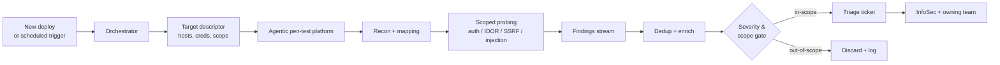


**Scope.** This workflow runs against **pre-production targets only**
(staging, preview environments, synthetic tenants). It does **not**
touch production, does **not** open PRs, and does **not** attempt
anything destructive. Output is structured findings that land in
the human triage queue — humans decide what to fix and how.


## What problem this solves

Point-in-time pen tests catch a snapshot of what was exploitable
the week a human tester looked. Between tests — a quarter, a half,
a year — new routes ship, dependencies update, auth surfaces
change, and the posture drifts. Agentic pen-test platforms close
that gap by running **continuously** against pre-production: every
build, every deploy, or on a schedule.

This page describes the **tool-agnostic workflow** for integrating
an agentic pen-test platform into the same orchestration spine
the other InfoSec workflows use. Two platforms fit this shape
today and the pattern generalises to
any similar platform that lands in the market. The workflow on
this page names neither; vendors are configuration, not contract.

## What agentic pen testing actually is

An **agentic pen tester** is an LLM-driven agent, or fleet of
agents, that takes the same steps a skilled human tester would
take — recon, mapping, credential discovery, authenticated
exploration, targeted exploit attempts — but runs autonomously
against a scoped target. The output is a set of findings with
reproduction steps, impact, and a recommended fix direction.

Platforms in this category differ in
which classes of vulnerabilities they cover best, how much they
automate end-to-end, and how they surface results. The **shape**
of integration, however, is consistent:

- A **target descriptor** goes in — hostnames or environments,
  authentication material, and a scope boundary.
- A **run** happens — recon, fuzzing, authenticated probing, with
  per-class modules for auth, IDOR, SSRF, injection, business
  logic, etc.
- A set of **findings** comes out — structured, deduplicated,
  scored, with repro steps and remediation hints.

Everything this page describes is built against that shape, not
against any one vendor's API.

## High-level flow

## The shape of integration — platform-agnostic

A platform is **integration-ready** for this workflow if it can
offer the following five surfaces. If a platform is missing one,
that's the gap to close before it moves from evaluation to
production.

### 1. Scoped target descriptors

- **Hostnames or environments.** The platform accepts a crisp
  scope: explicit hostnames, IP ranges, or environment labels
  (`staging`, `preview-pr-*`). No wildcards that would allow
  drifting into production.
- **Credentials.** Short-lived tokens or test accounts, scoped to
  the target environment. Never production credentials. Rotated
  per run.
- **Out-of-scope list.** Endpoints the platform must never touch
  (payment rails, PII bulk-export routes, anything with blast
  radius off-environment).
- **Data classification.** A signal of whether the environment
  holds real data. If yes, the run is blocked by default — most
  agentic pen testing belongs against synthetic or fully
  anonymised data.

### 2. Configurable module selection

- The platform exposes **per-class modules** (authz, IDOR, SSRF,
  injection, cryptographic, business logic, etc.) and lets the
  operator pick which run for this target.
- Destructive classes (anything write-heavy or state-changing)
  are **opt-in**, not default.
- A **dry-run** mode — the platform enumerates what it would do
  without actually issuing probes — is available for the first
  pass against any new target.

### 3. Findings stream with a stable schema

Regardless of vendor, the finding should land in the orchestrator
with at least:

- Unique finding ID (stable across re-runs so dedup works).
- Category and CWE mapping.
- Target (host, route, method).
- Reproduction steps — exact enough that a human can re-run them.
- Evidence — request/response captures with sensitive fields
  redacted at capture time.
- Severity and confidence, scored by the platform.
- A recommended fix direction.

The orchestrator normalises whatever the vendor emits into this
schema. Downstream consumers (triage queue, dashboard, SIEM) see
only the normalised shape.

### 4. Dedup, scope, and severity gates

Before a finding becomes a ticket, the orchestrator applies:

- **Dedup** — same finding from the same target on consecutive
  runs updates the existing ticket, it does not create a new one.
- **Scope gate** — findings outside the declared scope are
  logged and discarded.
- **Severity gate** — below-threshold findings (informational,
  known noise) route to a digest, not a per-ticket open.
- **Known-issue gate** — findings already tracked (tagged in a
  known-issues list, already in an open ticket) suppress until
  resolved.

### 5. Kill switches and rate caps

- **Per-run budget.** Max tool calls, max requests per target,
  max wall-clock time. The run hard-stops at the cap.
- **Global pause.** A `pentest-paused` label, flag, or API call
  that immediately halts every scheduled run fleet-wide.
- **Target health watch.** If the target environment starts
  returning 5xx at elevated rates, the run backs off rather than
  piling on.

Any platform that lacks a credible version of each of these is
not ready for scheduled runs against anything your team cares
about.

## How it differs from SCA, SAST, DAST

| Approach | Looks at | Finds | Typical cadence |
| -------- | -------- | ----- | --------------- |
| **SCA** | Lockfiles | Known-vulnerable dependencies | Every build |
| **SAST** | Source | Pattern-level weaknesses (injection, bad crypto) | Every build |
| **DAST** | Running app via fuzzing / crawling | Input-handling bugs, auth gaps | Nightly |
| **Agentic pen testing** | Running app via LLM-driven reasoning | Chained and logic-level issues — multi-step auth flaws, business-logic abuse, creative injection — that a pattern matcher misses | Continuous on pre-prod |

Agentic pen testing **complements** the other three; it does not
replace them. SCA remains the right tool for CVEs. SAST remains
the right tool for pattern-level code smells. DAST remains the
right tool for high-volume fuzzing. The agentic layer earns its
keep on the classes where reasoning across steps matters:
authenticated IDOR, multi-endpoint auth bypasses, business-logic
abuses (race conditions on coupon redemption, bypasses in
staged checkout flows), and SSRF paths that require chaining.

## Where a finding goes

Unlike the sensitive-data and vulnerable-dependency workflows,
agentic pen-test findings do **not** become PRs. They become
**triage tickets** because:

- The fix often requires a design or architectural decision, not
  a mechanical patch.
- The ownership boundary is broader (product + platform + often
  security engineering together).
- False positives at this layer look different from SCA false
  positives — a "valid" finding may turn out to be an intentional
  control that the tester didn't see.

Each finding becomes a ticket with:

- The normalised finding schema pasted in.
- Reproduction steps (replayable against staging).
- A link to the original platform run for evidence.
- Severity and owning team, auto-resolved from CODEOWNERS plus
  the service catalog.
- A **review SLA** tied to severity.

Closing the ticket requires a change merging *and* a re-run of
the platform confirming the finding is gone.

## Guardrails

- **Pre-production only.** Production targets are not configured
  into the platform. A run against production is a configuration
  failure, not an approved operation.
- **No write operations by default.** Modules that would mutate
  state (create accounts, change data, send emails) are disabled
  unless explicitly turned on for a specific run, with a named
  approver.
- **No persistent agents.** Each run is stateless from the
  platform's point of view — the orchestrator holds state (runs,
  findings, dedup keys), the platform does not hold tenant data
  between runs.
- **Rate caps on every target.** Per-second, per-minute,
  per-hour. The orchestrator trims caps as targets get smaller
  or less resilient.
- **All traffic is attributable.** Every request carries a
  run-ID header so the platform's traffic is separable from real
  user traffic in logs and SIEM.

## What the platform must not do

- Probe production. Period.
- Persist credentials across runs.
- Exfiltrate target data beyond what's needed to evidence a
  finding. Evidence captures are redacted and size-capped.
- Attempt denial-of-service — even against test targets. A
  finding about availability is reported, not proven via
  exhaustion.
- Chain into third-party services the target depends on. Scope
  ends at the target's boundary.

## Orchestration spine

Same spine as the rest of this section; only the intake and
dispatch rules change:

1. **Intake.** Trigger from a deploy event, a schedule, or an
   ad-hoc "test this environment" request from an owner.
2. **Dispatch.** Resolve the target descriptor, pick the module
   set, apply budget caps, check the kill switch.
3. **Run.** Hand off to the platform. The platform is a **sealed service** from
   the orchestrator's perspective.
4. **Verify.** Pull the findings stream, run dedup + scope +
   severity gates, normalise to the internal schema.
5. **Review.** Open triage tickets; notify InfoSec and owning
   teams; track SLA.

## How we decided when it's "active"

This workflow graduated from **On deck** to **Active** when:

- A pilot ran against three staging environments for 30 days
  without causing an incident outside scope.
- The finding stream was dedupe-stable run-over-run (same code,
  same findings; new deploy, new findings land cleanly).
- The severity gate was calibrated — below-threshold volume sat
  at a level owning teams could absorb.
- The kill-switch path was exercised end-to-end with a deliberate
  scope-violation drill.

Teams adopting this workflow in their own environment should run
a similar 30-day pilot before pointing it at anything with real
reviewers behind it.

## Evaluating a platform

When a new candidate shows up, evaluate against this checklist —
not vendor pitch decks:

- Does it hit the five integration surfaces above (scope, module
  selection, findings schema, gates, kill switches)?
- What's the rate of reproducible-to-non-reproducible findings on
  your environment, not theirs?
- How opaque is the agent's reasoning? Can a reviewer follow
  "why did the platform conclude X" to an audit trail of probes?
- How are credentials handled — does the platform broker them
  short-lived, or does it persist them?
- Does it degrade gracefully when a target is flaky, or does it
  hammer it?
- What happens when the orchestrator revokes a credential
  mid-run? (The correct answer is "stops cleanly.")

## What it won't catch

- Issues only reachable with production data or production
  traffic patterns.
- Attacks that require human-level social engineering (phishing,
  vishing). Out of scope and out of character.
- Supply-chain compromises upstream of your build — that's SCA
  plus SBOM governance plus CI integrity work.
- Anything the platform's modules weren't designed for. New
  vulnerability classes ship with new platform releases; stay
  on the upgrade path.

## Changelog

- 2026-04-22 — v1, promoted from On deck to Active after the
  30-day pilot. Vendor-neutral orchestration in place. Two
  platform backends supported today; others can
  be added behind the same shape.

## See also

- [Sensitive Data Element Remediation]()
- [Vulnerable Dependency Remediation]()
- [MCP Server Access]() — wiring the
  platform's findings stream into the orchestrator
- [Fundamentals]() — vocabulary
  (IDOR, SSRF, blast radius) used in triage tickets
