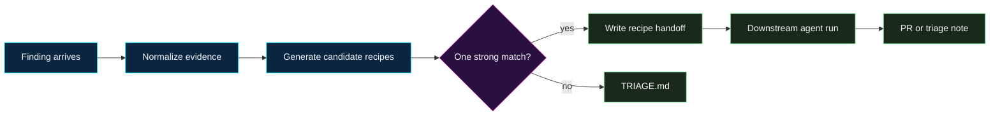


**Scope.** This recipe does not fix code. It classifies one security finding,
selects one downstream recipe, and writes the handoff contract an agent should
follow. If the match is weak, the correct answer is triage rather than a
speculative remediation run.


## What problem this solves

Agent-assisted remediation works best when the agent starts with one finding and
one recipe. In practice, findings often arrive as partial scanner alerts,
dependency advisories, tickets, SARIF snippets, bug bounty notes, or incident
summaries. The first risk is choosing the wrong workflow: using a dependency
recipe for a vendored artifact, using a SAST recipe for a cross-service design
bug, or using a CVE prompt before the advisory is mature enough to trust.

The recipe recommender is the intake step. It turns messy finding text into a
small routing decision:

- one recommended recipe,
- the evidence that justified the match,
- the agent prompt or workflow page to use next,
- the context sources the agent may read,
- the stop conditions that still apply.

If the recommender cannot make that decision confidently, it writes a triage
note and stops.

## High-level flow



## When to use it

- A scanner, ticket, or human report names a security issue, but the right
  remediation recipe is not obvious.
- You are dispatching an agent from a queue that may contain dependency, SAST,
  secret, container, CVE, MCP, browser-agent, or agent-control-plane findings.
- You want an auditable intake record before an agent opens a branch.
- You are tuning a dispatcher that uses `recipes_search`, `recipes_match_finding`,
  SARIF, SBOM, code scanning, or issue metadata as read-only context.

**Do not use it for:**

- Emergency incident response where containment has already started.
- Broad backlog cleanup. Run this against one finding at a time.
- Deciding whether to merge a PR. Use the
  [Reviewer Playbook]()
  for that.
- Replacing scanner, advisory, or ownership systems. Those remain the sources of
  truth.

## Inputs

Infer what you can from the task and available read-only context:

- **Finding identity** - scanner alert ID, CVE, GHSA, rule ID, issue URL,
  package name, image tag, file path, or ticket ID.
- **Finding text** - title, description, severity, affected component, affected
  file and line, advisory summary, or reproduction note.
- **Evidence pointers** - SARIF result, SBOM entry, dependency manifest, lockfile,
  code scanning alert, secret scanning alert, container scan, or internal
  runbook link.
- **Repository constraints** - code owners, test commands, release freeze, agent
  allowlists, and files the agent must not touch.

Ask a human for missing evidence only when the missing fact would change the
route.

## Matching rubric

Score every plausible recipe. Prefer a deterministic match over a clever one.

| Signal | Score |
| --- | ---: |
| Finding explicitly names the recipe class, such as dependency, SAST, secret, base image, CVE, MCP, or browser-agent boundary | +3 |
| Evidence source matches the recipe class, such as SBOM for dependencies or SARIF for SAST | +3 |
| The affected asset is in scope for that recipe's allowlist | +2 |
| The recipe has a clear verification path for this finding | +2 |
| The route can produce one PR or one triage note | +1 |
| The route would need production infrastructure, credentials, schema migration, or broad design work | -4 |
| The finding spans multiple services, repos, owners, or ambiguous assets | -3 |
| The advisory or scanner output is stale, disputed, or missing an affected component | -2 |

Choose a recipe only when the top score is at least 5 and beats the runner-up by
at least 2. Otherwise write a triage note.

## Routing table

| Finding shape | Recommended recipe |
| --- | --- |
| Vulnerable package, dependency advisory, lockfile finding, SBOM package hit | [Vulnerable Dependencies]() |
| SAST, CodeQL, Semgrep, SonarQube, Snyk Code, data-flow alert | [SAST Finding Remediation]() |
| Secret, token, credential, PII, sensitive field in logs/config/fixtures | [Sensitive Data]() |
| Dockerfile, base image, OS package, container scanner result | [Base Images and Containers]() |
| Unsafe parser, deserialization, weak JWT setting, XXE, shell eval, unsafe YAML | [Classic Vulnerable Defaults]() |
| Compromised artifact, poisoned package cache, registry mirror, CI cache purge | [Artifact Cache Purge]() |
| Wallet, address integrity, payment finality, custody, settlement workflow | [Crypto Payments]() |
| Smart contract, oracle, bridge, governance, multisig, protocol upgrade | [DeFi and Blockchain]() |
| Fresh CVE or advisory where affectedness is not yet proven | [CVE Intelligence Intake Gate]() |
| MCP connector, tool permissions, stdio launch, remote authorization, elicitation | [MCP Runtime Decision Evaluator]() or the specific MCP recipe in the hub |
| Browser automation, browser-agent prompt injection, page-boundary risk | [Browser Agent Boundary]() |

When a named CVE prompt exists in the
[CVE Recipes](), prefer that prompt after
the intake gate confirms the advisory is ready for remediation.

## The recommender prompt

~~~markdown
You are selecting the best security-recipes.ai recipe for one security finding.
You are not remediating the finding. You are not opening a PR. Your output is
one recipe handoff or a triage note.

## Step 1 - Normalize the finding

Extract the finding into this shape:

- finding_id:
- source_system:
- affected_asset:
- affected_file_or_package:
- vulnerability_class:
- evidence_links:
- known_verification_path:
- ambiguity_or_missing_context:

Use read-only evidence only. Do not mutate tickets, branches, cloud resources,
MCP configuration, scanner settings, or production systems.

## Step 2 - Generate candidate recipes

Consider at least these recipe families:

- vulnerable dependencies
- SAST finding remediation
- sensitive data
- base images and containers
- classic vulnerable defaults
- artifact cache purge
- crypto payments
- DeFi and blockchain
- CVE intelligence intake
- MCP runtime and connector recipes
- browser-agent boundary

For each plausible candidate, list the matching evidence and the reason it might
be wrong.

## Step 3 - Score candidates

Use this rubric:

- +3 explicit finding class match
- +3 evidence source match
- +2 affected asset is in the recipe allowlist
- +2 recipe has a verification path
- +1 output can be one PR or one triage note
- -4 requires production infrastructure, credentials, schema migration, or broad design work
- -3 spans multiple services, repos, owners, or ambiguous assets
- -2 advisory or scanner output is stale, disputed, or missing affected component data

Recommend a recipe only when the top score is at least 5 and beats the runner-up
by at least 2. If not, write a triage note.

## Step 4 - Return exactly one output

### Recipe handoff

- Recommended recipe:
- Recipe URL or local path:
- Confidence: high | medium
- Why this route:
- Evidence used:
- Context the remediation agent may read:
- Files or systems the remediation agent must not touch:
- Verification expected:
- Stop conditions:
- Suggested next prompt:

### Triage note

- Finding:
- Why no recipe is safe to recommend:
- Missing evidence or ambiguity:
- Human owner to ask:
- Suggested next action:

## Guardrails

- Pick one recipe, not a bundle.
- Do not patch code.
- Do not invent a new recipe when an existing recipe almost matches.
- Do not route to remediation when the fix needs architecture, schema,
  infrastructure, credential, or cross-repo changes.
- Do not suppress or close the original finding.
- Cite the evidence that drove the route.
~~~

## Handoff contract

A valid recommendation has this minimum shape:

```text
Recommended recipe: <title and URL>
Confidence: high | medium
Finding: <ID and source>
Why: <2-4 bullets tied to evidence>
Context allowed: <read-only sources>
Verification expected: <tests, scanner re-run, lockfile proof, DLP clean scan, etc.>
Stop if: <recipe-specific stop conditions>
```

The downstream remediation agent must cite the recommender output and the
selected recipe in its PR or triage note.

## Stop conditions

Write a triage note instead of recommending a recipe when:

- Two recipes score within 1 point of each other.
- The top score is below 5.
- The finding lacks an affected asset.
- The affected asset is generated, vendored, or owned by another team and the
  relevant recipe does not explicitly allow that scope.
- The fix requires production credentials, infrastructure changes, schema
  migration, cross-repo coordination, or incident containment.
- The advisory is too fresh or disputed to prove affectedness.

## Guardrails

- **Recommendation before remediation.** This recipe stops after a handoff. The
  next run uses the selected recipe.
- **One finding, one route.** Backlog summarization is out of scope.
- **Read-only evidence.** Recipe selection should never require write-capable
  connectors.
- **Evidence beats keywords.** A title that says "CVE" is not enough if the
  evidence is really a dependency bump, container image issue, or SAST alert.
- **Weak match means triage.** A safe non-answer is better than sending an agent
  into the wrong workflow.

## Python remediation tool



## See also

- [Quick Start]() - the simplest one-finding loop.
- [MCP Integration]() - read-only recipe search and
  retrieval context.
- [Integrate an AI Agent]() - how to
  hand a recipe to an agent safely.
- [Reviewer Playbook]()
  - what humans check after the downstream run.
