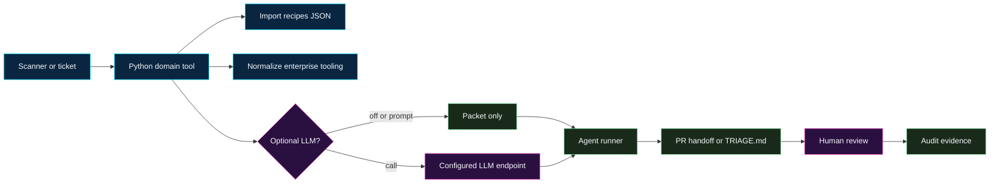

The Python remediation suite turns every playbook into a concrete, checked
workflow. It does not replace scanners, ticketing systems, source control, or
human reviewers. It creates the bounded packet an agent or orchestrator needs
before work starts, then verifies the evidence attached to that run:

- a playbook-specific, hash-only workspace inventory;
- the finding hash and exact workflow/decision gate;
- a human-readable plan and bounded agent task;
- explicit evidence requirements and expected outputs;
- integrity-hashed test, scan, review, approval, or policy evidence;
- deterministic verification before completion is claimed.

<figure class="sr-suite-figure">
  
  <figcaption>The suite keeps one finding, one domain tool, one recipe-informed output, and human review.</figcaption>
</figure>



## Tool commands

The `playbook` interface covers all 75 published scenarios from the same
versioned registry that renders their workflow visuals and serves the MCP
tools. Rechecked on August 21, 2026: the registry still has 75 playbooks
and `mcp_server.py` still exposes 75 `recipes_*` tools. It uses only the
Python standard library.

```bash
# Discover and inspect the contract before touching a workspace.
python scripts/security_recipes_remediation_suite.py playbook list
python scripts/security_recipes_remediation_suite.py playbook describe \
  --playbook vulnerable-dependencies
python scripts/security_recipes_remediation_suite.py playbook inspect \
  --playbook vulnerable-dependencies --workspace .

# Create a new, version-pinned run packet for one finding.
python scripts/security_recipes_remediation_suite.py playbook start \
  --playbook vulnerable-dependencies \
  --workspace . \
  --finding finding.json \
  --run-dir .security-recipes/runs/vulnerable-dependencies

# Attach evidence by path and SHA-256; file contents are not copied.
python scripts/security_recipes_remediation_suite.py playbook record \
  --run-dir .security-recipes/runs/vulnerable-dependencies \
  --file reports/sca-rescan.json \
  --kind scanner \
  --requirement "tests and SCA re-scan"

# Exit 0 only when the packet is valid and every evidence requirement is met.
python scripts/security_recipes_remediation_suite.py playbook verify \
  --run-dir .security-recipes/runs/vulnerable-dependencies
```

`start` creates four artifacts atomically:

| Artifact | Purpose |
| --- | --- |
| `run.json` | Versioned playbook identity, finding hash, bounded inventory, and requirements. |
| `PLAN.md` | The five workflow phases, decision gate, evidence checklist, and outputs. |
| `AGENT_TASK.md` | A constrained coding-agent handoff with explicit stop conditions. |
| `evidence.json` | Evidence metadata, requirement mapping, size, timestamp, and SHA-256. |

Workspace discovery skips links, junctions, dependency trees, unrelated build
output, and VCS data. A playbook can explicitly select a published recipe feed
or prior run evidence, but traversal remains limited to that declared branch.
File-count, individual-size, aggregate-size, and traversal limits are enforced
before hashing. The suite never treats a matching file pattern as blanket
write authorization.

## Dashboard container and UI

The suite now ships with a browser workbench that sits on top of the same
Python planner. The UI lets an operator:

- choose a remediation domain;
- paste free-text, JSON, or SARIF findings;
- configure recipe source, tooling hints, ecosystem, and LLM mode;
- save non-secret access and context notes inside a mounted state directory;
- generate a remediation packet and inspect the JSON plus agent handoff prompt;
- download the latest packet for CI, SOAR, ticketing, or agent handoff.

Build the dashboard image from this repo:

```bash
docker build -f Dockerfile.remediation-suite-ui -t security-recipes-suite-ui .
```

Run it:

```bash
docker run --rm -p 8787:8787 \
  -v "$(pwd)/tmp/remediation-suite-ui:/data" \
  -e OPENAI_API_KEY="$OPENAI_API_KEY" \
  security-recipes-suite-ui
```

Open <http://localhost:8787>. The container starts:

```bash
python scripts/security_recipes_remediation_suite.py serve-dashboard \
  --host 0.0.0.0 \
  --port 8787 \
  --state-dir /data
```

Useful runtime environment variables:

| Variable | Purpose |
| --- | --- |
| `SECURITY_RECIPES_DASHBOARD_HOST` | Bind host for the web server. |
| `SECURITY_RECIPES_DASHBOARD_PORT` | Port exposed by the UI, default `8787`. |
| `SECURITY_RECIPES_DASHBOARD_STATE_DIR` | Directory for persisted non-secret dashboard configuration. |
| `OPENAI_API_KEY` | Example API key used when the UI is set to `llm-mode call` with `OPENAI_API_KEY` as the configured env var. |

Health endpoint:

```text
GET /api/health
```

## Install from this repo

The suite uses the Python standard library. From a checkout of
`security-recipes.ai`:

```bash
python scripts/security_recipes_remediation_suite.py list-domains
```

Start the local dashboard without Docker:

```bash
python scripts/security_recipes_remediation_suite.py serve-dashboard
```

Run a domain-specific tool:

```bash
python scripts/security_recipes_remediation_suite.py deps \
  --finding dependabot-alert.json \
  --recipes-source public/api/recipes.json \
  --tooling github,snyk,jira \
  --ecosystem npm \
  --llm-mode prompt \
  --output out/deps-packet.json
```

The same suite works from CI, SOAR, a ticket webhook, a scheduled scanner job,
or an agent handoff. The command writes a JSON remediation packet by default.
Use `--finding -` to read a free-text, generic JSON, or SARIF finding from
standard input.

## Domain planner commands

| Section | Command | Best input |
| --- | --- | --- |
| Sensitive Data Element Remediation | `sde` | DLP, secret scanning, SDE JSON |
| Vulnerable Dependency Remediation | `deps` | CVE, GHSA, OSV, Dependabot, SCA, SBOM |
| SAST Finding Remediation | `sast` | SARIF, CodeQL, Semgrep, SonarQube, Snyk Code |
| Base Image and Container Layer Remediation | `base-image` | Trivy, Grype, container scanner, Dockerfile evidence |
| Artifact Cache and Mirror Quarantine | `cache-purge` | registry, mirror, cache, or malicious-artifact advisory |
| Recipe Recommender | `recommend` | any messy finding that needs routing first |
| Gatekeeping Patterns | `gate` | workflow, agent identity, policy, approval data |
| Runtime Controls | `runtime` | session, tool-call, proxy, egress, and telemetry data |
| Classic Vulnerable Defaults | `defaults` | unsafe parser, deserialization, XML, JWT, shell, TLS patterns |
| Crypto Payments Security | `crypto-payments` | wallet, address, settlement, custody, or payment-flow findings |
| DeFi and Blockchain Security | `defi` | smart contract, oracle, bridge, governance, or multisig findings |
| Program Metrics and KPIs | `metrics` | run records, PR data, scanner backlog, review metadata |
| Reviewer Playbook | `review` | PR diff, recipe id, run receipt, tests, scans |
| Rollout and Maturity Model | `rollout` | pilot state, controls, reviewer capacity, metrics |
| Compliance and Audit | `audit` | run receipt, approvals, control framework, evidence request |

You can also use the generic command:

```bash
python scripts/security_recipes_remediation_suite.py plan \
  --domain auto \
  --finding finding.sarif \
  --recipes-source https://security-recipes.ai/api/recipes.json
```

`--domain auto` scores the first finding against the domain registry and chooses
the strongest match. For production dispatch, prefer an explicit command when
the scanner already knows the finding class.

## Import recipes from the site

Every domain can import recipes from the built site or the public endpoint:

```bash
--recipes-source public/api/recipes.json
--recipes-source https://security-recipes.ai/api/recipes.json
```

Agents can also use the MCP server tools when the site is deployed with MCP:

- `recipes_search`
- `recipes_get`
- `recipes_match_finding`
- `recipes_playbooks_list`
- `recipes_playbook_get`
- `recipes_playbook_plan`

The three playbook MCP tools provide the same complete workflow contract and a
deterministic planning checklist without writing to a repository. The Python
suite does not need MCP to run. Its legacy domain planners can import the same
recipe corpus through JSON so enterprise schedulers and security platforms can
use it without embedding a browser or a site-specific client.

## Optional LLM assist

LLM assist is opt-in and has three modes:

| Mode | Behavior |
| --- | --- |
| `off` | No model prompt or call is attached. |
| `prompt` | The packet includes the domain-specific prompt for another agent to use. |
| `call` | The suite calls an OpenAI-compatible chat completions endpoint using an API key from the configured environment variable. |

Example config:

```json
{
  "endpoint": "https://api.openai.com/v1/chat/completions",
  "model": "gpt-5.5",
  "api_key_env": "OPENAI_API_KEY",
  "temperature": 0.2,
  "timeout": 30
}
```

Run with:

```bash
python scripts/security_recipes_remediation_suite.py sast \
  --finding codeql.sarif \
  --recipes-source public/api/recipes.json \
  --llm-config llm.json \
  --llm-mode call
```

Use `prompt` mode first in regulated environments. It produces the model prompt
without transmitting data, which makes review and redaction easier.

## Packet anatomy

<figure class="sr-suite-figure">
  
  <figcaption>The JSON packet is the handoff contract between scanners, agents, reviewers, and audit systems.</figcaption>
</figure>

Each packet contains:

- `classification` - domain score and routing rationale.
- `findings` - normalized finding identity, source, severity, asset, location,
  and raw evidence.
- `recipe_import` - recipes matched from `/api/recipes.json`.
- `enterprise_tooling` - compatible source control, scanner, ticketing,
  registry, GRC, SIEM, or platform categories.
- `workflow` - inputs, allowed actions, stop conditions, evidence, and outputs.
- `agent_handoff` - a domain-specific prompt with guardrails.
- `llm_assist` - disabled, prompt-only, or configured model-call metadata.

## Enterprise integration pattern



The integrations are intentionally broad:

- source control: GitHub, GitLab, Azure DevOps, Bitbucket;
- scanners: CodeQL, Semgrep, SonarQube, Snyk, Wiz, Trivy, Grype, OSV,
  Gitleaks, TruffleHog, Veracode, Checkmarx, Fortify;
- registries and artifact systems: Artifactory, Nexus, Harbor, ECR, ACR, GAR,
  Quay, npm, PyPI, Maven, NuGet;
- ticketing and response: Jira, Linear, ServiceNow, PagerDuty, SOAR;
- evidence and audit: Drata, Vanta, Secureframe, ServiceNow GRC, Archer,
  AuditBoard, SIEM and data warehouse exports.

The suite only shapes the packet. Connector credentials, write access,
approval policies, and production actions stay in the enterprise control plane.

## Domain reference































## Guardrails

- One finding goes into one playbook run or legacy domain planner.
- Every playbook run is bound to one registry profile and one finding hash.
- Inspection is bounded, hash-only, and link-safe; it never grants write scope.
- Evidence is accepted only from regular files inside the recorded workspace.
- Verification fails on profile drift, finding/evidence tampering, invalid
  paths, missing evidence requirements, or schema mismatch.
- A packet can produce a plan, PR handoff, audit packet, or triage note.
- The suite never auto-merges.
- The suite does not mutate cloud, registry, ticketing, source-control, GRC, or
  payment systems by itself.
- LLM calls are off by default.
- Secrets, private findings, customer data, and source snippets should stay out
  of `--llm-mode call` unless your approved boundary permits that transmission.
