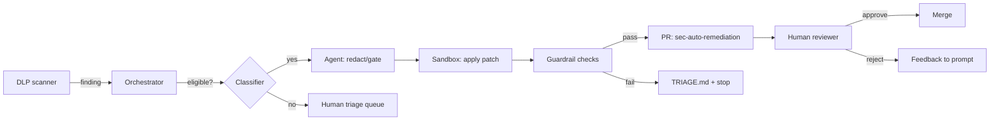
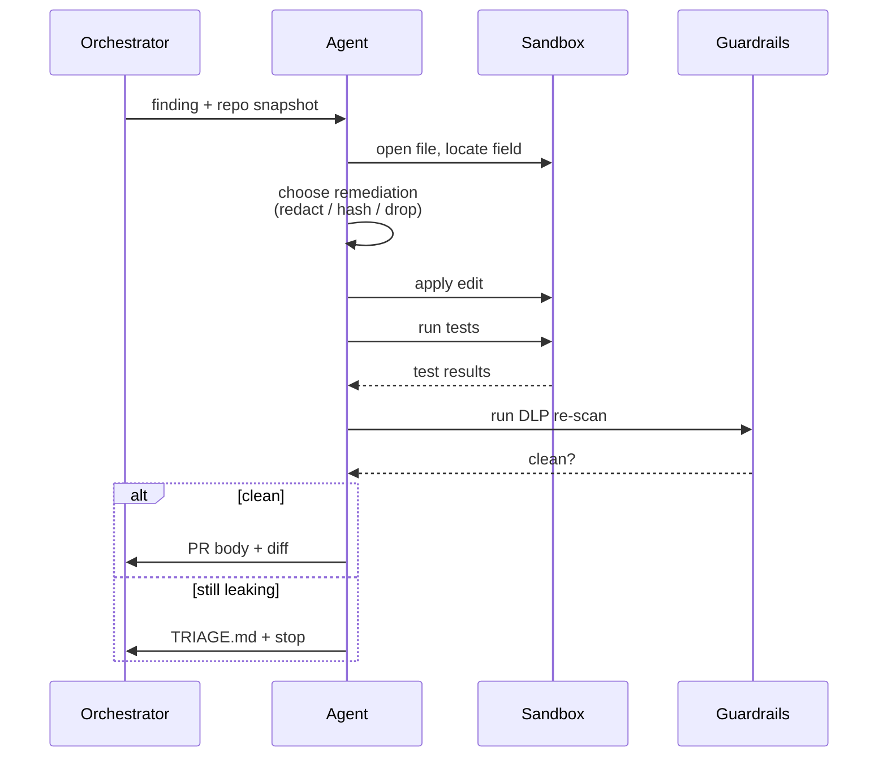


**Scope.** This workflow handles the *unintentional leaks* —
fields that showed up somewhere they weren't supposed to. It does
**not** handle designed data flows (those go through privacy review)
and it does **not** touch database rows (data-layer remediation is
out of scope).


## What problem this solves

Teams routinely commit configs, log formatters, and schema files
that — usually by accident — start emitting sensitive elements
(email addresses, phone numbers, session tokens, internal user
IDs) into places where they shouldn't appear. Our DLP scanner
catches these; historically, the remediation was a Jira ticket
that sat for weeks. This workflow turns the same finding into a
PR within the hour.

## High-level flow

## What 'eligible' means

The classifier decides whether a finding is safe to hand to the
agent. A finding is **eligible** when all of these hold:

- The file extension is on the allowlist (`*.yaml`, `*.yml`,
  `*.json`, `*.tf`, `*.py` log formatters, `*.ts` log formatters).
- The finding is a **field name or value** — not a free-text string
  in a comment or docstring.
- The repo has a passing test suite and a working CI pipeline.
- The repo has opted in by adding a `.sec-auto-remediation.yml`
  file at the root.

Anything else goes to the human triage queue.

## What the agent does

The agent runs inside a sandboxed container with a strict tool
allowlist (read files, write files, run tests, run a redaction
linter). Its procedure:

## Remediation menu

The agent picks from a small, reviewed set of patterns:

- **Redact.** Replace the field with a masked value in logs
  (`user@example.com` → `u***@example.com`).
- **Drop.** Remove the field from the payload entirely when the
  downstream consumer doesn't need it.
- **Hash.** Replace with a salted hash when the downstream needs
  uniqueness but not the raw value.
- **Gate.** Put the field behind a feature flag so prod traffic
  stops emitting it immediately while a longer fix is designed.

The agent picks **one** and justifies the pick in the PR body. It
does not invent new patterns.

## Guardrails

- **No schema changes.** The agent will never alter a
  database schema, migration, or public API contract — those
  escape the blast radius and go to human triage.
- **No bulk edits.** One finding → one PR. Multiple findings in
  the same file produce multiple PRs, each reviewable in
  isolation.
- **DLP re-scan required.** Before opening the PR, the agent
  re-runs the DLP scanner against the sandbox and confirms the
  original finding is gone. If it isn't, the agent stops.
- **Human approval required.** The PR is tagged
  `sec-auto-remediation`. A reviewer from InfoSec **and** a
  reviewer from the owning team must approve before merge.

## What it won't catch

- Leaks that only manifest in production (e.g. only certain
  tenants hit the log path).
- Leaks inside binary artifacts or encoded blobs.
- Leaks that require a schema change to fix cleanly.
- Secrets rotation — the agent redacts the field; rotating the
  compromised secret is a separate, human-driven workflow.

## How this workflow evolves

The orchestration stays stable — intake, dispatch, sandbox, guard,
review. What changes:

- **Prompt.** We tune the remediation-menu instructions quarterly
  based on reviewer feedback.
- **Model.** We upgrade the underlying model when a newer one
  meaningfully improves precision on our eval set.
- **Tools.** When a new scanner joins intake, we add it as another
  MCP connector; the orchestrator doesn't change.

## Changelog

- 2026-04-21 — v1, rolled out to opt-in repos. YAML, JSON, and
  Terraform formatters only.
