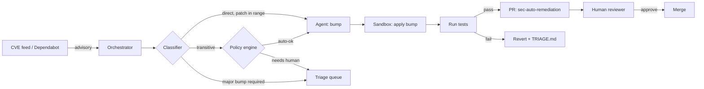
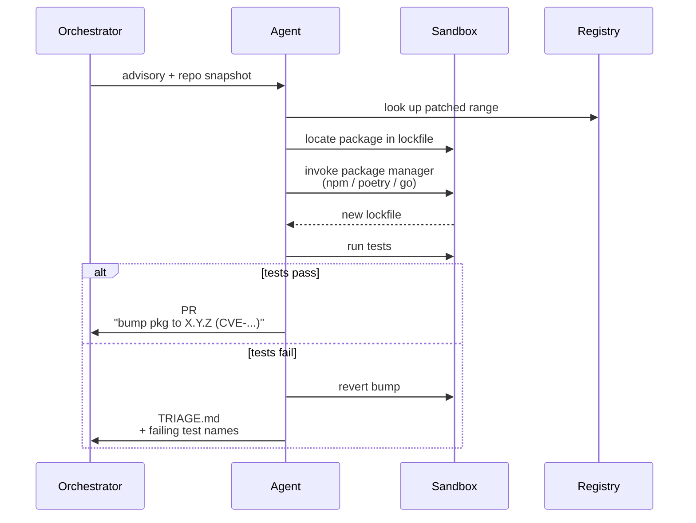


**Scope.** Third-party dependencies only (SCA findings). First-party
code vulnerabilities (SAST) go through a separate workflow because
the fix shape is wildly different.


## What problem this solves

A typical mid-sized repo sees 5–20 new dependency advisories per
month. Most of them are routine version bumps — the advisory
reports the affected range, there's a patched version, and the
lockfile just needs updating. Historically this work piled up and
lost its urgency; by the time someone got to it, three more had
landed. This workflow drains the easy cases automatically so the
humans only see the hard ones.

## High-level flow

## What 'eligible' means

The classifier hands a finding to the agent only when:

- The advisory specifies a fix version (not "no fix yet").
- The affected package is present in the repo's lockfile.
- The patched version does **not** cross a major-version boundary
  on a direct dependency. Major bumps require a human.
- The repo has a passing CI pipeline and a `make test` (or
  equivalent) target the agent can invoke.

Everything else routes to the triage queue.

## What the agent does

## Per-ecosystem notes

- **Node.** Uses `npm`, `pnpm`, or `yarn` depending on the
  lockfile present. Never hand-edits `package-lock.json`.
- **Python.** Uses `poetry`, `uv`, or `pip-compile` depending on
  the project. Hand-editing `requirements.txt` is allowed only
  when no resolver is configured.
- **Go.** Uses `go get` then `go mod tidy`. Never edits
  `go.sum` directly.
- **Monorepos.** Each lockfile gets its own PR. No cross-lockfile
  bundling — reviewers need diffs they can reason about in
  isolation.

## Guardrails

- **One CVE, one PR.** Bundling multiple fixes masks which bump
  caused a regression. One is the rule, even if it creates more
  PRs.
- **No code edits outside the lockfile.** If a bump requires a
  code change, the agent stops — that's a human call.
- **No CI skip tokens.** The agent will never add `[skip ci]`,
  `[skip test]`, or similar. If CI fails, the change fails.
- **Quota per repo.** A per-repo cap on open agent PRs prevents
  the reviewer queue from becoming a firehose.
- **Yanked version guard.** The registry is re-queried just before
  PR open; if the patched version was yanked, the agent stops and
  writes a triage note.

## What it won't catch

- **Transitive deps behind a pin** — when a direct dep pins the
  vulnerable transitive by exact version, the bump requires the
  direct dep to update first. Routed to triage.
- **Private registries** the orchestrator hasn't been granted
  read access to.
- **Native modules** that build on the CI runner but fail in prod
  (different ABI, different glibc). Reviewer checklist flags
  these; the agent doesn't detect them.
- **Embargoed / pre-disclosure CVEs** — these go through an
  out-of-band process; the automated feed doesn't see them.

## How this workflow evolves

Same principle as the other workflows: orchestration is constant,
inputs evolve.

- **Prompt.** The triage heuristics (when to stop, how to format
  the PR body) get tuned from reviewer pushback.
- **Model.** Upgraded when a newer model measurably improves
  precision on our labelled CVE set.
- **Tools.** New ecosystem connectors (e.g. Rust `Cargo.lock`,
  PHP `composer.lock`) plug in as MCP servers without touching
  the orchestrator.

## Changelog

- 2026-04-21 — v1, covers Node, Python, and Go. Rust and PHP
  queued for next quarter.
